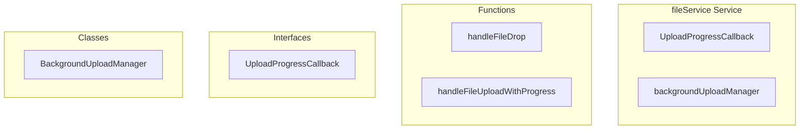

# fileService Service

**File:** `src/services/fileService.ts`

## Overview




## Exports

- **UploadProgressCallback** - interface export
- **backgroundUploadManager** - const export

## Functions

### `handleFileDrop(userId: string, file: any)`

No description available.

**Parameters:**
- `userId: string`
- `file: any`

**Returns:** `void`

```typescript
async function handleFileDrop(userId: string, file: any)
```

### `handleFileUploadWithProgress(userId: string, file: File, onProgress?: UploadProgressCallback)`

No description available.

**Parameters:**
- `userId: string`
- `file: File`
- `onProgress?: UploadProgressCallback`

**Returns:** `Promise&lt;string | null&gt;`

```typescript
async function handleFileUploadWithProgress(
    userId: string, 
    file: File, 
    onProgress?: UploadProgressCallback
): Promise<string | null>
```


## Classes

### BackgroundUploadManager

No description available.

**Methods:**
- `startUpload`
- `cancelUpload`
- `hasActiveUploads`
- `getActiveUploadCount`

**Properties:**
- `uploads`
- `callbacks`
- `uploadId`
- `userId`
- `file`
- `onProgress`
- `uploadPromise`
- `callback`
- `0`


## Interfaces

### UploadProgressCallback

No description available.

```typescript
interface UploadProgressCallback {

  (progress: number): void;

}
```


## Source Code Insights

**File Size:** 3867 characters
**Lines of Code:** 134
**Imports:** 3

## Usage Example

```typescript
import { UploadProgressCallback, backgroundUploadManager } from '@/services/fileService'

// Example usage
handleFileDrop()
```

---

*This documentation was automatically generated from the source code.*