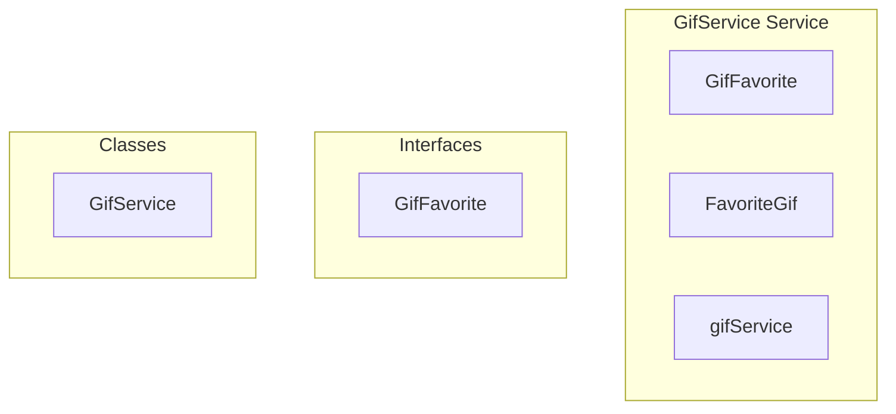

# GifService Service

**File:** `src/services/GifService.ts`

## Overview




## Exports

- **GifFavorite** - interface export
- **FavoriteGif** - type export
- **GifService** - class export
- **gifService** - const export


## Classes

### GifService

No description available.

**Methods:**
- `getInstance`
- `initializeCache`
- `catch`
- `addFavoriteByUrl`
- `removeFavoriteByUrl`
- `toggleFavoriteByUrl`
- `toggleFavorite`
- `addFavorite`
- `removeFavorite`
- `getFavorites`
- `_fetchFavorites`
- `isFavoriteByUrl`
- `isFavoriteByUrlAsync`
- `favoriteToGif`
- `clearCache`

**Properties:**
- `instance`
- `lookups`
- `favoriteUrls`
- `cacheInitialized`
- `OPTIMIZED`
- `favoritesCache`
- `favoritesCacheTime`
- `pendingFavoritesRequest`
- `isAuth`
- `supabase`
- `cache`
- `true`
- `initialized`
- `URL`
- `gifUrl`
- `previewUrl`
- `title`
- `success`
- `error`
- `context`
- `user_id`
- `gif_url`
- `preview_url`
- `favorites`
- `caches`
- `refreshes`
- `null`
- `isFavorite`
- `isCurrentlyFavorite`
- `result`
- `method`
- `removeFavoriteByUrl`
- `sites`
- `GIFs`
- `auth`
- `valid`
- `now`
- `requests`
- `DB`
- `ascending`
- `loaded`
- `id`
- `media_formats`
- `gif`
- `gifpreview`
- `fallbacks`
- `mp4`
- `webm`
- `false`
- `0`


## Interfaces

### GifFavorite

No description available.

```typescript
interface GifFavorite {

  id: string
  user_id: string
  gif_url: string
  preview_url: string
  title: string | null
  created_at: string

}
```


## Type Definitions

### FavoriteGif

No description available.

```typescript
export type FavoriteGif = GifFavorite

// Cache TTL: 5 minutes
const CACHE_TTL = 5 * 60 * 1000

export class GifService {
  private static instance: GifService
  
  // Local cache of favorite URLs for quick lookups
  private favoriteUrls: Set<string> = new Set()
  private cacheInitialized = false
  
  // OPTIMIZED: Full favorites cache with TTL
  private favoritesCache: FavoriteGif[] | null = null
  private favoritesCacheTime = 0
  private pendingFavoritesRequest: Promise<FavoriteGif[]> | null =...
```


## Constants

### CACHE_TTL

No description available.

```typescript
const CACHE_TTL = 5 * 60 * 1000
```


## Source Code Insights

**File Size:** 9723 characters
**Lines of Code:** 325
**Imports:** 4

## Usage Example

```typescript
import { GifFavorite, FavoriteGif, GifService, gifService } from '@/services/GifService'

// Example usage
// Use the exported functionality
```

---

*This documentation was automatically generated from the source code.*