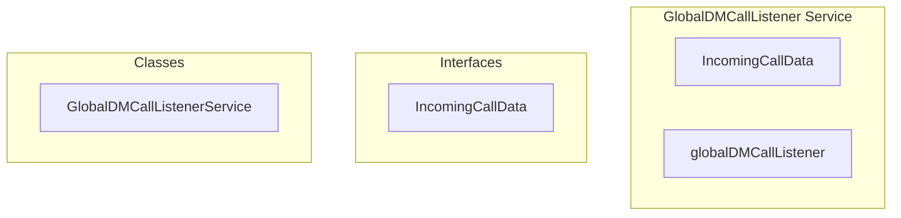

# GlobalDMCallListener Service

**File:** `src/services/GlobalDMCallListener.ts`

## Overview




## Exports

- **IncomingCallData** - interface export
- **globalDMCallListener** - const export


## Classes

### GlobalDMCallListenerService

No description available.

**Methods:**
- `initialize`
- `handleCallSignal`
- `switch`
- `handleIncomingCall`
- `dismissIncomingCall`
- `isInitialized`
- `cleanup`

**Properties:**
- `userChannel`
- `currentUserId`
- `calls`
- `incomingCall`
- `showIncomingCallModal`
- `Initialize`
- `done`
- `exists`
- `userId`
- `channelName`
- `User`
- `Channel`
- `event`
- `signal`
- `RECEIVED`
- `Type`
- `From`
- `Conversation`
- `status`
- `signals`
- `toast`
- `type`
- `break`
- `answered`
- `activeCall`
- `undefined`
- `declineMsg`
- `checks`
- `CALL`
- `To`
- `permissions`
- `permissionCheck`
- `conversationId`
- `result`
- `back`
- `any`
- `data`
- `callerData`
- `loaded`
- `incomingCallData`
- `callerId`
- `callerName`
- `callerAvatar`
- `callType`
- `timestamp`
- `state`
- `true`
- `UPDATED`
- `moment`
- `modals`
- `DOM`
- `call`
- `null`
- `false`
- `initialized`
- `Cleanup`


## Interfaces

### IncomingCallData

No description available.

```typescript
interface IncomingCallData {

  callerId: string
  callerName: string
  callerAvatar: string
  callType: 'voice' | 'video'
  conversationId: string
  timestamp: number

}
```


## Source Code Insights

**File Size:** 7275 characters
**Lines of Code:** 240
**Imports:** 7

## Usage Example

```typescript
import { IncomingCallData, globalDMCallListener } from '@/services/GlobalDMCallListener'

// Example usage
// Use the exported functionality
```

---

*This documentation was automatically generated from the source code.*