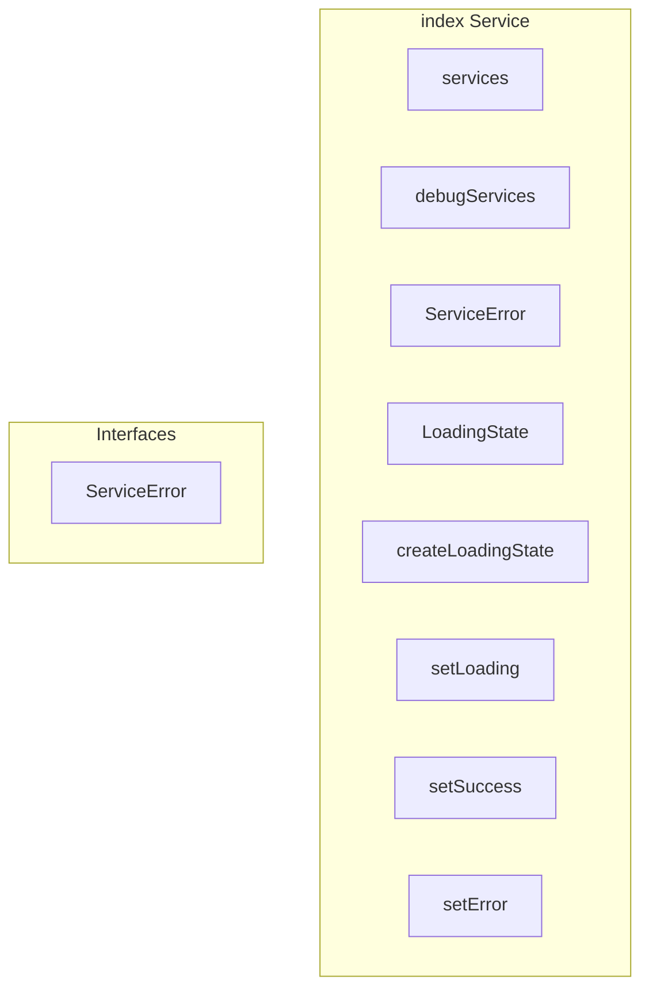

# index Service

**File:** `src/services/index.ts`

## Overview




## Exports

- **services** - const export
- **debugServices** - const export
- **ServiceError** - interface export
- **LoadingState** - interface export
- **createLoadingState** - function export
- **setLoading** - function export
- **setSuccess** - function export
- **setError** - function export


## Interfaces

### ServiceError

No description available.

```typescript
interface ServiceError {

  code: string
  message: string
  details?: any

}
```


## Source Code Insights

**File Size:** 5372 characters
**Lines of Code:** 189
**Imports:** 11

## Usage Example

```typescript
import { services, debugServices, ServiceError, LoadingState, createLoadingState, setLoading, setSuccess, setError } from '@/services/index'

// Example usage
// Use the exported functionality
```

---

*This documentation was automatically generated from the source code.*