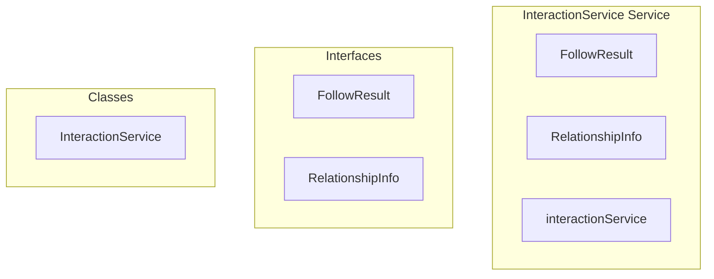

# InteractionService Service

**File:** `src/services/InteractionService.ts`

## Overview




## Exports

- **FollowResult** - interface export
- **RelationshipInfo** - interface export
- **InteractionService** - class export
- **interactionService** - const export


## Classes

### InteractionService

No description available.

**Methods:**
- `getInstance`
- `toggleFollow`
- `catch`
- `acceptFollowRequest`
- `rejectFollowRequest`
- `toggleBlock`
- `toggleMute`
- `toggled`
- `getUserRelationships`
- `getFollowers`
- `getFollowing`
- `getFollowRequests`
- `getCurrentUserProfileId`
- `createError`

**Properties:**
- `instance`
- `PRESERVES`
- `Simplified`
- `validation`
- `data`
- `profileId`
- `automatically`
- `result`
- `error`
- `blocking`
- `muting`
- `RelationshipInfo`
- `relationships`
- `userId`
- `options`
- `limit`
- `offset`
- `followers`
- `hasMore`
- `total`
- `following`
- `Simple`
- `more`
- `domain`
- `ascending`
- `profile`
- `id`
- `username`
- `display_name`
- `avatar_url`
- `is_local`
- `handle`
- `clean`
- `bio`
- `banner_url`
- `status`
- `color`
- `is_admin`
- `federated_id`
- `ap_id`
- `followers_count`
- `following_count`
- `posts_count`
- `created_at`
- `updated_at`
- `Profile`
- `efficiently`
- `count`
- `requests`
- `follower`
- `format`
- `transformedRequests`
- `transformedResult`
- `OPTIMIZED`
- `message`
- `code`
- `details`


## Interfaces

### FollowResult

No description available.

```typescript
interface FollowResult {

  following: boolean
  pending?: boolean
  followCount?: number

}
```

### RelationshipInfo

No description available.

```typescript
interface RelationshipInfo {

  following: boolean
  followedBy: boolean
  blocking: boolean
  muting: boolean
  followingPending: boolean
  followedByPending: boolean

}
```


## Source Code Insights

**File Size:** 13188 characters
**Lines of Code:** 412
**Imports:** 4

## Usage Example

```typescript
import { FollowResult, RelationshipInfo, InteractionService, interactionService } from '@/services/InteractionService'

// Example usage
// Use the exported functionality
```

---

*This documentation was automatically generated from the source code.*