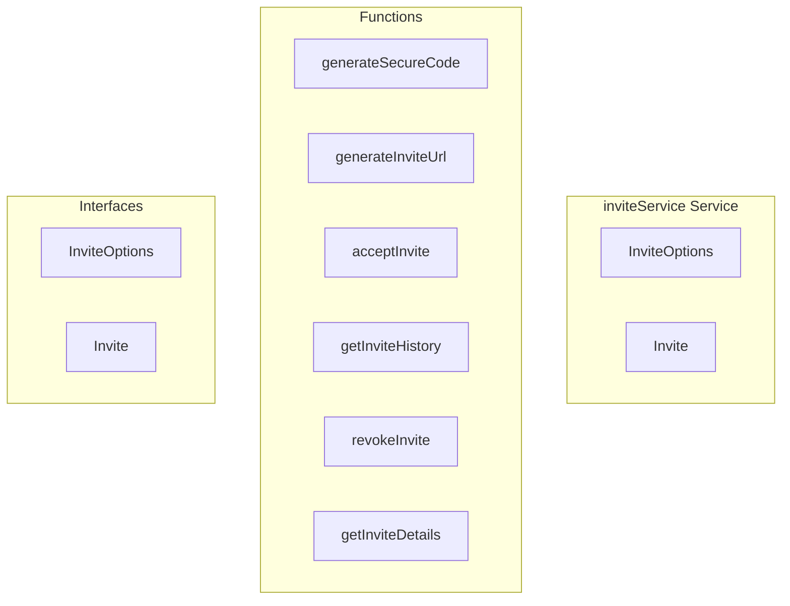

# inviteService Service

**File:** `src/services/inviteService.ts`

## Overview




## Exports

- **InviteOptions** - interface export
- **Invite** - interface export

## Functions

### `generateSecureCode()`

No description available.

**Parameters:**
None

**Returns:** `string`

```typescript
function generateSecureCode(): string
```

### `generateInviteUrl(serverId: string, userId: string, options: InviteOptions = {})`

No description available.

**Parameters:**
- `serverId: string`
- `userId: string`
- `options: InviteOptions = {}`

**Returns:** `Promise&lt;`

```typescript
async function generateInviteUrl(
  serverId: string, 
  userId: string, 
  options: InviteOptions = {}
): Promise<
```

### `acceptInvite(code: string, userId: string)`

No description available.

**Parameters:**
- `code: string`
- `userId: string`

**Returns:** `Promise&lt;`

```typescript
async function acceptInvite(code: string, userId: string): Promise<
```

### `getInviteHistory(userId: string, serverId?: string)`

No description available.

**Parameters:**
- `userId: string`
- `serverId?: string`

**Returns:** `Promise&lt;Invite[]&gt;`

```typescript
async function getInviteHistory(userId: string, serverId?: string): Promise<Invite[]>
```

### `revokeInvite(inviteId: string, userId: string)`

No description available.

**Parameters:**
- `inviteId: string`
- `userId: string`

**Returns:** `Promise&lt;boolean&gt;`

```typescript
async function revokeInvite(inviteId: string, userId: string): Promise<boolean>
```

### `getInviteDetails(code: string)`

No description available.

**Parameters:**
- `code: string`

**Returns:** `Promise&lt;`

```typescript
async function getInviteDetails(code: string): Promise<
```


## Interfaces

### InviteOptions

No description available.

```typescript
interface InviteOptions {

  expiresIn?: number; // minutes, 0 = never expires
  maxUses?: number; // 0 = unlimited
  temporary?: boolean;

}
```

### Invite

No description available.

```typescript
interface Invite {

  id: string;
  code: string;
  server_id: string;
  created_by: string;
  expires_at: string | null;
  max_uses: number | null;
  uses: number;
  temporary: boolean;
  created_at: string;
  used: boolean;

}
```


## Source Code Insights

**File Size:** 7543 characters
**Lines of Code:** 268
**Imports:** 4

## Usage Example

```typescript
import { InviteOptions, Invite } from '@/services/inviteService'

// Example usage
generateSecureCode()
```

---

*This documentation was automatically generated from the source code.*