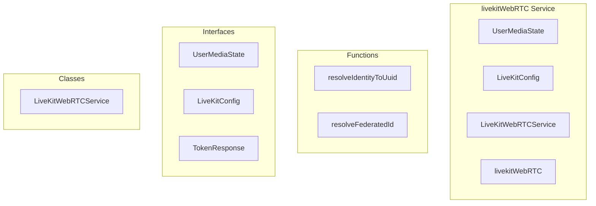

# livekitWebRTC Service

**File:** `src/services/livekitWebRTC.ts`

## Overview




## Exports

- **UserMediaState** - interface export
- **LiveKitConfig** - interface export
- **LiveKitWebRTCService** - class export
- **livekitWebRTC** - const export

## Functions

### `resolveIdentityToUuid(identity: string, remoteServerDomain?: string | null)`

No description available.

**Parameters:**
- `identity: string`
- `remoteServerDomain?: string | null`

**Returns:** `Promise&lt;string | null&gt;`

```typescript
/**
 * LiveKit WebRTC Service
 * 
 * Provides a SFU-based WebRTC implementation using LiveKit.
 * Mirrors the unifiedWebRTC API for seamless switching between SFU and P2P modes.
 * 
 * Features:
 * - Selective Forwarding Unit (SFU) for efficient media routing
 * - Built-in E2EE support
 * - Scales to large rooms (stage events)
 * - Automatic quality adaptation
 */

import {
  Room,
  RoomEvent,
  RemoteParticipant,
  LocalParticipant,
  Track,
  TrackPublication,
  ConnectionState,
  ParticipantEvent,
  LocalTrack,
  LocalAudioTrack,
  LocalVideoTrack,
  RemoteTrack,
  RemoteAudioTrack,
  RemoteVideoTrack,
  VideoPresets,
  AudioPresets,
  createLocalAudioTrack,
  createLocalVideoTrack,
  setLogLevel,
  LogLevel,
  ExternalE2EEKeyProvider,
} from 'livekit-client';
import { supabase } from '@/supabase';
import { debug } from '@/utils/debug';
import { userStorage } from '@/utils/userScopedStorage';
import { VoiceSettingsService } from './VoiceSettingsService';

// =============================================================================
// FEDERATED IDENTITY HELPERS
// =============================================================================

// Cache for federated ID to profile UUID mappings
const federatedIdToUuidCache = new Map<string, string>();

// Reverse cache: UUID to LiveKit identity (for looking up participants by UUID)
const uuidToIdentityCache = new Map<string, string>();

/**
 * Resolve a LiveKit identity to a profile UUID
 * For local users, identity is already the UUID
 * For federated users, identity is `federated:{federatedId}` and we need to look up the UUID
 * @param identity - The LiveKit participant identity
 * @param remoteServerDomain - Optional domain of the remote server (for resolving non-federated identities from remote servers)
 */
async function resolveIdentityToUuid(identity: string, remoteServerDomain?: string | null): Promise<string | null>
```

### `resolveFederatedId(federatedId: string, originalIdentity: string)`

No description available.

**Parameters:**
- `federatedId: string`
- `originalIdentity: string`

**Returns:** `Promise&lt;string | null&gt;`

```typescript
/**
 * Resolve a federated ID (actor URL) to a local profile UUID
 */
async function resolveFederatedId(federatedId: string, originalIdentity: string): Promise<string | null>
```


## Classes

### LiveKitWebRTCService

No description available.

**Methods:**
- `constructor`
- `getResolutionPreset`
- `switch`
- `getConfig`
- `catch`
- `isAvailable`
- `getToken`
- `getFederatedToken`
- `joinChannel`
- `joinWithToken`
- `leaveChannel`
- `publishLocalAudio`
- `toggleVideo`
- `toggleScreenShare`
- `toggleMute`
- `setMuted`
- `toggleDeafen`
- `updateStreamQuality`
- `loadStreamQualitySettings`
- `setUserMicVolume`
- `setUserScreenShareVolume`
- `getUserMicVolume`
- `getUserScreenShareVolume`
- `findAudioElementByResolvedId`
- `hasScreenShareAudio`
- `getLocalStream`
- `getUserStream`
- `attachVideoToElement`
- `detachVideoFromElement`
- `getLocalState`
- `getAllUsers`
- `syncExistingParticipants`
- `hasSubscribedTracks`
- `setupRoomListeners`
- `setupParticipantListeners`
- `createMediaState`
- `broadcastMediaState`
- `loadAudioSettings`
- `getSelectedDevices`
- `updateInputDevice`
- `updateOutputDevice`
- `updateVideoDevice`
- `enableE2EE`
- `disableE2EE`
- `on`
- `off`
- `emit`
- `isConnected`
- `getCurrentChannelId`
- `getStats`

**Properties:**
- `room`
- `channelId`
- `currentUserId`
- `roomType`
- `remoteServerDomain`
- `channels`
- `state`
- `localMediaState`
- `userId`
- `isAudioEnabled`
- `isVideoEnabled`
- `isScreenSharing`
- `isMuted`
- `isDeafened`
- `isSpeaking`
- `audioLevel`
- `states`
- `allUserStates`
- `control`
- `remoteMicAudioElements`
- `remoteScreenShareAudioElements`
- `100`
- `userMicVolumes`
- `userScreenShareVolumes`
- `streamQualitySettings`
- `resolution`
- `frameRate`
- `audioBitrate`
- `listeners`
- `eventListeners`
- `settings`
- `audioConstraints`
- `echoCancellation`
- `noiseSuppression`
- `autoGainControl`
- `selection`
- `selectedInputDevice`
- `selectedOutputDevice`
- `selectedVideoDevice`
- `provider`
- `e2eeKeyProvider`
- `cache`
- `configCache`
- `configCacheTime`
- `CONFIG_CACHE_TTL`
- `minute`
- `value`
- `width`
- `height`
- `360`
- `480`
- `720`
- `1080`
- `max`
- `default`
- `CONFIGURATION`
- `backend`
- `now`
- `valid`
- `response`
- `config`
- `enabled`
- `mode`
- `wsUrl`
- `allowFederatedVoice`
- `available`
- `MANAGEMENT`
- `data`
- `method`
- `headers`
- `body`
- `error`
- `instance`
- `instanceUrl`
- `actorId`
- `roomName`
- `TODO`
- `SFU`
- `channel`
- `cancellation`
- `connection`
- `cleanup`
- `null`
- `domain`
- `type`
- `tokenResponse`
- `token`
- `options`
- `adaptiveStream`
- `dynacast`
- `e2ee`
- `server`
- `prompt`
- `anyway`
- `autoSubscribe`
- `rtcConfig`
- `iceTransportPolicy`
- `connecting`
- `participants`
- `track`
- `check`
- `ones`
- `users`
- `true`
- `false`
- `URL`
- `wsUrlParsed`
- `oldChannelId`
- `CONTROLS`
- `audioTrack`
- `deviceId`
- `audioBitrateBps`
- `dtx`
- `red`
- `bitrate`
- `needed`
- `mute`
- `audio`
- `active`
- `videoTrack`
- `facingMode`
- `constraint`
- `videoCodec`
- `simulcast`
- `video`
- `videoPublication`
- `camera`
- `share`
- `screenshare`
- `muted`
- `screenResolution`
- `targetFrameRate`
- `audioBitrateKbps`
- `captureOptions`
- `IMPORTANT`
- `normalization`
- `capture`
- `contentHint`
- `systemAudio`
- `publishOptions`
- `videoEncoding`
- `maxBitrate`
- `1_500_000`
- `maxFramerate`
- `second`
- `screenShareAudioBitrate`
- `it`
- `actualSettings`
- `displaySurface`
- `debugging`
- `published`
- `Video`
- `captured`
- `hasScreenShareAudio`
- `Audio`
- `reasons`
- `disabling`
- `audioPublication`
- `change`
- `avoid`
- `CONTROL`
- `tracks`
- `creation`
- `updated`
- `trackCount`
- `continue`
- `constraints`
- `ideal`
- `16`
- `framerate`
- `applying`
- `Note`
- `saved`
- `localStorage`
- `volume`
- `clampedVolume`
- `exists`
- `identity`
- `audioElement`
- `map`
- `element`
- `undefined`
- `ACCESS`
- `stream`
- `participant`
- `federated`
- `consumed`
- `videoElement`
- `attachVideoToElement`
- `localParticipant`
- `ations`
- `ation`
- `streaming`
- `seen`
- `result`
- `HANDLING`
- `NOTE`
- `existingParticipants`
- `UUID`
- `mediaState`
- `total`
- `them`
- `immediately`
- `later`
- `hasSubscribedTracks`
- `reactivity`
- `tracked`
- `changes`
- `connected`
- `lookups`
- `operations`
- `disconnected`
- `minimum`
- `key`
- `source`
- `subscribed`
- `only`
- `lookupId`
- `TrackSubscribed`
- `isScreenShareAudio`
- `first`
- `existingElement`
- `savedVolume`
- `unsubscribed`
- `references`
- `detach`
- `keys`
- `ending`
- `lookup`
- `speakerIdentities`
- `duplicates`
- `processedUserIds`
- `50`
- `level`
- `events`
- `Disconnected`
- `Error`
- `message`
- `unpublished`
- `flag`
- `unpublish`
- `unmuted`
- `changed`
- `speaking`
- `resolvedUserId`
- `microphone`
- `hasMic`
- `isMicMuted`
- `break`
- `encoder`
- `reliable`
- `VoiceSettingsService`
- `devices`
- `inputDevice`
- `outputDevice`
- `videoDevice`
- `device`
- `to`
- `output`
- `E2EE`
- `SYSTEM`
- `event`
- `callback`
- `index`
- `listener`
- `METHODS`
- `ID`
- `statistics`
- `numParticipants`
- `connectionQuality`


## Interfaces

### UserMediaState

No description available.

```typescript
interface UserMediaState {

  userId: string;
  isAudioEnabled: boolean;
  isVideoEnabled: boolean;
  isScreenSharing: boolean;
  isMuted: boolean;
  isDeafened: boolean;
  isSpeaking: boolean;
  audioLevel: number;

}
```

### LiveKitConfig

No description available.

```typescript
interface LiveKitConfig {

  enabled: boolean;
  mode: 'sfu' | 'p2p' | 'hybrid';
  wsUrl: string | null;
  allowFederatedVoice: boolean;

}
```

### TokenResponse

No description available.

```typescript
interface TokenResponse {

  token: string;
  wsUrl: string;
  roomName: string;
  identity: string;

}
```


## Source Code Insights

**File Size:** 80933 characters
**Lines of Code:** 2178
**Imports:** 5

## Usage Example

```typescript
import { UserMediaState, LiveKitConfig, LiveKitWebRTCService, livekitWebRTC } from '@/services/livekitWebRTC'

// Example usage
resolveIdentityToUuid()
```

---

*This documentation was automatically generated from the source code.*