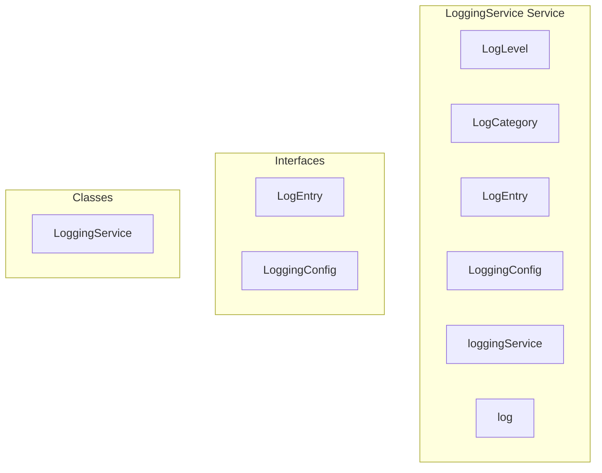

# LoggingService Service

**File:** `src/services/LoggingService.ts`

## Overview




## Exports

- **LogLevel** - type export
- **LogCategory** - type export
- **LogEntry** - interface export
- **LoggingConfig** - interface export
- **loggingService** - const export
- **log** - const export


## Classes

### LoggingService

No description available.

**Methods:**
- `constructor`
- `loadConfig`
- `updateConfig`
- `setUserConsent`
- `hasUserConsent`
- `getOrCreateSessionId`
- `shouldLog`
- `sanitizeData`
- `createEntry`
- `addToBuffer`
- `debug`
- `info`
- `warn`
- `error`
- `logNavigation`
- `logInteraction`
- `logPerformance`
- `logNetworkError`
- `logAuthEvent`
- `logFederationEvent`
- `logVoiceEvent`
- `saveBufferToStorage`
- `loadBufferFromStorage`
- `clearBuffer`
- `startFlushTimer`
- `flushToServer`
- `catch`
- `setupGlobalErrorHandlers`
- `setupPerformanceObservers`
- `getBuffer`
- `exportLogs`
- `downloadLogs`
- `destroy`

**Properties:**
- `config`
- `buffer`
- `flushTimer`
- `sessionId`
- `errorCount`
- `MAX_ERRORS_PER_SESSION`
- `Configuration`
- `stored`
- `errors`
- `consent`
- `Ignore`
- `userConsent`
- `Management`
- `Methods`
- `false`
- `sanitized`
- `patterns`
- `continue`
- `objects`
- `value`
- `data`
- `level`
- `category`
- `message`
- `error`
- `entry`
- `id`
- `timestamp`
- `url`
- `width`
- `height`
- `details`
- `name`
- `stack`
- `large`
- `storage`
- `Logging`
- `to`
- `element`
- `duration`
- `status`
- `path`
- `success`
- `event`
- `domain`
- `issues`
- `recentEntries`
- `entries`
- `logging`
- `entriesToSend`
- `server`
- `filtered`
- `endpoint`
- `body`
- `Handlers`
- `filename`
- `lineno`
- `colno`
- `rejections`
- `originalError`
- `Observers`
- `PerformanceObserver`
- `longTaskObserver`
- `100ms`
- `startTime`
- `entryTypes`
- `clsObserver`
- `shift`
- `hadRecentInput`
- `lcpObserver`
- `lastEntry`
- `observers`
- `timing`
- `pageLoadTime`
- `domContentLoaded`
- `ttfb`
- `blob`
- `a`
- `Cleanup`


## Interfaces

### LogEntry

No description available.

```typescript
interface LogEntry {

  id: string
  timestamp: string
  level: LogLevel
  category: LogCategory
  message: string
  data?: Record<string, any>
  context?: {
    url?: string
    route?: string
    userId?: string // Hashed if consent not given
    sessionId?: string
    userAgent?: string
    viewport?: { width: number; height: number }
  }
  performance?: {
    duration?: number
    memoryUsage?: number
    timestamp?: number
  }
  error?: {
    name?: string
    message?: string
    stack?: string
    componentSt
  // ...
}
```

### LoggingConfig

No description available.

```typescript
interface LoggingConfig {

  enabled: boolean
  minLevel: LogLevel
  sendToServer: boolean
  bufferSize: number
  flushInterval: number // ms
  userConsent: boolean // Privacy consent for detailed logging
  includePerformance: boolean
  includeNavigation: boolean
  includeInteractions: boolean
  excludePatterns: RegExp[] // Patterns to exclude from logging

}
```


## Type Definitions

### LogLevel

No description available.

```typescript
export type LogLevel = 'debug' | 'info' | 'warn' | 'error'

export type LogCategory = 
  | 'error'
  | 'performance'
  | 'navigation'
  | 'interaction'
  | 'network'
  | 'auth'
  | 'federation'
  | 'voice'
  | 'custom'

export interface LogEntry {
  id: string
  timestamp: string
  level: LogLevel
  category: LogCategory
  message: string
  data?: Record<string, any>
  context?: {
    url?: string
    route?: string
    userId?: string // Hashed if consent not given
    sessionId?: string
    us...
```


## Constants

### LOG_LEVELS

No description available.

```typescript
const LOG_LEVELS: Record<LogLevel, number> = {
```

### DEFAULT_CONFIG

No description available.

```typescript
const DEFAULT_CONFIG: LoggingConfig = {
```

### STORAGE_KEY

No description available.

```typescript
const STORAGE_KEY = 'harmony_log_buffer'
```

### CONSENT_KEY

No description available.

```typescript
const CONSENT_KEY = 'harmony_logging_consent'
```

### SESSION_ID_KEY

No description available.

```typescript
const SESSION_ID_KEY = 'harmony_session_id'
```


## Source Code Insights

**File Size:** 18168 characters
**Lines of Code:** 641
**Imports:** 2

## Usage Example

```typescript
import { LogLevel, LogCategory, LogEntry, LoggingConfig, loggingService, log } from '@/services/LoggingService'

// Example usage
// Use the exported functionality
```

---

*This documentation was automatically generated from the source code.*