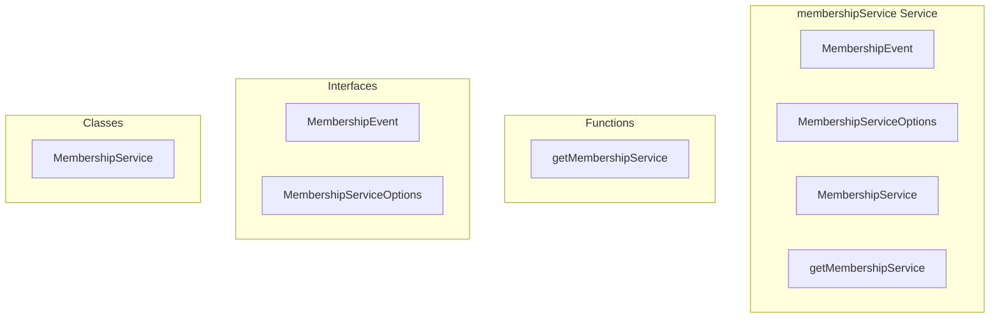

# membershipService Service

**File:** `src/services/membershipService.ts`

## Overview




## Exports

- **MembershipEvent** - interface export
- **MembershipServiceOptions** - interface export
- **MembershipService** - class export
- **getMembershipService** - function export

## Functions

### `getMembershipService()`

No description available.

**Parameters:**
None

**Returns:** `MembershipService`

```typescript
export function getMembershipService(): MembershipService
```


## Classes

### MembershipService

No description available.

**Methods:**
- `constructor`
- `getServerUsersStore`
- `subscribeToServer`
- `catch`
- `unsubscribeFromServer`
- `subscribeToServers`
- `cleanup`
- `handleMembershipEvent`
- `handleUserJoin`
- `handleUserLeave`
- `refreshServerUserList`
- `getActiveSubscriptions`
- `getMembershipHistory`

**Properties:**
- `subscriptions`
- `options`
- `MembershipServiceOptions`
- `server`
- `channel`
- `event`
- `schema`
- `table`
- `filter`
- `received`
- `subscription`
- `existingChannel`
- `servers`
- `events`
- `member`
- `consistency`
- `members`
- `userIds`
- `data`
- `list`
- `limit`
- `supabase`
- `ascending`
- `error`
- `history`


## Interfaces

### MembershipEvent

No description available.

```typescript
interface MembershipEvent {

  id: string
  server_id: string
  user_id: string
  event_type: 'join' | 'leave' | 'kick' | 'ban'
  initiated_by?: string
  metadata: {
    username?: string
    display_name?: string
    joined_at?: string
    left_at?: string
    via_invite?: boolean
  }
  created_at: string

}
```

### MembershipServiceOptions

No description available.

```typescript
interface MembershipServiceOptions {

  onUserJoin?: (event: MembershipEvent) => void
  onUserLeave?: (event: MembershipEvent) => void
  onError?: (error: Error) => void

}
```


## Source Code Insights

**File Size:** 7351 characters
**Lines of Code:** 233
**Imports:** 5

## Usage Example

```typescript
import { MembershipEvent, MembershipServiceOptions, MembershipService, getMembershipService } from '@/services/membershipService'

// Example usage
getMembershipService()
```

---

*This documentation was automatically generated from the source code.*