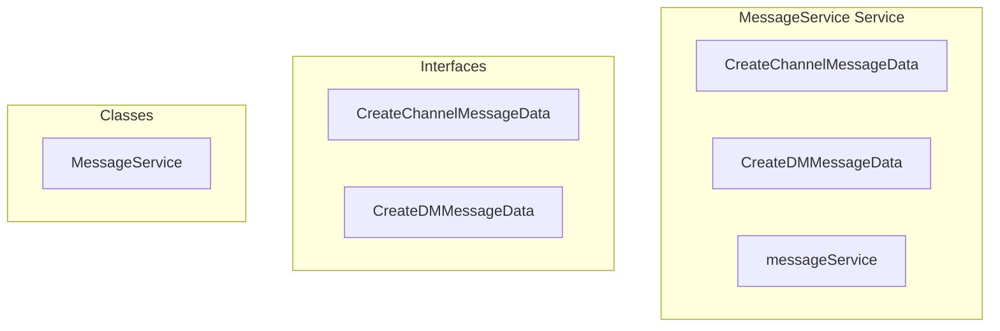

# MessageService Service

**File:** `src/services/MessageService.ts`

## Overview




## Exports

- **CreateChannelMessageData** - interface export
- **CreateDMMessageData** - interface export
- **MessageService** - class export
- **messageService** - const export


## Classes

### MessageService

No description available.

**Methods:**
- `getInstance`
- `sendChannelMessage`
- `successfully`
- `catch`
- `sendDMMessage`
- `editMessage`
- `deleteMessage`
- `toggleReaction`
- `isValidUUID`
- `getMessageReactions`
- `getBatchMessageReactions`
- `loadChannelMessages`
- `loadConversationMessages`
- `loadMessage`
- `pinMessage`
- `unpinMessage`
- `getPinnedChannelMessages`
- `getPinnedDMMessages`
- `getPinnedCount`
- `getCurrentUserProfileId`
- `createError`

**Properties:**
- `instance`
- `serverId`
- `channelId`
- `content`
- `replyTo`
- `Simplified`
- `message`
- `error`
- `conversationId`
- `automatically`
- `newContent`
- `design`
- `PRESERVES`
- `messageId`
- `emojiId`
- `added`
- `newCount`
- `result`
- `isNativeEmoji`
- `field`
- `countQuery`
- `count`
- `response`
- `UUID`
- `4122`
- `uuidRegex`
- `emoji_id`
- `emoji_name`
- `users`
- `username`
- `display_name`
- `reactions`
- `options`
- `limit`
- `before`
- `after`
- `signal`
- `messages`
- `hasMore`
- `nextCursor`
- `API`
- `PINNING`
- `DM`
- `p_message_id`
- `successfully`
- `true`
- `channel`
- `separately`
- `supabase`
- `ascending`
- `useUserData`
- `id`
- `created_at`
- `channel_id`
- `conversation_id`
- `user_id`
- `reply_to`
- `is_pinned`
- `pinned_at`
- `pinned_by`
- `metadata`
- `conversation`
- `component`
- `p_channel_id`
- `p_conversation_id`
- `0`
- `OPTIMIZED`
- `code`
- `details`


## Interfaces

### CreateChannelMessageData

No description available.

```typescript
interface CreateChannelMessageData {

  content: MessagePart[]
  channelId: string
  replyTo?: string

}
```

### CreateDMMessageData

No description available.

```typescript
interface CreateDMMessageData {

  content: MessagePart[]
  conversationId: string
  replyTo?: string

}
```


## Source Code Insights

**File Size:** 17328 characters
**Lines of Code:** 557
**Imports:** 4

## Usage Example

```typescript
import { CreateChannelMessageData, CreateDMMessageData, MessageService, messageService } from '@/services/MessageService'

// Example usage
// Use the exported functionality
```

---

*This documentation was automatically generated from the source code.*