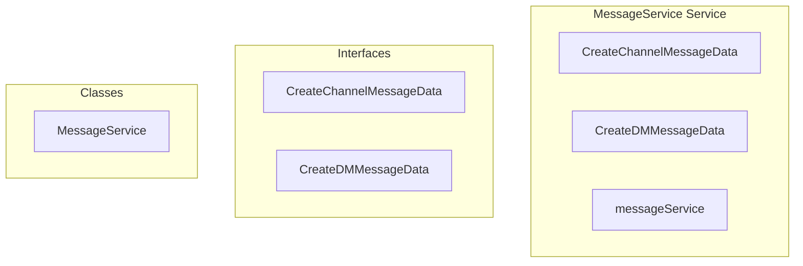

# MessageService Service

**File:** `src/services/MessageService.ts`

## Overview


```mermaid
graph TB
    subgraph "MessageService Service"
        CREATECHANNELMESSAGEDATA[CreateChannelMessageData]
        CREATEDMMESSAGEDATA[CreateDMMessageData]
        MESSAGESERVICE[MessageService]
        MESSAGESERVICE[messageService]
    end
    
    subgraph "Interfaces"
        INT_CREATECHANNELMESSAGEDATA[CreateChannelMessageData]
        INT_CREATEDMMESSAGEDATA[CreateDMMessageData]
    end
    
    subgraph "Classes"
        CLS_MESSAGESERVICE[MessageService]
    end
```


## Exports

- **CreateChannelMessageData** - interface export
- **CreateDMMessageData** - interface export
- **MessageService** - class export
- **messageService** - const export


## Classes

### MessageService

No description available.

**Methods:**
- `getInstance`
- `sendChannelMessage`
- `successfully`
- `catch`
- `sendDMMessage`
- `editMessage`
- `deleteMessage`
- `toggleReaction`
- `getMessageReactions`
- `getBatchMessageReactions`
- `loadChannelMessages`
- `loadConversationMessages`
- `loadMessage`
- `getCurrentUserProfileId`
- `createError`

**Properties:**
- `instance`
- `serverId`
- `channelId`
- `content`
- `replyTo`
- `Simplified`
- `message`
- `error`
- `conversationId`
- `automatically`
- `newContent`
- `design`
- `PRESERVES`
- `messageId`
- `emojiId`
- `added`
- `newCount`
- `result`
- `response`
- `supabase`
- `count`
- `emoji_id`
- `emoji_name`
- `users`
- `username`
- `display_name`
- `reactions`
- `options`
- `limit`
- `before`
- `after`
- `signal`
- `messages`
- `hasMore`
- `nextCursor`
- `API`
- `data`
- `code`
- `details`


## Interfaces

### CreateChannelMessageData

No description available.

```typescript
interface CreateChannelMessageData {

  content: MessagePart[]
  channelId: string
  replyTo?: string

}
```

### CreateDMMessageData

No description available.

```typescript
interface CreateDMMessageData {

  content: MessagePart[]
  conversationId: string
  replyTo?: string

}
```


## Source Code Insights

**File Size:** 12133 characters
**Lines of Code:** 384
**Imports:** 4

## Usage Example

```typescript
import { CreateChannelMessageData, CreateDMMessageData, MessageService, messageService } from '@/services/MessageService'

// Example usage
// Use the exported functionality
```

---

*This documentation was automatically generated from the source code.*