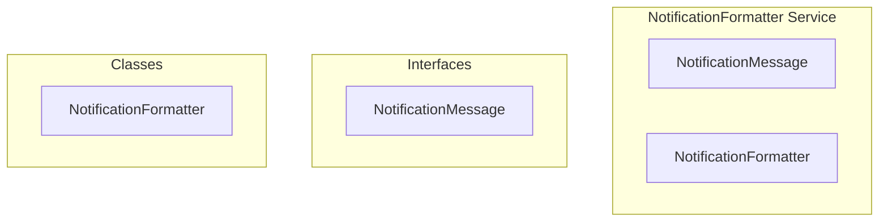

# NotificationFormatter Service

**File:** `src/services/NotificationFormatter.ts`

## Overview




## Exports

- **NotificationMessage** - interface export
- **NotificationFormatter** - class export


## Classes

### NotificationFormatter

No description available.

**Methods:**
- `formatNotification`
- `catch`
- `getPreviewText`
- `getUsername`
- `getAvatarUrl`
- `getServerName`
- `getChannelName`
- `isClickable`
- `getNavigationData`

**Properties:**
- `messages`
- `template`
- `types`
- `title`
- `message`
- `shortTitle`
- `notification`
- `data`
- `formatted`
- `format`
- `users`
- `user`
- `username`
- `object`
- `displayName`
- `fallbacks`
- `avatar`
- `fallback`
- `null`
- `IDs`
- `navigation`
- `type`
- `postId`
- `postUrl`
- `part`
- `highlightUser`
- `formats`
- `conversationId`
- `messageId`
- `serverId`
- `channelId`


## Interfaces

### NotificationMessage

No description available.

```typescript
interface NotificationMessage {

  title: string
  message: string
  shortTitle?: string // For badges/compact views

}
```


## Constants

### MESSAGE_TEMPLATES

No description available.

```typescript
const MESSAGE_TEMPLATES = {
```


## Source Code Insights

**File Size:** 18364 characters
**Lines of Code:** 514
**Imports:** 3

## Usage Example

```typescript
import { NotificationMessage, NotificationFormatter } from '@/services/NotificationFormatter'

// Example usage
// Use the exported functionality
```

---

*This documentation was automatically generated from the source code.*