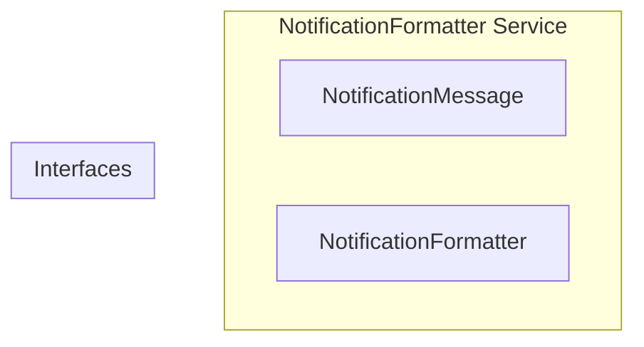

# NotificationFormatter Service

**File:** `src/services/NotificationFormatter.ts`

## Overview


```mermaid
graph TB
    subgraph "NotificationFormatter Service"
        NOTIFICATIONMESSAGE[NotificationMessage]
        NOTIFICATIONFORMATTER[NotificationFormatter]
    end
    
    
    
    subgraph "Interfaces"
        NOTIFICATIONMESSAGE[NotificationMessage]
    end
```

## Exports

- **NotificationMessage** - No description
- **NotificationFormatter** - No description


## Classes

### NotificationFormatter

No description available.

**Methods:**
- `formatNotification`
- `if`

**Properties:**
- `notification`
- `template`
- `title`
- `message`
- `shortTitle`


## Interfaces

### NotificationMessage

No description available.

```typescript
export interface NotificationMessage {
  title: string
  message: string
  shortTitle?: string // For badges/compact views
}
```


## Constants

### MESSAGE_TEMPLATES

No description available.

```typescript
const MESSAGE_TEMPLATES = {
```


## Source Code Insights

**File Size:** 11206 characters
**Lines of Code:** 316
**Imports:** 1

## Usage Example

```typescript
import { NotificationMessage, NotificationFormatter } from '@/services/NotificationFormatter.ts'

// Example usage
// Use the exported functionality
```

---

*This documentation was automatically generated from the source code.*