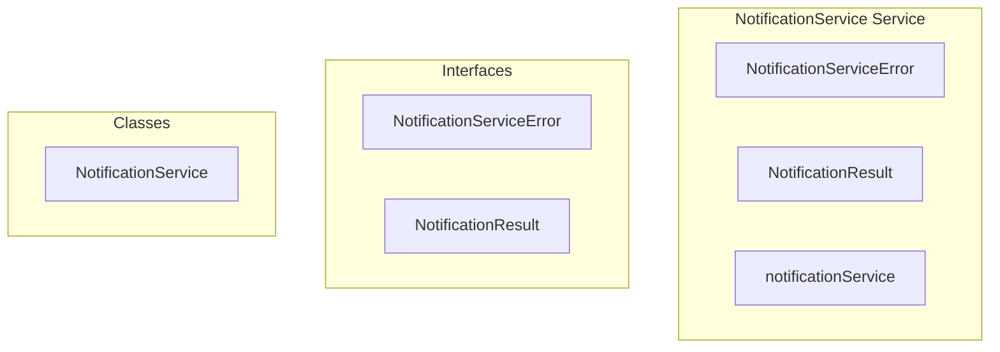

# NotificationService Service

**File:** `src/services/NotificationService.ts`

## Overview




## Exports

- **NotificationServiceError** - interface export
- **NotificationResult** - interface export
- **NotificationService** - class export
- **notificationService** - const export


## Classes

### NotificationService

No description available.

**Methods:**
- `getInstance`
- `sendNotification`
- `catch`
- `fetchNotifications`
- `_fetchNotificationsDirect`
- `markAsRead`
- `markAllAsRead`
- `deleteNotification`
- `getUnreadCount`
- `loadPreferences`
- `updatePreferences`
- `createError`

**Properties:**
- `instance`
- `system`
- `type`
- `toUserId`
- `data`
- `options`
- `serverId`
- `channelId`
- `conversationId`
- `activityId`
- `category`
- `notification_type`
- `to_user_id`
- `notification_data`
- `server_id`
- `channel_id`
- `conversation_id`
- `activity_id`
- `success`
- `notification`
- `error`
- `pagination`
- `Note`
- `userId`
- `limit`
- `offset`
- `unreadOnly`
- `layer`
- `p_user_id`
- `p_limit`
- `p_offset`
- `p_unread_only`
- `p_notification_types`
- `fails`
- `query`
- `notifications`
- `method`
- `read_at`
- `ascending`
- `read`
- `supabase`
- `is_read`
- `true`
- `user`
- `count`
- `0`
- `preferences`
- `null`
- `user_id`
- `onConflict`
- `updated`
- `METHODS`
- `message`
- `details`


## Interfaces

### NotificationServiceError

No description available.

```typescript
interface NotificationServiceError {

  code: string
  message: string
  details?: any

}
```

### NotificationResult

No description available.

```typescript
interface NotificationResult {

  success: boolean
  notificationIds?: string[]

}
```


## Source Code Insights

**File Size:** 9021 characters
**Lines of Code:** 336
**Imports:** 3

## Usage Example

```typescript
import { NotificationServiceError, NotificationResult, NotificationService, notificationService } from '@/services/NotificationService'

// Example usage
// Use the exported functionality
```

---

*This documentation was automatically generated from the source code.*