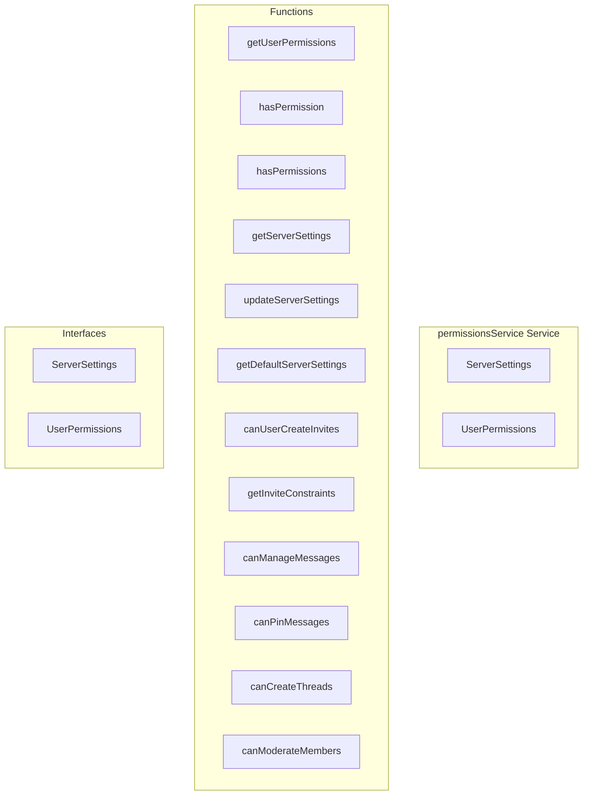

# permissionsService Service

**File:** `src/services/permissionsService.ts`

## Overview




## Exports

- **ServerSettings** - interface export
- **UserPermissions** - interface export

## Functions

### `getUserPermissions(userId: string, serverId: string)`

No description available.

**Parameters:**
- `userId: string`
- `serverId: string`

**Returns:** `Promise&lt;UserPermissions&gt;`

```typescript
/**
 * Get comprehensive user permissions for a server
 * Uses the new role-based permission system
 */
async function getUserPermissions(userId: string, serverId: string): Promise<UserPermissions>
```

### `hasPermission(userId: string, serverId: string, permission: Permission, channelId?: string)`

No description available.

**Parameters:**
- `userId: string`
- `serverId: string`
- `permission: Permission`
- `channelId?: string`

**Returns:** `Promise&lt;boolean&gt;`

```typescript
/**
 * Check if user has a specific permission
 */
async function hasPermission(
  userId: string,
  serverId: string,
  permission: Permission,
  channelId?: string
): Promise<boolean>
```

### `hasPermissions(userId: string, serverId: string, permissions: Permission[], channelId?: string)`

No description available.

**Parameters:**
- `userId: string`
- `serverId: string`
- `permissions: Permission[]`
- `channelId?: string`

**Returns:** `Promise&lt;boolean&gt;`

```typescript
/**
 * Check if user has all specified permissions
 */
async function hasPermissions(
  userId: string,
  serverId: string,
  permissions: Permission[],
  channelId?: string
): Promise<boolean>
```

### `getServerSettings(serverId: string)`

No description available.

**Parameters:**
- `serverId: string`

**Returns:** `Promise&lt;ServerSettings | null&gt;`

```typescript
/**
 * Get server settings
 */
async function getServerSettings(serverId: string): Promise<ServerSettings | null>
```

### `updateServerSettings(serverId: string, settings: Partial&lt;ServerSettings&gt;)`

No description available.

**Parameters:**
- `serverId: string`
- `settings: Partial&lt;ServerSettings&gt;`

**Returns:** `Promise&lt;boolean&gt;`

```typescript
/**
 * Update server settings
 */
async function updateServerSettings(serverId: string, settings: Partial<ServerSettings>): Promise<boolean>
```

### `getDefaultServerSettings(serverId: string)`

No description available.

**Parameters:**
- `serverId: string`

**Returns:** `ServerSettings`

```typescript
/**
 * Get default server settings
 */
function getDefaultServerSettings(serverId: string): ServerSettings
```

### `canUserCreateInvites(userId: string, serverId: string)`

No description available.

**Parameters:**
- `userId: string`
- `serverId: string`

**Returns:** `Promise&lt;boolean&gt;`

```typescript
/**
 * Check if user can create invites
 */
async function canUserCreateInvites(userId: string, serverId: string): Promise<boolean>
```

### `getInviteConstraints(userId: string, serverId: string)`

No description available.

**Parameters:**
- `userId: string`
- `serverId: string`

**Returns:** `Promise&lt;`

```typescript
/**
 * Get invite constraints for a user
 */
async function getInviteConstraints(userId: string, serverId: string): Promise<
```

### `canManageMessages(userId: string, serverId: string, channelId?: string)`

No description available.

**Parameters:**
- `userId: string`
- `serverId: string`
- `channelId?: string`

**Returns:** `Promise&lt;boolean&gt;`

```typescript
/**
 * Check if user can manage messages (edit/delete others' messages, pin)
 */
async function canManageMessages(userId: string, serverId: string, channelId?: string): Promise<boolean>
```

### `canPinMessages(userId: string, serverId: string, channelId?: string)`

No description available.

**Parameters:**
- `userId: string`
- `serverId: string`
- `channelId?: string`

**Returns:** `Promise&lt;boolean&gt;`

```typescript
/**
 * Check if user can pin messages
 */
async function canPinMessages(userId: string, serverId: string, channelId?: string): Promise<boolean>
```

### `canCreateThreads(userId: string, serverId: string, channelId?: string)`

No description available.

**Parameters:**
- `userId: string`
- `serverId: string`
- `channelId?: string`

**Returns:** `Promise&lt;boolean&gt;`

```typescript
/**
 * Check if user can create threads
 */
async function canCreateThreads(userId: string, serverId: string, channelId?: string): Promise<boolean>
```

### `canModerateMembers(userId: string, serverId: string)`

No description available.

**Parameters:**
- `userId: string`
- `serverId: string`

**Returns:** `Promise&lt;boolean&gt;`

```typescript
/**
 * Check if user can kick/ban members
 */
async function canModerateMembers(userId: string, serverId: string): Promise<boolean>
```


## Interfaces

### ServerSettings

No description available.

```typescript
interface ServerSettings {

  id: string
  server_id: string
  default_role_id?: string
  invite_permissions: {
    who_can_create: 'everyone' | 'roles' | 'administrators'
    allowed_roles?: string[]
    default_expiration: number // minutes, 0 = never
    max_expiration: number // minutes, 0 = no limit
    allow_temporary: boolean
    max_uses_limit: number // 0 = no limit
  }
  moderation_settings?: {
    auto_mod_enabled: boolean
    spam_filter: boolean
    link_filter: boolean
  }
  created_at?: string
  updated_at?
  // ...
}
```

### UserPermissions

No description available.

```typescript
interface UserPermissions {

  userId: string
  serverId: string
  permissions: Permission[]
  roles: ServerRole[]
  isOwner: boolean
  isAdmin: boolean

}
```


## Source Code Insights

**File Size:** 9095 characters
**Lines of Code:** 334
**Imports:** 3

## Usage Example

```typescript
import { ServerSettings, UserPermissions } from '@/services/permissionsService'

// Example usage
getUserPermissions()
```

---

*This documentation was automatically generated from the source code.*