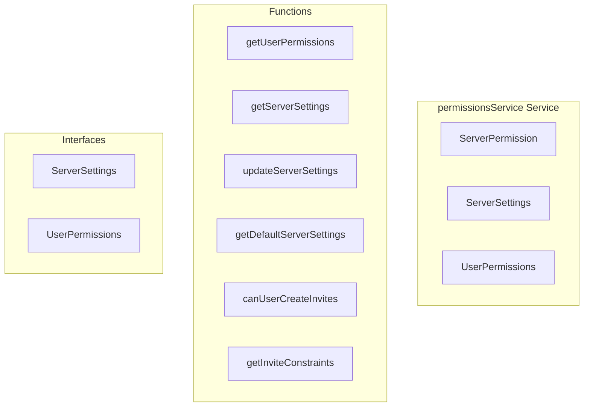

# permissionsService Service

**File:** `src/services/permissionsService.ts`

## Overview


```mermaid
graph TB
    subgraph "permissionsService Service"
        SERVERPERMISSION[ServerPermission]
        SERVERSETTINGS[ServerSettings]
        USERPERMISSIONS[UserPermissions]
    end
    
    subgraph "Functions"
        FN_GETUSERPERMISSIONS[getUserPermissions]
        FN_GETSERVERSETTINGS[getServerSettings]
        FN_UPDATESERVERSETTINGS[updateServerSettings]
        FN_GETDEFAULTSERVERSETTINGS[getDefaultServerSettings]
        FN_CANUSERCREATEINVITES[canUserCreateInvites]
        FN_GETINVITECONSTRAINTS[getInviteConstraints]
    end
    
    subgraph "Interfaces"
        INT_SERVERSETTINGS[ServerSettings]
        INT_USERPERMISSIONS[UserPermissions]
    end
```


## Exports

- **ServerPermission** - enum export
- **ServerSettings** - interface export
- **UserPermissions** - interface export

## Functions

### `getUserPermissions(userId: string, serverId: string)`

No description available.

**Parameters:**
- `userId: string`
- `serverId: string`

**Returns:** `Promise&lt;UserPermissions&gt;`

```typescript
async function getUserPermissions(userId: string, serverId: string): Promise<UserPermissions>
```

### `getServerSettings(serverId: string)`

No description available.

**Parameters:**
- `serverId: string`

**Returns:** `Promise&lt;ServerSettings | null&gt;`

```typescript
async function getServerSettings(serverId: string): Promise<ServerSettings | null>
```

### `updateServerSettings(serverId: string, settings: Partial&lt;ServerSettings&gt;)`

No description available.

**Parameters:**
- `serverId: string`
- `settings: Partial&lt;ServerSettings&gt;`

**Returns:** `Promise&lt;boolean&gt;`

```typescript
async function updateServerSettings(serverId: string, settings: Partial<ServerSettings>): Promise<boolean>
```

### `getDefaultServerSettings(serverId: string)`

No description available.

**Parameters:**
- `serverId: string`

**Returns:** `ServerSettings`

```typescript
function getDefaultServerSettings(serverId: string): ServerSettings
```

### `canUserCreateInvites(userId: string, serverId: string)`

No description available.

**Parameters:**
- `userId: string`
- `serverId: string`

**Returns:** `Promise&lt;boolean&gt;`

```typescript
async function canUserCreateInvites(userId: string, serverId: string): Promise<boolean>
```

### `getInviteConstraints(userId: string, serverId: string)`

No description available.

**Parameters:**
- `userId: string`
- `serverId: string`

**Returns:** `Promise&lt;`

```typescript
async function getInviteConstraints(userId: string, serverId: string): Promise<
```


## Interfaces

### ServerSettings

No description available.

```typescript
interface ServerSettings {

  id: string
  server_id: string
  invite_permissions: {
    who_can_create: 'everyone' | 'roles' | 'administrators'
    allowed_roles?: string[]
    default_expiration: number // minutes, 0 = never
    max_expiration: number // minutes, 0 = no limit
    allow_temporary: boolean
    max_uses_limit: number // 0 = no limit
  }
  created_at?: string
  updated_at?: string

}
```

### UserPermissions

No description available.

```typescript
interface UserPermissions {

  userId: string
  serverId: string
  permissions: ServerPermission[]
  roles: string[]
  isOwner: boolean
  isAdmin: boolean

}
```


## Source Code Insights

**File Size:** 7392 characters
**Lines of Code:** 276
**Imports:** 2

## Usage Example

```typescript
import { ServerPermission, ServerSettings, UserPermissions } from '@/services/permissionsService'

// Example usage
getUserPermissions()
```

---

*This documentation was automatically generated from the source code.*