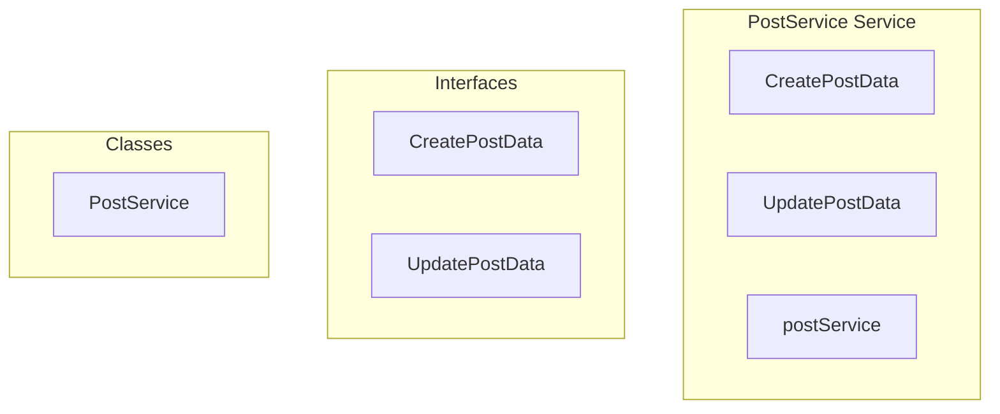

# PostService Service

**File:** `src/services/PostService.ts`

## Overview




## Exports

- **CreatePostData** - interface export
- **UpdatePostData** - interface export
- **PostService** - class export
- **postService** - const export


## Classes

### PostService

No description available.

**Methods:**
- `getInstance`
- `createPost`
- `catch`
- `updatePost`
- `deletePost`
- `toggleLike`
- `toggleShare`
- `toggleReblog`
- `toggleBookmark`
- `toggleReaction`
- `isValidUUID`
- `loadTimelinePosts`
- `loadPost`
- `getPostReactions`
- `getCurrentUserProfileId`
- `createError`

**Properties:**
- `instance`
- `Simplified`
- `automatically`
- `post`
- `error`
- `updates`
- `PRESERVES`
- `liked`
- `newCount`
- `result`
- `implementation`
- `code`
- `shared`
- `PostService`
- `dependencies`
- `compatibility`
- `reblogged`
- `UI`
- `bookmarked`
- `emojiId`
- `coreResult`
- `isNativeEmoji`
- `field`
- `countQuery`
- `count`
- `added`
- `UUID`
- `4122`
- `uuidRegex`
- `timelineType`
- `options`
- `limit`
- `before`
- `after`
- `signal`
- `posts`
- `hasMore`
- `nextCursor`
- `coreTimelineType`
- `API`
- `found`
- `emoji_id`
- `emoji_name`
- `users`
- `username`
- `display_name`
- `reactions`
- `OPTIMIZED`
- `message`
- `details`


## Interfaces

### CreatePostData

No description available.

```typescript
interface CreatePostData {

  content: MessagePart[]
  visibility: 'public' | 'unlisted' | 'followers' | 'direct'
  content_warning?: string
  in_reply_to?: string
  media_attachments?: any[]
  is_sensitive?: boolean
  language?: string

}
```

### UpdatePostData

No description available.

```typescript
interface UpdatePostData {

  content?: MessagePart[]
  content_warning?: string
  is_sensitive?: boolean

}
```


## Source Code Insights

**File Size:** 12934 characters
**Lines of Code:** 391
**Imports:** 4

## Usage Example

```typescript
import { CreatePostData, UpdatePostData, PostService, postService } from '@/services/PostService'

// Example usage
// Use the exported functionality
```

---

*This documentation was automatically generated from the source code.*