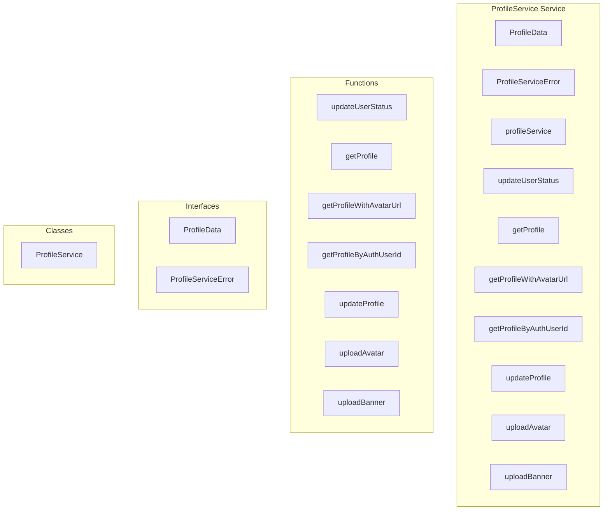

# ProfileService Service

**File:** `src/services/ProfileService.ts`

## Overview


```mermaid
graph TB
    subgraph "ProfileService Service"
        PROFILEDATA[ProfileData]
        PROFILESERVICEERROR[ProfileServiceError]
        PROFILESERVICE[ProfileService]
        PROFILESERVICE[profileService]
        UPDATEUSERSTATUS[updateUserStatus]
        GETPROFILE[getProfile]
        GETPROFILEWITHAVATARURL[getProfileWithAvatarUrl]
        GETPROFILEBYAUTHUSERID[getProfileByAuthUserId]
        UPDATEPROFILE[updateProfile]
        UPLOADAVATAR[uploadAvatar]
        UPLOADBANNER[uploadBanner]
    end
    
    subgraph "Functions"
        FN_UPDATEUSERSTATUS[updateUserStatus]
        FN_GETPROFILE[getProfile]
        FN_GETPROFILEWITHAVATARURL[getProfileWithAvatarUrl]
        FN_GETPROFILEBYAUTHUSERID[getProfileByAuthUserId]
        FN_UPDATEPROFILE[updateProfile]
        FN_UPLOADAVATAR[uploadAvatar]
        FN_UPLOADBANNER[uploadBanner]
    end
    
    subgraph "Interfaces"
        INT_PROFILEDATA[ProfileData]
        INT_PROFILESERVICEERROR[ProfileServiceError]
    end
    
    subgraph "Classes"
        CLS_PROFILESERVICE[ProfileService]
    end
```


## Exports

- **ProfileData** - interface export
- **ProfileServiceError** - interface export
- **ProfileService** - class export
- **profileService** - const export
- **updateUserStatus** - const export
- **getProfile** - const export
- **getProfileWithAvatarUrl** - const export
- **getProfileByAuthUserId** - const export
- **updateProfile** - const export
- **uploadAvatar** - const export
- **uploadBanner** - const export

## Functions

### `updateUserStatus(userId: string, status: number)`

No description available.

**Parameters:**
- `userId: string`
- `status: number`

**Returns:** `Unknown`

```typescript
export const updateUserStatus = (userId: string, status: number) =>
```

### `getProfile(userId: string)`

No description available.

**Parameters:**
- `userId: string`

**Returns:** `Unknown`

```typescript
export const getProfile = (userId: string) =>
```

### `getProfileWithAvatarUrl(userId: string)`

No description available.

**Parameters:**
- `userId: string`

**Returns:** `Unknown`

```typescript
export const getProfileWithAvatarUrl = (userId: string) =>
```

### `getProfileByAuthUserId(authUserId: string)`

No description available.

**Parameters:**
- `authUserId: string`

**Returns:** `Unknown`

```typescript
export const getProfileByAuthUserId = (authUserId: string) =>
```

### `updateProfile(profileData: ProfileData)`

No description available.

**Parameters:**
- `profileData: ProfileData`

**Returns:** `Unknown`

```typescript
export const updateProfile = (profileData: ProfileData) =>
```

### `uploadAvatar(file: File, userId: string)`

No description available.

**Parameters:**
- `file: File`
- `userId: string`

**Returns:** `Unknown`

```typescript
export const uploadAvatar = (file: File, userId: string) =>
```

### `uploadBanner(file: File, userId: string)`

No description available.

**Parameters:**
- `file: File`
- `userId: string`

**Returns:** `Unknown`

```typescript
export const uploadBanner = (file: File, userId: string) =>
```


## Classes

### ProfileService

No description available.

**Methods:**
- `getInstance`
- `getCurrentProfile`
- `catch`
- `updateCurrentProfile`
- `createProfile`
- `getProfileById`
- `getProfileByUsername`
- `searchProfiles`
- `checkUsernameAvailability`
- `createError`
- `updateUserStatus`
- `fetchProfile`
- `fetchProfileByAuthUserId`
- `updateProfile`
- `isProfileComplete`
- `getProfileWithAvatarUrl`
- `uploadAvatar`
- `uploadBanner`

**Properties:**
- `instance`
- `profile`
- `lookup`
- `context`
- `data`
- `error`
- `automatically`
- `cache`
- `auth_user_id`
- `userDataService`
- `ID`
- `username`
- `domain`
- `query`
- `profiles`
- `options`
- `limit`
- `offset`
- `includeFederated`
- `hasMore`
- `total`
- `searchQuery`
- `count`
- `availability`
- `available`
- `reason`
- `message`
- `code`
- `details`
- `status`
- `supabase`
- `useCache`
- `service`
- `null`
- `userId`
- `url`
- `imports`
- `result`
- `URL`
- `avatar_url`
- `success`
- `avatar`
- `banner_url`
- `banner`


## Interfaces

### ProfileData

No description available.

```typescript
interface ProfileData {

  username?: string
  display_name?: string
  avatar_url?: string
  banner_url?: string
  bio?: string
  color?: string

}
```

### ProfileServiceError

No description available.

```typescript
interface ProfileServiceError {

  code: string
  message: string
  details?: any

}
```


## Source Code Insights

**File Size:** 11877 characters
**Lines of Code:** 433
**Imports:** 5

## Usage Example

```typescript
import { ProfileData, ProfileServiceError, ProfileService, profileService, updateUserStatus, getProfile, getProfileWithAvatarUrl, getProfileByAuthUserId, updateProfile, uploadAvatar, uploadBanner } from '@/services/ProfileService'

// Example usage
updateUserStatus()
```

---

*This documentation was automatically generated from the source code.*