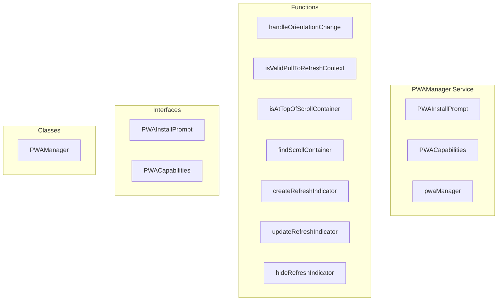

# PWAManager Service

**File:** `src/services/PWAManager.ts`

## Overview




## Exports

- **PWAInstallPrompt** - interface export
- **PWACapabilities** - interface export
- **PWAManager** - class export
- **pwaManager** - const export

## Functions

### `handleOrientationChange()`

No description available.

**Parameters:**
None

**Returns:** `Unknown`

```typescript
const handleOrientationChange = () =>
```

### `isValidPullToRefreshContext(target: Element)`

No description available.

**Parameters:**
- `target: Element`

**Returns:** `boolean`

```typescript
const isValidPullToRefreshContext = (target: Element): boolean =>
```

### `isAtTopOfScrollContainer(container: Element)`

No description available.

**Parameters:**
- `container: Element`

**Returns:** `boolean`

```typescript
const isAtTopOfScrollContainer = (container: Element): boolean =>
```

### `findScrollContainer(target: Element)`

No description available.

**Parameters:**
- `target: Element`

**Returns:** `Element | null`

```typescript
const findScrollContainer = (target: Element): Element | null =>
```

### `createRefreshIndicator()`

No description available.

**Parameters:**
None

**Returns:** `Unknown`

```typescript
const createRefreshIndicator = () =>
```

### `updateRefreshIndicator(progress: number)`

No description available.

**Parameters:**
- `progress: number`

**Returns:** `Unknown`

```typescript
const updateRefreshIndicator = (progress: number) =>
```

### `hideRefreshIndicator()`

No description available.

**Parameters:**
None

**Returns:** `Unknown`

```typescript
const hideRefreshIndicator = () =>
```


## Classes

### PWAManager

No description available.

**Methods:**
- `getInstance`
- `initialize`
- `detectCapabilities`
- `setupInstallPrompt`
- `setupNativeAppBehaviors`
- `setupFocusManagement`
- `setupKeyboardShortcuts`
- `setupNativeScrolling`
- `setupOrientationHandling`
- `setupShareTarget`
- `setupAppShortcuts`
- `setupBadgeAPI`
- `updateBadge`
- `catch`
- `showInstallPrompt`
- `shareContent`
- `setupPullToRefresh`
- `isAtTopOfScrollContainer`
- `setupSafeAreas`
- `preventDoubleClickZoom`
- `isAppInstalled`
- `isStandaloneMode`
- `isMobileDevice`
- `notifyInstallAvailable`
- `notifyAppInstalled`
- `handleSharedContent`
- `showPullToRefreshIndicator`
- `hidePullToRefreshIndicator`
- `hideLoadingScreen`
- `triggerRefresh`
- `getCapabilities`
- `isSupported`

**Properties:**
- `instance`
- `installPrompt`
- `capabilities`
- `canInstall`
- `isInstalled`
- `isStandalone`
- `supportsNotifications`
- `supportsBackgroundSync`
- `supportsShare`
- `supportsBadging`
- `supportsShortcuts`
- `features`
- `Manager`
- `handling`
- `behaviors`
- `shortcuts`
- `API`
- `ready`
- `any`
- `true`
- `event`
- `null`
- `false`
- `feel`
- `inputs`
- `target`
- `areas`
- `tap`
- `management`
- `PWA`
- `behavior`
- `navigation`
- `accessibility`
- `lastFocusedElement`
- `users`
- `focus`
- `actions`
- `refresh`
- `reload`
- `UX`
- `iOS`
- `body`
- `handleOrientationChange`
- `changes`
- `detail`
- `orientation`
- `angle`
- `browsers`
- `vh`
- `setup`
- `urlParams`
- `sharedData`
- `title`
- `text`
- `url`
- `path`
- `shortcut`
- `count`
- `prompt`
- `result`
- `contexts`
- `startY`
- `currentY`
- `pullDistance`
- `pullThreshold`
- `maxPull`
- `isPulling`
- `hasHapticTriggered`
- `refreshIndicator`
- `validScrollContainer`
- `validSelectors`
- `feeds`
- `messages`
- `container`
- `ID`
- `isValidPullToRefreshContext`
- `isAtTopOfScrollContainer`
- `top`
- `0`
- `findScrollContainer`
- `element`
- `current`
- `computedStyle`
- `overflowY`
- `createRefreshIndicator`
- `viewBox`
- `fill`
- `styles`
- `position`
- `left`
- `right`
- `height`
- `background`
- `display`
- `alignItems`
- `justifyContent`
- `color`
- `transform`
- `transition`
- `zIndex`
- `pointerEvents`
- `updateRefreshIndicator`
- `indicator`
- `normalizedProgress`
- `icon`
- `crossedThreshold`
- `threshold`
- `pattern`
- `hideRefreshIndicator`
- `isAtTop`
- `passive`
- `move`
- `devices`
- `lastTouchEnd`
- `now`
- `methods`
- `listen`
- `data`
- `UI`
- `screen`
- `loadingElement`
- `animation`
- `supported`


## Interfaces

### PWAInstallPrompt

No description available.

```typescript
interface PWAInstallPrompt {

  prompt(): Promise<void>
  userChoice: Promise<{ outcome: 'accepted' | 'dismissed' }>

}
```

### PWACapabilities

No description available.

```typescript
interface PWACapabilities {

  canInstall: boolean
  isInstalled: boolean
  isStandalone: boolean
  supportsNotifications: boolean
  supportsBackgroundSync: boolean
  supportsShare: boolean
  supportsBadging: boolean
  supportsShortcuts: boolean

}
```


## Source Code Insights

**File Size:** 19914 characters
**Lines of Code:** 681
**Imports:** 2

## Usage Example

```typescript
import { PWAInstallPrompt, PWACapabilities, PWAManager, pwaManager } from '@/services/PWAManager'

// Example usage
handleOrientationChange()
```

---

*This documentation was automatically generated from the source code.*