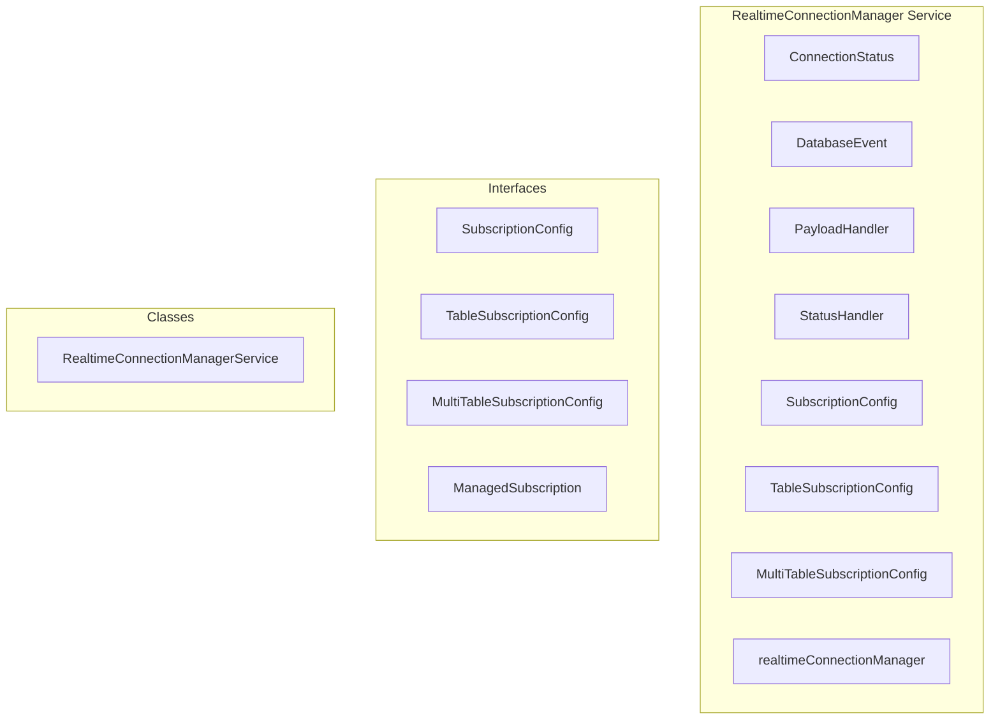

# RealtimeConnectionManager Service

**File:** `src/services/RealtimeConnectionManager.ts`

## Overview




## Exports

- **ConnectionStatus** - type export
- **DatabaseEvent** - type export
- **PayloadHandler** - type export
- **StatusHandler** - type export
- **SubscriptionConfig** - interface export
- **TableSubscriptionConfig** - interface export
- **MultiTableSubscriptionConfig** - interface export
- **realtimeConnectionManager** - const export


## Classes

### RealtimeConnectionManagerService

No description available.

**Methods:**
- `initialize`
- `cleanup`
- `subscribeToTable`
- `subscribeToMultipleTables`
- `subscribe`
- `connectTableSubscription`
- `catch`
- `connectMultiTableSubscription`
- `connectSingleSubscription`
- `reconnect`
- `switch`
- `handleSubscriptionStatus`
- `updateSubscriptionStatus`
- `updateGlobalStatus`
- `notifyStatusListeners`
- `scheduleReconnect`
- `forceReconnect`
- `forceReconnectAll`
- `forceGlobalReconnect`
- `unsubscribe`
- `unsubscribeAll`
- `startHealthCheck`
- `stopHealthCheck`
- `performHealthCheck`
- `getStatus`
- `getSubscriptionStatus`
- `hasSubscription`
- `getSubscriptionCount`
- `getAllStatuses`
- `getDebugInfo`

**Properties:**
- `subscriptions`
- `globalStatus`
- `statusListeners`
- `healthCheckInterval`
- `authListener`
- `initialized`
- `isReconnecting`
- `Methods`
- `manager`
- `true`
- `RealtimeManager`
- `data`
- `unmounts`
- `null`
- `false`
- `DELETE`
- `unsubscribe`
- `channelName`
- `table`
- `filter`
- `onInsert`
- `onUpdate`
- `onDelete`
- `onStatusChange`
- `config`
- `managedSub`
- `configType`
- `channel`
- `status`
- `retryCount`
- `retryTimeoutId`
- `lastConnectedAt`
- `lastErrorAt`
- `lastError`
- `rapidCloseCount`
- `lastClosedAt`
- `tables`
- `compatibility`
- `schema`
- `handler`
- `event`
- `type`
- `break`
- `Management`
- `0`
- `now`
- `timeSinceConnect`
- `longer`
- `again`
- `wait`
- `cooldown`
- `count`
- `listener`
- `hasConnected`
- `hasConnecting`
- `hasReconnecting`
- `hasError`
- `newStatus`
- `Logic`
- `baseDelay`
- `jitter`
- `delay`
- `subscription`
- `connecting`
- `reconnecting`
- `it`
- `reconnects`
- `globally`
- `sparingly`
- `attempts`
- `realtimeClient`
- `recursion`
- `Unsubscription`
- `retry`
- `IMPORTANT`
- `reconnect`
- `channels`
- `Check`
- `automatically`
- `long`
- `reconnection`
- `timeSinceError`
- `API`
- `exists`
- `debugging`
- `statuses`
- `info`
- `channelState`
- `subscriptionCount`
- `healthCheckRunning`


## Interfaces

### SubscriptionConfig

No description available.

```typescript
interface SubscriptionConfig {

  channelName: string
  table: string
  schema?: string
  event?: DatabaseEvent
  filter?: string
  onPayload: PayloadHandler
  onStatusChange?: (status: ConnectionStatus) => void

}
```

### TableSubscriptionConfig

No description available.

```typescript
interface TableSubscriptionConfig {

  /** Unique channel name for this subscription */
  channelName: string
  /** Database table to subscribe to */
  table: string
  /** Database schema (default: 'public') */
  schema?: string
  /** PostgREST filter (e.g., 'channel_id=eq.123') */
  filter?: string
  /** Handler for INSERT events */
  onInsert?: PayloadHandler
  /** Handler for UPDATE events */
  onUpdate?: PayloadHandler
  /** Handler for DELETE events */
  onDelete?: PayloadHandler
  /** Handler for status changes */
  onStatus
  // ...
}
```

### MultiTableSubscriptionConfig

No description available.

```typescript
interface MultiTableSubscriptionConfig {

  /** Unique channel name for this subscription */
  channelName: string
  /** Tables to subscribe to */
  tables: Array<{
    table: string
    schema?: string
    filter?: string
    onInsert?: PayloadHandler
    onUpdate?: PayloadHandler
    onDelete?: PayloadHandler
  }>
  /** Handler for status changes */
  onStatusChange?: StatusHandler

}
```

### ManagedSubscription

No description available.

```typescript
interface ManagedSubscription {

  config: SubscriptionConfig | TableSubscriptionConfig | MultiTableSubscriptionConfig
  configType: 'single' | 'table' | 'multi'
  channel: RealtimeChannel | null
  status: ConnectionStatus
  retryCount: number
  retryTimeoutId: ReturnType<typeof setTimeout> | null
  lastConnectedAt: Date | null
  lastErrorAt: Date | null
  lastError: string | null
  // Track rapid close cycles to detect server-side rejection
  rapidCloseCount: number
  lastClosedAt: Date | null

}
```


## Type Definitions

### ConnectionStatus

No description available.

```typescript
/**
 * RealtimeConnectionManager
 * 
 * Professional-grade wrapper for Supabase realtime subscriptions with:
 * - Automatic reconnection with exponential backoff
 * - Connection health monitoring  
 * - Centralized subscription management
 * - Status tracking and callbacks
 * - Multi-event support (INSERT, UPDATE, DELETE)
 * - Global visibility and auth token refresh handling
 * 
 * Architecture similar to Discord/Slack for reliability.
 */

import { supabase } from '@/supabase'
import { debug }...
```


## Constants

### RETRY_CONFIG

No description available.

```typescript
const RETRY_CONFIG = {
```

### HEALTH_CHECK_INTERVAL

No description available.

```typescript
const HEALTH_CHECK_INTERVAL = 60000  // 60 seconds - just a safety net, not aggressive
```

### STALE_CONNECTION_THRESHOLD

No description available.

```typescript
const STALE_CONNECTION_THRESHOLD = 5 * 60 * 1000  // 5 minutes - very conservative
```


## Source Code Insights

**File Size:** 31698 characters
**Lines of Code:** 950
**Imports:** 3

## Usage Example

```typescript
import { ConnectionStatus, DatabaseEvent, PayloadHandler, StatusHandler, SubscriptionConfig, TableSubscriptionConfig, MultiTableSubscriptionConfig, realtimeConnectionManager } from '@/services/RealtimeConnectionManager'

// Example usage
// Use the exported functionality
```

---

*This documentation was automatically generated from the source code.*