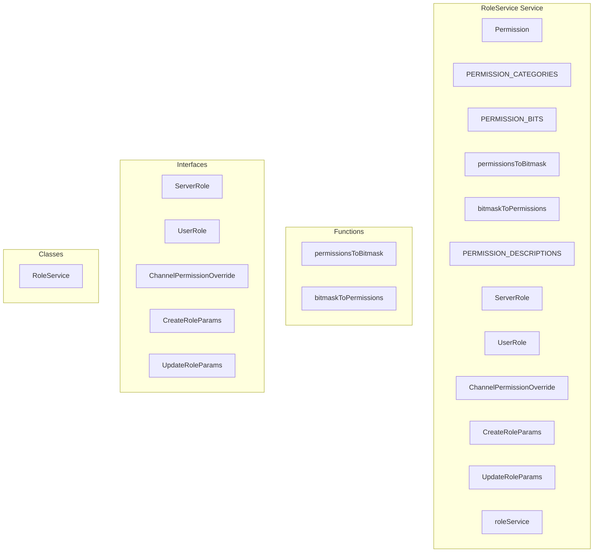

# RoleService Service

**File:** `src/services/RoleService.ts`

## Overview




## Exports

- **Permission** - enum export
- **PERMISSION_CATEGORIES** - const export
- **PERMISSION_BITS** - const export
- **permissionsToBitmask** - function export
- **bitmaskToPermissions** - function export
- **PERMISSION_DESCRIPTIONS** - const export
- **ServerRole** - interface export
- **UserRole** - interface export
- **ChannelPermissionOverride** - interface export
- **CreateRoleParams** - interface export
- **UpdateRoleParams** - interface export
- **roleService** - const export

## Functions

### `permissionsToBitmask(permissions: Record&lt;Permission, boolean&gt; | Partial&lt;Record&lt;Permission, boolean&gt;&gt;)`

No description available.

**Parameters:**
- `permissions: Record&lt;Permission, boolean&gt; | Partial&lt;Record&lt;Permission, boolean&gt;&gt;`

**Returns:** `bigint`

```typescript
/**
 * Convert permissions object to bigint bitmask for database storage
 */
export function permissionsToBitmask(permissions: Record<Permission, boolean> | Partial<Record<Permission, boolean>>): bigint
```

### `bitmaskToPermissions(bitmask: bigint | number | string)`

No description available.

**Parameters:**
- `bitmask: bigint | number | string`

**Returns:** `Record&lt;Permission, boolean&gt;`

```typescript
/**
 * Convert bigint bitmask from database to permissions object
 */
export function bitmaskToPermissions(bitmask: bigint | number | string): Record<Permission, boolean>
```


## Classes

### RoleService

No description available.

**Methods:**
- `getServerRoles`
- `catch`
- `getRolesForServer`
- `getRole`
- `createRole`
- `updateRole`
- `deleteRole`
- `reorderRoles`
- `getUserRoles`
- `_fetchUserRoles`
- `getRoleMembers`
- `getRoleMembersForServer`
- `assignRole`
- `removeRole`
- `getUserPermissions`
- `_fetchUserPermissions`
- `hasPermission`
- `hasPermissions`
- `getChannelOverrides`
- `setChannelOverride`
- `deleteChannelOverride`
- `getHighestRole`
- `getUserColor`
- `canManageUser`
- `clearCache`
- `clearServerCache`

**Properties:**
- `roleCache`
- `userRolesCache`
- `permissionCache`
- `OPTIMIZED`
- `pendingUserRolesRequests`
- `pendingPermissionsRequests`
- `Operations`
- `server`
- `forceRefresh`
- `supabase`
- `ascending`
- `error`
- `separately`
- `roleIds`
- `memberCounts`
- `data`
- `1`
- `roles`
- `permissions`
- `member_count`
- `compatibility`
- `ID`
- `format`
- `ServerRole`
- `role`
- `null`
- `params`
- `maxPosition`
- `database`
- `permissionsBitmask`
- `0`
- `server_id`
- `name`
- `color`
- `hoist`
- `mentionable`
- `position`
- `icon_url`
- `unicode_emoji`
- `cache`
- `frontend`
- `present`
- `dbParams`
- `caches`
- `invalidation`
- `false`
- `true`
- `rolePositions`
- `updates`
- `Assignments`
- `serverId`
- `cacheKey`
- `first`
- `requests`
- `fetchPromise`
- `DB`
- `sortedRoles`
- `id`
- `username`
- `display_name`
- `avatar_url`
- `profiles`
- `members`
- `role_id`
- `query`
- `assignments`
- `user`
- `roleId`
- `user_id`
- `Note`
- `owner`
- `Calculations`
- `calculation`
- `userId`
- `channelId`
- `p_user_id`
- `p_server_id`
- `p_channel_id`
- `permission`
- `once`
- `requiredPermissions`
- `Overrides`
- `channel`
- `overrides`
- `targetType`
- `targetId`
- `allow`
- `deny`
- `channel_id`
- `target_type`
- `target_id`
- `onConflict`
- `override`
- `Methods`
- `hoistedRole`
- `managerId`
- `managerHighest`
- `targetHighest`


## Interfaces

### ServerRole

No description available.

```typescript
interface ServerRole {

  id: string
  server_id: string
  name: string
  color: string
  hoist: boolean
  mentionable: boolean
  position: number
  permissions: Record<Permission, boolean>
  icon_url?: string
  unicode_emoji?: string
  is_default?: boolean
  is_admin?: boolean
  member_count?: number
  created_at: string
  updated_at: string
  ap_id?: string
  federation_metadata?: Record<string, any>

}
```

### UserRole

No description available.

```typescript
interface UserRole {

  id: string
  user_id: string
  role_id: string
  server_id: string
  assigned_at: string
  assigned_by?: string

}
```

### ChannelPermissionOverride

No description available.

```typescript
interface ChannelPermissionOverride {

  id: string
  channel_id: string
  target_type: 'role' | 'user'
  target_id: string
  allow: Record<Permission, boolean>
  deny: Record<Permission, boolean>
  created_at: string
  updated_at: string

}
```

### CreateRoleParams

No description available.

```typescript
interface CreateRoleParams {

  server_id: string
  name: string
  color?: string
  hoist?: boolean
  mentionable?: boolean
  permissions?: Partial<Record<Permission, boolean>>
  icon_url?: string
  unicode_emoji?: string

}
```

### UpdateRoleParams

No description available.

```typescript
interface UpdateRoleParams {

  name?: string
  color?: string
  hoist?: boolean
  mentionable?: boolean
  position?: number
  permissions?: Record<Permission, boolean> | string[]
  icon_url?: string
  unicode_emoji?: string

}
```


## Constants

### PERMISSION_CATEGORIES

No description available.

```typescript
export const PERMISSION_CATEGORIES = {
```

### PERMISSION_BITS

No description available.

```typescript
export const PERMISSION_BITS: Record<Permission, number> = {
```

### PERMISSION_DESCRIPTIONS

No description available.

```typescript
export const PERMISSION_DESCRIPTIONS: Record<Permission, string> = {
```


## Source Code Insights

**File Size:** 29022 characters
**Lines of Code:** 974
**Imports:** 2

## Usage Example

```typescript
import { Permission, PERMISSION_CATEGORIES, PERMISSION_BITS, permissionsToBitmask, bitmaskToPermissions, PERMISSION_DESCRIPTIONS, ServerRole, UserRole, ChannelPermissionOverride, CreateRoleParams, UpdateRoleParams, roleService } from '@/services/RoleService'

// Example usage
permissionsToBitmask()
```

---

*This documentation was automatically generated from the source code.*