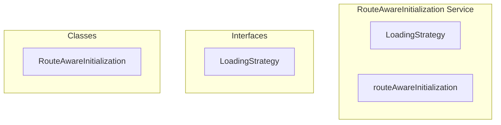

# RouteAwareInitialization Service

**File:** `src/services/RouteAwareInitialization.ts`

## Overview




## Exports

- **LoadingStrategy** - interface export
- **RouteAwareInitialization** - class export
- **routeAwareInitialization** - const export


## Classes

### RouteAwareInitialization

No description available.

**Methods:**
- `getInstance`
- `getLoadingStrategy`
- `getCriticalPathData`
- `getContentLoadingData`
- `getBackgroundLoadingData`
- `getOnDemandData`
- `logStrategy`

**Properties:**
- `instance`
- `route`
- `routeName`
- `routePath`
- `RouteAwareInitialization`
- `routes`
- `shouldLoadDMs`
- `shouldLoadAllServerPresence`
- `shouldLoadAllServerEmojis`
- `shouldLoadNotificationsFull`
- `currentServerId`
- `currentChannelId`
- `routeType`
- `currentConversationId`
- `socialRoutes`
- `criticalData`
- `contentData`
- `only`
- `onDemandData`
- `debugging`
- `Strategy`
- `Path`
- `Loading`
- `Only`


## Interfaces

### LoadingStrategy

No description available.

```typescript
interface LoadingStrategy {

  shouldLoadDMs: boolean
  shouldLoadAllServerPresence: boolean
  shouldLoadAllServerEmojis: boolean
  shouldLoadNotificationsFull: boolean
  currentServerId?: string
  currentChannelId?: string
  currentConversationId?: string
  routeType: 'server-channel' | 'dm' | 'dm-list' | 'social' | 'other'

}
```


## Source Code Insights

**File Size:** 7586 characters
**Lines of Code:** 207
**Imports:** 2

## Usage Example

```typescript
import { LoadingStrategy, RouteAwareInitialization, routeAwareInitialization } from '@/services/RouteAwareInitialization'

// Example usage
// Use the exported functionality
```

---

*This documentation was automatically generated from the source code.*