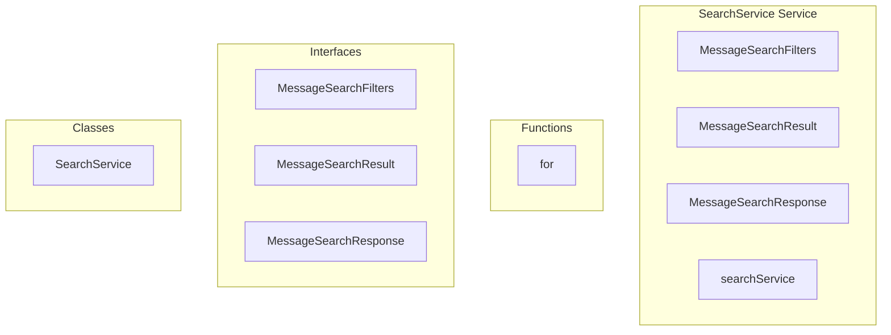

# SearchService Service

**File:** `src/services/SearchService.ts`

## Overview




## Exports

- **MessageSearchFilters** - interface export
- **MessageSearchResult** - interface export
- **MessageSearchResponse** - interface export
- **SearchService** - class export
- **searchService** - const export

## Functions

### `for(const msg of messages)`

No description available.

**Parameters:**
- `const msg of messages`

**Returns:** `void`

```typescript
function
        for (const msg of messages)
```


## Classes

### SearchService

No description available.

**Methods:**
- `constructor`
- `getInstance`
- `searchMessages`
- `catch`
- `loadMessagesByIds`
- `Date`

**Properties:**
- `instance`
- `DEFAULT_LIMIT`
- `MAX_LIMIT`
- `filters`
- `options`
- `present`
- `hasFilters`
- `IDs`
- `channelIds`
- `parameters`
- `limit`
- `offset`
- `PostgreSQL`
- `fromDate`
- `toDate`
- `messages`
- `query`
- `userId`
- `serverId`
- `hasMedia`
- `hasUrl`
- `normalizedQuery`
- `p_query`
- `p_channel_id`
- `p_channel_ids`
- `p_user_id`
- `p_conversation_id`
- `p_server_id`
- `p_has_media`
- `p_has_url`
- `p_from_date`
- `p_to_date`
- `p_limit`
- `p_offset`
- `error`
- `failed`
- `searchResults`
- `hasMore`
- `results`
- `result`
- `messageIds`
- `messageMap`
- `sortedMessages`
- `Message`
- `supabase`
- `type`
- `id`
- `created_at`
- `updated_at`
- `channel_id`
- `conversation_id`
- `user_id`
- `bot_id`
- `content`
- `reply_to`
- `is_system`
- `metadata`
- `reactions`
- `decryption`
- `encrypted`
- `encryption_metadata`
- `decryptedMessages`
- `fails`
- `batchSize`
- `signal`
- `onProgress`
- `count`
- `total`
- `processed`
- `data`
- `ascending`
- `break`
- `complete`


## Interfaces

### MessageSearchFilters

No description available.

```typescript
interface MessageSearchFilters {

  query: string // Search text
  channelId?: string | string[] // Single or multiple channels
  userId?: string // From specific user
  conversationId?: string // DM conversation
  serverId?: string // Within specific server
  hasMedia?: boolean // Messages with file attachments
  hasUrl?: boolean // Messages containing URLs
  fromDate?: Date // Date range start
  toDate?: Date // Date range end
  limit?: number
  offset?: number

}
```

### MessageSearchResult

No description available.

```typescript
interface MessageSearchResult {

  message_id: string
  relevance: number
  content_text: string
  channel_id: string | null
  conversation_id: string | null
  user_id: string
  created_at: string

}
```

### MessageSearchResponse

No description available.

```typescript
interface MessageSearchResponse {

  results: Message[]
  total?: number
  hasMore: boolean

}
```


## Source Code Insights

**File Size:** 9749 characters
**Lines of Code:** 309
**Imports:** 3

## Usage Example

```typescript
import { MessageSearchFilters, MessageSearchResult, MessageSearchResponse, SearchService, searchService } from '@/services/SearchService'

// Example usage
for()
```

---

*This documentation was automatically generated from the source code.*