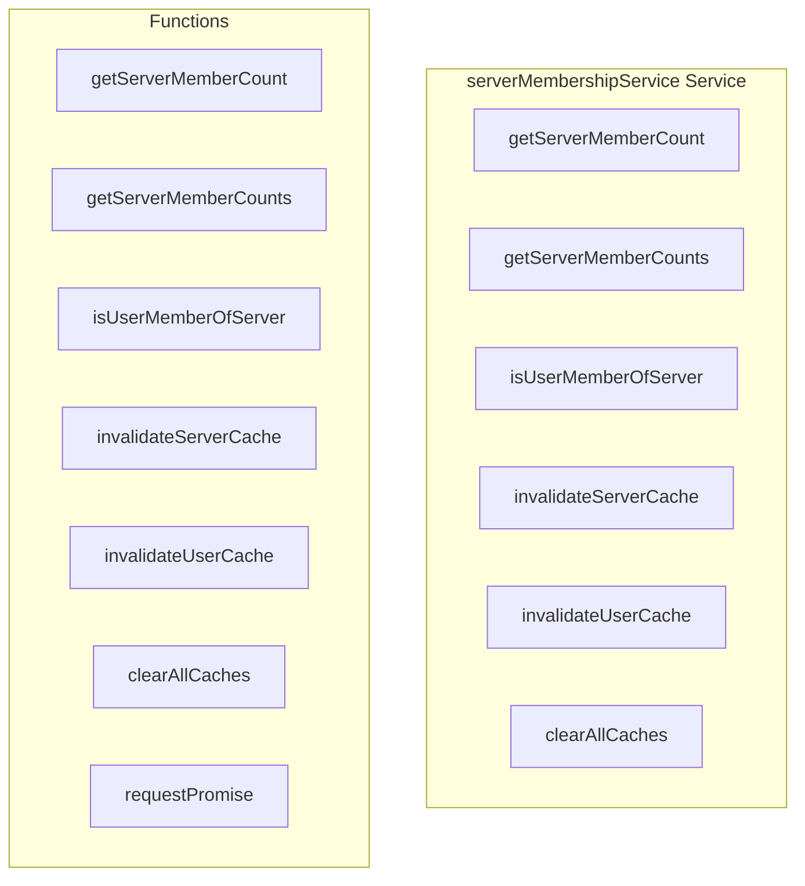

# serverMembershipService Service

**File:** `src/services/serverMembershipService.ts`

## Overview




## Exports

- **getServerMemberCount** - function export
- **getServerMemberCounts** - function export
- **isUserMemberOfServer** - function export
- **invalidateServerCache** - function export
- **invalidateUserCache** - function export
- **clearAllCaches** - function export

## Functions

### `getServerMemberCount(serverId: string, forceRefresh = false)`

No description available.

**Parameters:**
- `serverId: string`
- `forceRefresh = false`

**Returns:** `Promise&lt;number&gt;`

```typescript
/**
 * Server Membership Service
 * Centralized service for server membership queries with caching
 * Prevents duplicate queries to user_servers table
 */

import { supabase } from '@/supabase'
import { debug } from '@/utils/debug'

// Cache for member counts (server_id -> count)
const memberCountCache = new Map<string, { count: number; timestamp: number }>()
const MEMBER_COUNT_CACHE_TTL = 5 * 60 * 1000 // 5 minutes

// Cache for user membership checks (userId-serverId -> boolean)
const membershipCache = new Map<string, { isMember: boolean; timestamp: number }>()
const MEMBERSHIP_CACHE_TTL = 2 * 60 * 1000 // 2 minutes

// Pending requests to prevent duplicate concurrent queries
const pendingMemberCountRequests = new Map<string, Promise<number>>()
const pendingMembershipChecks = new Map<string, Promise<boolean>>()

/**
 * Get member count for a server (with caching and deduplication)
 */
export async function getServerMemberCount(serverId: string, forceRefresh = false): Promise<number>
```

### `getServerMemberCounts(serverIds: string[])`

No description available.

**Parameters:**
- `serverIds: string[]`

**Returns:** `Promise&lt;Map&lt;string, number&gt;&gt;`

```typescript
/**
 * Batch get member counts for multiple servers (more efficient)
 */
export async function getServerMemberCounts(serverIds: string[]): Promise<Map<string, number>>
```

### `isUserMemberOfServer(userId: string, serverId: string, forceRefresh = false)`

No description available.

**Parameters:**
- `userId: string`
- `serverId: string`
- `forceRefresh = false`

**Returns:** `Promise&lt;boolean&gt;`

```typescript
/**
 * Check if a user is a member of a server (with caching)
 */
export async function isUserMemberOfServer(
  userId: string,
  serverId: string,
  forceRefresh = false
): Promise<boolean>
```

### `invalidateServerCache(serverId: string)`

No description available.

**Parameters:**
- `serverId: string`

**Returns:** `void`

```typescript
/**
 * Invalidate cache for a server (call when membership changes)
 */
export function invalidateServerCache(serverId: string): void
```

### `invalidateUserCache(userId: string)`

No description available.

**Parameters:**
- `userId: string`

**Returns:** `void`

```typescript
/**
 * Invalidate cache for a user (call when user joins/leaves servers)
 */
export function invalidateUserCache(userId: string): void
```

### `clearAllCaches()`

No description available.

**Parameters:**
None

**Returns:** `void`

```typescript
/**
 * Clear all caches (use sparingly)
 */
export function clearAllCaches(): void
```

### `requestPromise(async ()`

No description available.

**Parameters:**
- `async (`

**Returns:** `Unknown`

```typescript
const requestPromise = (async () =>
```


## Constants

### MEMBER_COUNT_CACHE_TTL

No description available.

```typescript
const MEMBER_COUNT_CACHE_TTL = 5 * 60 * 1000 // 5 minutes
```

### MEMBERSHIP_CACHE_TTL

No description available.

```typescript
const MEMBERSHIP_CACHE_TTL = 2 * 60 * 1000 // 2 minutes
```


## Source Code Insights

**File Size:** 6637 characters
**Lines of Code:** 231
**Imports:** 2

## Usage Example

```typescript
import { getServerMemberCount, getServerMemberCounts, isUserMemberOfServer, invalidateServerCache, invalidateUserCache, clearAllCaches } from '@/services/serverMembershipService'

// Example usage
getServerMemberCount()
```

---

*This documentation was automatically generated from the source code.*