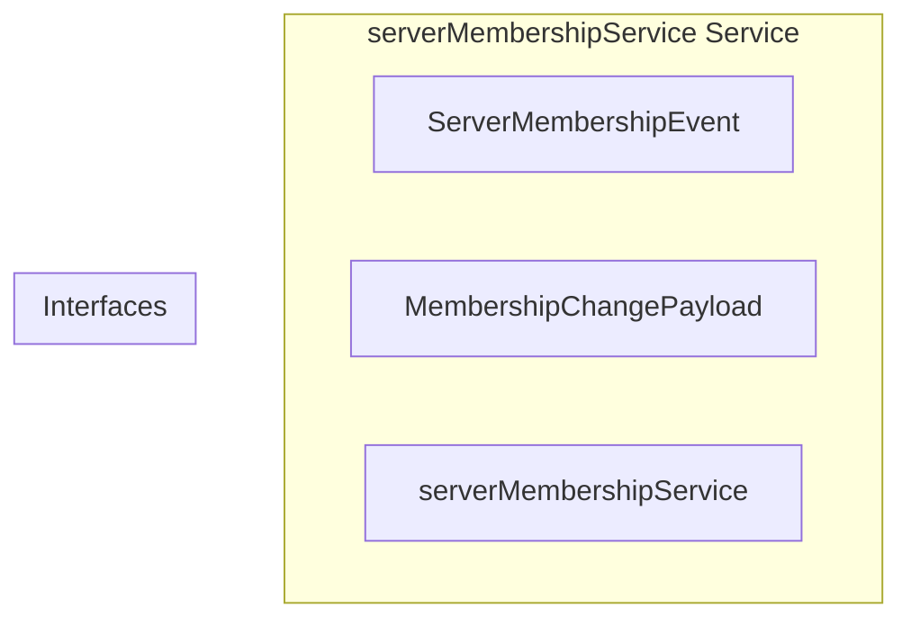

# serverMembershipService Service

**File:** `src/services/serverMembershipService.ts`

## Overview


```mermaid
graph TB
    subgraph "serverMembershipService Service"
        SERVERMEMBERSHIPEVENT[ServerMembershipEvent]
        MEMBERSHIPCHANGEPAYLOAD[MembershipChangePayload]
        SERVERMEMBERSHIPSERVICE[ServerMembershipService]
        SERVERMEMBERSHIPSERVICE[serverMembershipService]
    end
    
    
    
    subgraph "Interfaces"
        SERVERMEMBERSHIPEVENT[ServerMembershipEvent]
        MEMBERSHIPCHANGEPAYLOAD[MembershipChangePayload]
    end
```

## Exports

- **ServerMembershipEvent** - No description
- **MembershipChangePayload** - No description
- **ServerMembershipService** - No description
- **serverMembershipService** - No description


## Classes

### ServerMembershipService

No description available.

**Methods:**
- `constructor`

**Properties:**
- `instance`
- `membershipChannels`
- `pgNotifyChannel`
- `null`


## Interfaces

### ServerMembershipEvent

No description available.

```typescript
export interface ServerMembershipEvent {
  id: string
  server_id: string
  user_id: string
  event_type: 'join' | 'leave' | 'kick' | 'ban'
  initiated_by?: string
  metadata: Record<string, any>
  created_at: string
}
```

### MembershipChangePayload

No description available.

```typescript
export interface MembershipChangePayload {
  type: 'user_joined' | 'user_left'
  server_id: string
  user_id: string
  event_id: string
  timestamp: string
}
```


## Source Code Insights

**File Size:** 8886 characters
**Lines of Code:** 297
**Imports:** 4

## Usage Example

```typescript
import { ServerMembershipEvent, MembershipChangePayload, ServerMembershipService, serverMembershipService } from '@/services/serverMembershipService.ts'

// Example usage
// Use the exported functionality
```

---

*This documentation was automatically generated from the source code.*