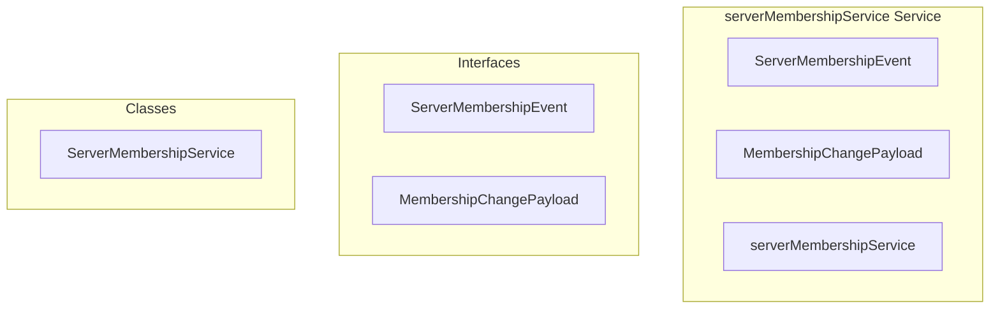

# serverMembershipService Service

**File:** `src/services/serverMembershipService.ts`

## Overview


```mermaid
graph TB
    subgraph "serverMembershipService Service"
        SERVERMEMBERSHIPEVENT[ServerMembershipEvent]
        MEMBERSHIPCHANGEPAYLOAD[MembershipChangePayload]
        SERVERMEMBERSHIPSERVICE[ServerMembershipService]
        SERVERMEMBERSHIPSERVICE[serverMembershipService]
    end
    
    subgraph "Interfaces"
        INT_SERVERMEMBERSHIPEVENT[ServerMembershipEvent]
        INT_MEMBERSHIPCHANGEPAYLOAD[MembershipChangePayload]
    end
    
    subgraph "Classes"
        CLS_SERVERMEMBERSHIPSERVICE[ServerMembershipService]
    end
```


## Exports

- **ServerMembershipEvent** - interface export
- **MembershipChangePayload** - interface export
- **ServerMembershipService** - class export
- **serverMembershipService** - const export


## Classes

### ServerMembershipService

No description available.

**Methods:**
- `constructor`
- `getInstance`
- `subscribeToServerMembership`
- `subscribeToGlobalMembershipChanges`
- `handleMembershipEvent`
- `switch`
- `catch`
- `handleRealTimeMembershipChange`
- `handleUserJoined`
- `handleUserLeft`
- `handleUserRemoved`
- `triggerUserJoin`
- `triggerUserLeave`
- `getMembershipHistory`
- `unsubscribeFromServer`
- `cleanup`

**Properties:**
- `instance`
- `membershipChannels`
- `pgNotifyChannel`
- `server`
- `existingChannel`
- `membershipChannel`
- `event`
- `schema`
- `table`
- `filter`
- `supabase`
- `subscription`
- `serverUsersStore`
- `serverChannelStore`
- `break`
- `NOTIFY`
- `list`
- `member`
- `profile`
- `users`
- `like`
- `sound`
- `feedback`
- `any`
- `here`
- `messaging`
- `userId`
- `toast`
- `server_id`
- `user_id`
- `created_at`
- `gracefully`
- `violation`
- `true`
- `achieved`
- `error`
- `false`
- `leave`
- `limit`
- `ascending`
- `history`
- `channel`
- `subscriptions`
- `channels`
- `null`


## Interfaces

### ServerMembershipEvent

No description available.

```typescript
interface ServerMembershipEvent {

  id: string
  server_id: string
  user_id: string
  event_type: 'join' | 'leave' | 'kick' | 'ban'
  initiated_by?: string
  metadata: Record<string, any>
  created_at: string

}
```

### MembershipChangePayload

No description available.

```typescript
interface MembershipChangePayload {

  type: 'user_joined' | 'user_left'
  server_id: string
  user_id: string
  event_id: string
  timestamp: string

}
```


## Source Code Insights

**File Size:** 9460 characters
**Lines of Code:** 311
**Imports:** 6

## Usage Example

```typescript
import { ServerMembershipEvent, MembershipChangePayload, ServerMembershipService, serverMembershipService } from '@/services/serverMembershipService'

// Example usage
// Use the exported functionality
```

---

*This documentation was automatically generated from the source code.*