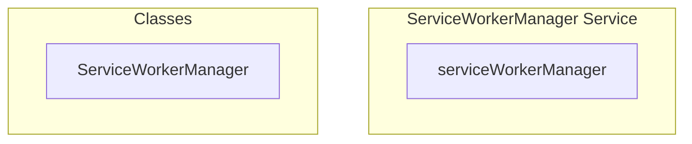

# ServiceWorkerManager Service

**File:** `src/services/ServiceWorkerManager.ts`

## Overview




## Exports

- **ServiceWorkerManager** - class export
- **serviceWorkerManager** - const export


## Classes

### ServiceWorkerManager

No description available.

**Methods:**
- `getInstance`
- `initialize`
- `catch`
- `requestNotificationPermission`
- `subscribeToPushNotifications`
- `sendSubscriptionToServer`
- `handleServiceWorkerMessage`
- `switch`
- `handleNavigateToNotification`
- `handleMarkNotificationRead`
- `handleServiceWorkerUpdate`
- `sendMessage`
- `updateNotificationSettings`
- `clearStoredNotifications`
- `unsubscribeFromPush`
- `urlBase64ToUint8Array`
- `activateWaitingServiceWorker`
- `isSupported`
- `ready`
- `serviceWorkerRegistration`
- `prefetchCriticalResources`
- `getVersion`
- `checkForUpdate`

**Properties:**
- `instance`
- `registration`
- `isRegistered`
- `notifications`
- `ServiceWorker`
- `supported`
- `false`
- `worker`
- `scope`
- `friendly`
- `newWorker`
- `updates`
- `detail`
- `skipWaiting`
- `type`
- `true`
- `permission`
- `null`
- `subscribed`
- `subscription`
- `vapidPublicKey`
- `userVisibleOnly`
- `applicationServerKey`
- `created`
- `server`
- `userId`
- `supabase`
- `user_id`
- `endpoint`
- `onConflict`
- `error`
- `break`
- `default`
- `click`
- `router`
- `path`
- `read`
- `notification`
- `notificationStore`
- `here`
- `it`
- `settings`
- `push`
- `Uint8Array`
- `padding`
- `base64`
- `rawData`
- `outputArray`
- `i`
- `change`
- `ready`
- `window`
- `registered`
- `performance`
- `info`
- `version`
- `updated`
- `messageChannel`
- `seconds`
- `available`


## Source Code Insights

**File Size:** 12344 characters
**Lines of Code:** 431
**Imports:** 1

## Usage Example

```typescript
import { ServiceWorkerManager, serviceWorkerManager } from '@/services/ServiceWorkerManager'

// Example usage
// Use the exported functionality
```

---

*This documentation was automatically generated from the source code.*