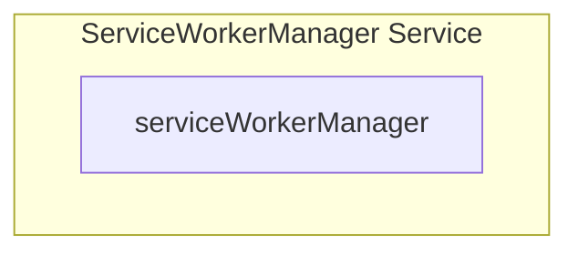

# ServiceWorkerManager Service

**File:** `src/services/ServiceWorkerManager.ts`

## Overview


```mermaid
graph TB
    subgraph "ServiceWorkerManager Service"
        SERVICEWORKERMANAGER[ServiceWorkerManager]
        SERVICEWORKERMANAGER[serviceWorkerManager]
    end
    
    
    
    
```

## Exports

- **ServiceWorkerManager** - No description
- **serviceWorkerManager** - No description


## Classes

### ServiceWorkerManager

No description available.

**Methods:**
- `getInstance`
- `if`

**Properties:**
- `instance`
- `registration`
- `null`
- `isRegistered`
- `instance`


## Source Code Insights

**File Size:** 12257 characters
**Lines of Code:** 428
**Imports:** 0

## Usage Example

```typescript
import { ServiceWorkerManager, serviceWorkerManager } from '@/services/ServiceWorkerManager.ts'

// Example usage
// Use the exported functionality
```

---

*This documentation was automatically generated from the source code.*