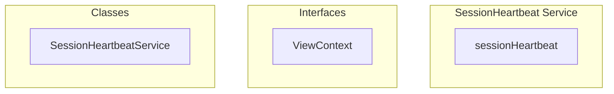

# SessionHeartbeat Service

**File:** `src/services/SessionHeartbeat.ts`

## Overview




## Exports

- **sessionHeartbeat** - const export


## Classes

### SessionHeartbeatService

No description available.

**Methods:**
- `initialize`
- `stop`
- `updateContext`
- `clearContext`

**Properties:**
- `currentContext`
- `isInitialized`
- `internally`
- `true`
- `Heartbeat`
- `false`
- `calls`
- `context`


## Interfaces

### ViewContext

No description available.

```typescript
interface ViewContext {

  serverId?: string
  channelId?: string
  conversationId?: string

}
```


## Source Code Insights

**File Size:** 1410 characters
**Lines of Code:** 59
**Imports:** 1

## Usage Example

```typescript
import { sessionHeartbeat } from '@/services/SessionHeartbeat'

// Example usage
// Use the exported functionality
```

---

*This documentation was automatically generated from the source code.*