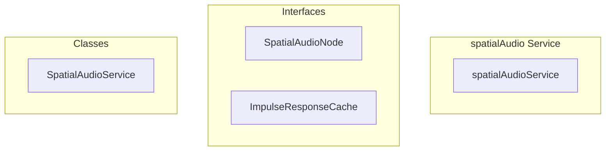

# spatialAudio Service

**File:** `src/services/spatialAudio.ts`

## Overview




## Exports

- **SpatialAudioService** - class export
- **spatialAudioService** - const export


## Classes

### SpatialAudioService

No description available.

**Methods:**
- `constructor`
- `initialize`
- `catch`
- `createMasterAudioChain`
- `preloadImpulseResponses`
- `setListener`
- `setupSpatialForUser`
- `createAudioProcessingChain`
- `removeUser`
- `disconnectAudioChain`
- `updateSpatialEffects`
- `resetToDefaultAudio`
- `setUserGain`
- `setUserPanning`
- `setUser3DPosition`
- `updateUserPosition`
- `startSpatialUpdates`
- `stopSpatialUpdates`
- `createPannerNode`
- `createReverbNode`
- `createImpulseResponse`
- `loadExternalImpulseResponse`
- `enableSpatialAudio`
- `disableSpatialAudio`
- `updateSettings`
- `getStatus`
- `debugAudioState`
- `destroy`

**Properties:**
- `audioContext`
- `spatialNodes`
- `destination`
- `listenerUserId`
- `isInitialized`
- `impulseResponseCache`
- `masterGainNode`
- `compressorNode`
- `optimization`
- `lastUpdateTime`
- `updateThrottleMs`
- `updates`
- `animationFrameId`
- `INITIALIZATION`
- `context`
- `latency`
- `latencyHint`
- `sampleRate`
- `chain`
- `true`
- `initialized`
- `state`
- `baseLatency`
- `outputLatency`
- `enabling`
- `spatialStore`
- `Note`
- `audio`
- `error`
- `control`
- `dynamics`
- `30`
- `knee`
- `4`
- `chains`
- `sizes`
- `roomSizes`
- `key`
- `responses`
- `MANAGEMENT`
- `calculations`
- `userId`
- `listener`
- `directly`
- `streams`
- `mediaStream`
- `check`
- `user`
- `tracks`
- `audioTracks`
- `exists`
- `debugging`
- `id`
- `live`
- `liveTracks`
- `source`
- `effect`
- `channelCount`
- `count`
- `monoSource`
- `splitter`
- `merger`
- `mono`
- `channel`
- `i`
- `processingChain`
- `configuration`
- `spatialNode`
- `gainNode`
- `outputGain`
- `pannerNode`
- `convolver`
- `isConnected`
- `lastGain`
- `lastPanning`
- `audioContextState`
- `hasReverb`
- `pannerType`
- `effects`
- `Chain`
- `processing`
- `inputGain`
- `positioning`
- `panner`
- `reverb`
- `resources`
- `node`
- `safely`
- `tracking`
- `glitches`
- `false`
- `disconnection`
- `EFFECTS`
- `performance`
- `now`
- `enabled`
- `self`
- `listenerPos`
- `userPos`
- `set`
- `gain`
- `panning`
- `available`
- `volume`
- `pan`
- `PannerNode`
- `curves`
- `falloff`
- `dbGain`
- `linearGain`
- `distortion`
- `clampedGain`
- `clicks`
- `currentTime`
- `transitionTime`
- `responsiveness`
- `range`
- `clampedPanning`
- `dramaticPanning`
- `scaling`
- `x`
- `y`
- `z`
- `transitions`
- `browsers`
- `is`
- `space`
- `centerX`
- `overlay`
- `centerY`
- `center`
- `dx`
- `dy`
- `angle`
- `radians`
- `radius`
- `intensity`
- `minRadius`
- `maxRadius`
- `audioX`
- `audioY`
- `level`
- `audioZ`
- `recalculation`
- `store`
- `null`
- `CREATION`
- `capabilities`
- `0`
- `HRTF`
- `1`
- `settings`
- `panningModel`
- `distanceModel`
- `refDistance`
- `maxDistance`
- `rolloffFactor`
- `binauralIntensity`
- `360`
- `API`
- `fallback`
- `response`
- `one`
- `cacheKey`
- `impulseResponse`
- `length`
- `impulse`
- `ambience`
- `2`
- `channelData`
- `characteristics`
- `normalizedTime`
- `sound`
- `earlyDecay`
- `lateDecay`
- `3`
- `earlyReflection`
- `noise`
- `highFreqRolloff`
- `rolloff`
- `filteredNoise`
- `earlyComponent`
- `lateComponent`
- `variation`
- `arrayBuffer`
- `audioBuffer`
- `from`
- `METHODS`
- `initialization`
- `disconnected`
- `done`
- `nodes`
- `loop`
- `IMPORTANT`
- `HTMLAudioElement`
- `ORDER`
- `CRITICAL`
- `needed`
- `changed`
- `shouldHaveReverb`
- `undefined`
- `size`
- `newConvolver`
- `oldConvolver`
- `status`
- `isEnabled`
- `activeUsers`
- `State`
- `Initialized`
- `running`
- `Connected`
- `value`
- `type`
- `model`
- `factor`
- `distance`
- `Position`
- `stream`
- `setting`
- `positions`
- `muted`
- `connections`
- `CLEANUP`
- `userIds`
- `cache`
- `AudioContext`


## Interfaces

### SpatialAudioNode

No description available.

```typescript
interface SpatialAudioNode {

  userId: string;
  gainNode: GainNode; // Input gain
  outputGain: GainNode; // Output gain (before compressor)
  pannerNode: PannerNode | StereoPannerNode;
  convolver?: ConvolverNode;
  source: MediaStreamAudioSourceNode;
  mediaStream: MediaStream;
  isConnected: boolean;
  lastGain: number;
  lastPanning: number;

}
```

### ImpulseResponseCache

No description available.

```typescript
interface ImpulseResponseCache {

  [roomSize: string]: AudioBuffer;

}
```


## Source Code Insights

**File Size:** 42940 characters
**Lines of Code:** 1177
**Imports:** 2

## Usage Example

```typescript
import { SpatialAudioService, spatialAudioService } from '@/services/spatialAudio'

// Example usage
// Use the exported functionality
```

---

*This documentation was automatically generated from the source code.*