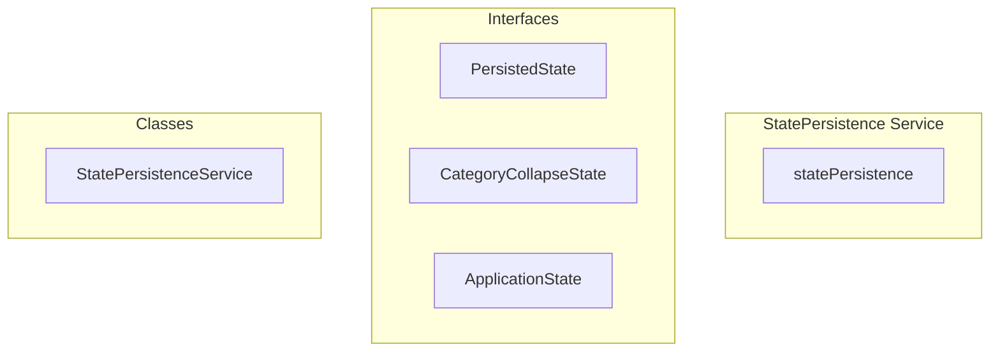

# StatePersistence Service

**File:** `src/services/StatePersistence.ts`

## Overview




## Exports

- **statePersistence** - const export


## Classes

### StatePersistenceService

No description available.

**Methods:**
- `initialize`
- `_initialize`
- `state`
- `catch`
- `loadState`
- `updateLastActiveTimestamp`
- `saveState`
- `debouncedSave`
- `forceSave`
- `cleanup`
- `clearOldStates`
- `setLastServer`
- `getLastServer`
- `setLastChannel`
- `getLastChannel`
- `setCategoryCollapseState`
- `getCategoryCollapseState`
- `getServerCategoryStates`
- `batchUpdateCategoryStates`
- `setSidebarState`
- `getSidebarState`
- `setAppInitialized`
- `isAppInitialized`
- `setHasServers`
- `shouldShowNoServersSplash`
- `isCurrentlyRestoring`
- `setRestorationComplete`
- `clearState`
- `exportState`
- `importState`
- `performHealthCheck`

**Properties:**
- `state`
- `appState`
- `isLoaded`
- `loadingPromise`
- `FIX`
- `saveTimeout`
- `pendingSave`
- `migration`
- `stored`
- `parsed`
- `needed`
- `hasInitialized`
- `hasServers`
- `shouldShowSplash`
- `isRestoring`
- `true`
- `defaults`
- `timestamp`
- `handling`
- `stateToSave`
- `lastActiveTimestamp`
- `once`
- `cleanup`
- `write`
- `false`
- `initialization`
- `null`
- `changes`
- `timeouts`
- `space`
- `keysToRemove`
- `i`
- `key`
- `validation`
- `serverId`
- `saved`
- `server`
- `channelId`
- `batching`
- `categoryId`
- `collapsed`
- `writes`
- `category`
- `serverStates`
- `performance`
- `categoryStates`
- `visible`
- `states`
- `sidebar`
- `flash`
- `boolean`
- `initialized`
- `Fallback`
- `management`
- `value`
- `confirmation`
- `keys`
- `persisted`
- `runtime`
- `validatedState`
- `integrity`
- `isHealthy`
- `issues`
- `available`
- `structure`


## Interfaces

### PersistedState

No description available.

```typescript
interface PersistedState {

  lastServerId: string | null
  lastChannelByServer: Record<string, string>
  categoryCollapseStates: Record<string, Record<string, boolean>>
  sidebarStates: {
    leftSidebarVisible: boolean
    rightSidebarVisible: boolean
  }
  appInitialized: boolean
  uiPreferences: {
    theme: string
    fontSize: number
    enableAnimations: boolean
  }
  lastActiveTimestamp: number

}
```

### CategoryCollapseState

No description available.

```typescript
interface CategoryCollapseState {

  [categoryId: string]: boolean

}
```

### ApplicationState

No description available.

```typescript
interface ApplicationState {

  hasInitialized: boolean
  hasServers: boolean
  shouldShowSplash: boolean
  isRestoring: boolean

}
```


## Constants

### STORAGE_KEY

No description available.

```typescript
const STORAGE_KEY = 'app-state' // Will be prefixed with user ID by userStorage
```

### STATE_VERSION

No description available.

```typescript
const STATE_VERSION = '1.2.0'
```

### DEFAULT_STATE

No description available.

```typescript
const DEFAULT_STATE: PersistedState = {
```

### DEFAULT_APP_STATE

No description available.

```typescript
const DEFAULT_APP_STATE: ApplicationState = {
```


## Source Code Insights

**File Size:** 14735 characters
**Lines of Code:** 535
**Imports:** 2

## Usage Example

```typescript
import { statePersistence } from '@/services/StatePersistence'

// Example usage
// Use the exported functionality
```

---

*This documentation was automatically generated from the source code.*