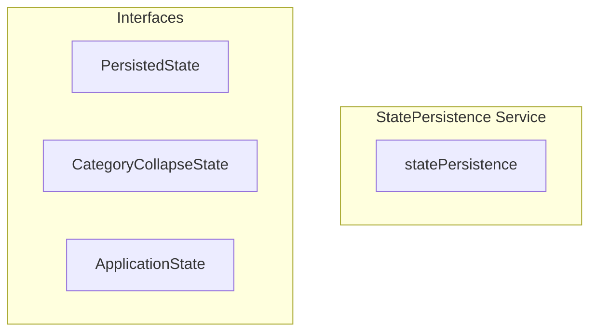

# StatePersistence Service

**File:** `src/services/StatePersistence.ts`

## Overview


```mermaid
graph TB
    subgraph "StatePersistence Service"
        STATEPERSISTENCE[statePersistence]
    end
    
    
    
    subgraph "Interfaces"
        PERSISTEDSTATE[PersistedState]
        CATEGORYCOLLAPSESTATE[CategoryCollapseState]
        APPLICATIONSTATE[ApplicationState]
    end
```

## Exports

- **statePersistence** - No description


## Classes

### StatePersistenceService

No description available.

**Methods:**
None

**Properties:**
- `state`
- `PersistedState`


## Interfaces

### PersistedState

No description available.

```typescript
interface PersistedState {
  lastServerId: string | null
  lastChannelByServer: Record<string, string>
  categoryCollapseStates: Record<string, Record<string, boolean>>
  sidebarStates: {
    leftSidebarVisible: boolean
    rightSidebarVisible: boolean
  }
```

### CategoryCollapseState

No description available.

```typescript
interface CategoryCollapseState {
  [categoryId: string]: boolean
}
```

### ApplicationState

No description available.

```typescript
interface ApplicationState {
  hasInitialized: boolean
  hasServers: boolean
  shouldShowSplash: boolean
  isRestoring: boolean
}
```


## Constants

### STORAGE_KEY

No description available.

```typescript
const STORAGE_KEY = 'harmony-app-state'
```

### STATE_VERSION

No description available.

```typescript
const STATE_VERSION = '1.2.0'
```


## Source Code Insights

**File Size:** 13767 characters
**Lines of Code:** 504
**Imports:** 0

## Usage Example

```typescript
import { statePersistence } from '@/services/StatePersistence.ts'

// Example usage
// Use the exported functionality
```

---

*This documentation was automatically generated from the source code.*