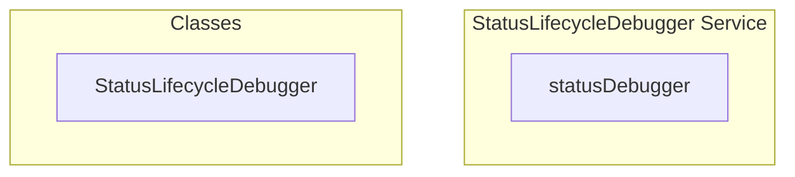

# StatusLifecycleDebugger Service

**File:** `src/services/StatusLifecycleDebugger.ts`

## Overview




## Exports

- **statusDebugger** - const export


## Classes

### StatusLifecycleDebugger

No description available.

**Methods:**
- `startDebugging`
- `stopDebugging`
- `getCurrentStatusInfo`
- `testManualStatusChange`
- `catch`
- `simulateInactivity`
- `showDebugPanel`

**Properties:**
- `isDebugging`
- `logHistory`
- `monitoring`
- `true`
- `events`
- `log`
- `false`
- `undefined`
- `information`
- `currentUser`
- `activityState`
- `user`
- `id`
- `username`
- `status`
- `lastHeartbeat`
- `isOnline`
- `activity`
- `lastActivity`
- `timeSinceLastActivity`
- `isIdle`
- `isAway`
- `changes`
- `to`
- `failed`
- `testing`
- `time`
- `millisecondsAgo`
- `console`
- `info`
- `User`
- `State`
- `History`


## Source Code Insights

**File Size:** 6147 characters
**Lines of Code:** 180
**Imports:** 4

## Usage Example

```typescript
import { statusDebugger } from '@/services/StatusLifecycleDebugger'

// Example usage
// Use the exported functionality
```

---

*This documentation was automatically generated from the source code.*