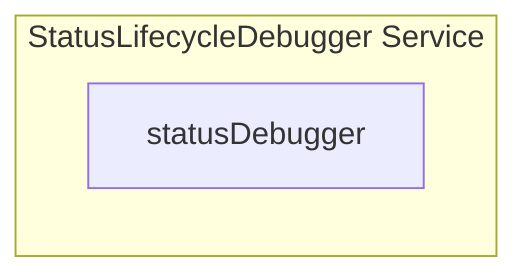

# StatusLifecycleDebugger Service

**File:** `src/services/StatusLifecycleDebugger.ts`

## Overview


```mermaid
graph TB
    subgraph "StatusLifecycleDebugger Service"
        STATUSDEBUGGER[statusDebugger]
    end
    
    
    
    
```

## Exports

- **statusDebugger** - No description


## Classes

### StatusLifecycleDebugger

No description available.

**Methods:**
- `startDebugging`
- `if`

**Properties:**
- `isDebugging`
- `logHistory`
- `isDebugging`
- `logHistory`
- `event`
- `log`
- `changed`


## Source Code Insights

**File Size:** 6151 characters
**Lines of Code:** 179
**Imports:** 3

## Usage Example

```typescript
import { statusDebugger } from '@/services/StatusLifecycleDebugger.ts'

// Example usage
// Use the exported functionality
```

---

*This documentation was automatically generated from the source code.*