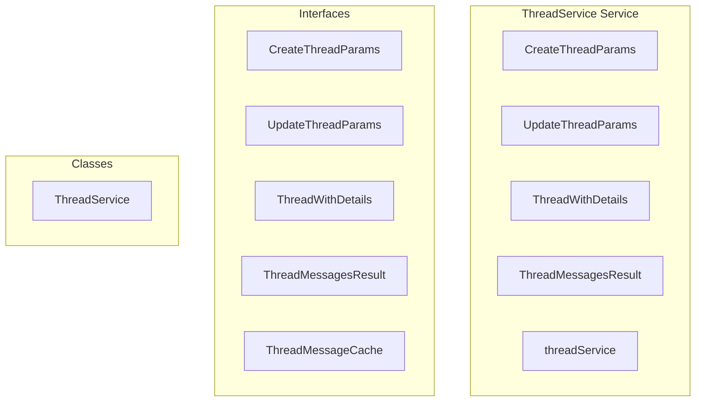

# ThreadService Service

**File:** `src/services/ThreadService.ts`

## Overview




## Exports

- **CreateThreadParams** - interface export
- **UpdateThreadParams** - interface export
- **ThreadWithDetails** - interface export
- **ThreadMessagesResult** - interface export
- **threadService** - const export


## Classes

### ThreadService

No description available.

**Methods:**
- `hasValidMessageCache`
- `getCachedMessages`
- `createThread`
- `catch`
- `getThread`
- `getChannelThreads`
- `getThreadsForChannel`
- `getServerThreads`
- `getUserThreads`
- `updateThread`
- `deleteThread`
- `archiveThread`
- `unarchiveThread`
- `lockThread`
- `unlockThread`
- `joinThread`
- `leaveThread`
- `getThreadMembers`
- `markThreadAsRead`
- `setThreadMuted`
- `isCacheValid`
- `loadCachedMessages`
- `evictOldestCache`
- `addMessageToCache`
- `updateMessageInCache`
- `removeMessageFromCache`
- `getThreadMessages`
- `sendThreadMessage`
- `getThreadForMessage`
- `messageHasThread`
- `getUnreadCount`
- `clearCache`
- `clearThreadCache`

**Properties:**
- `threadCache`
- `memberCache`
- `messageCache`
- `cacheValidityDuration`
- `maxCacheSize`
- `shown`
- `cached`
- `false`
- `cacheAge`
- `rendering`
- `null`
- `messages`
- `has_more`
- `oldest_id`
- `Operations`
- `message`
- `p_message_id`
- `p_name`
- `p_auto_archive_duration`
- `thread`
- `ID`
- `forceRefresh`
- `directly`
- `supabase`
- `error`
- `separately`
- `channelData`
- `creatorData`
- `parentMessage`
- `data`
- `member`
- `isMember`
- `profileId`
- `found`
- `channel_name`
- `server_id`
- `creator_username`
- `creator_display_name`
- `creator_avatar_url`
- `parent_message`
- `is_member`
- `channel`
- `channelId`
- `options`
- `includeArchived`
- `limit`
- `offset`
- `hints`
- `query`
- `ascending`
- `components`
- `threads`
- `compatibility`
- `serverId`
- `archived`
- `server`
- `channelsError`
- `channelIds`
- `channelMap`
- `channels`
- `names`
- `of`
- `avatar_url`
- `specified`
- `aTime`
- `bTime`
- `params`
- `updateData`
- `archived_at`
- `cache`
- `Thread`
- `true`
- `result`
- `Membership`
- `thread_id`
- `user_id`
- `onConflict`
- `members`
- `profiles`
- `lastMessageId`
- `last_read_message_id`
- `last_read_at`
- `read`
- `notifications`
- `muted`
- `status`
- `Messages`
- `valid`
- `now`
- `reached`
- `oldestThreadId`
- `oldestTime`
- `entry`
- `lastFetchedAt`
- `hasMore`
- `messageId`
- `index`
- `updatedMessage`
- `threadId`
- `before`
- `after`
- `first`
- `instantly`
- `user`
- `color`
- `reactions`
- `url`
- `resultMessages`
- `embeds`
- `load`
- `oldestMessageId`
- `content`
- `replyTo`
- `insertData`
- `channel_id`
- `stats`
- `Methods`
- `position`
- `count`
- `0`


## Interfaces

### CreateThreadParams

No description available.

```typescript
interface CreateThreadParams {

  message_id: string
  name: string
  auto_archive_duration?: 60 | 1440 | 4320 | 10080 // minutes

}
```

### UpdateThreadParams

No description available.

```typescript
interface UpdateThreadParams {

  name?: string
  archived?: boolean
  locked?: boolean
  auto_archive_duration?: 60 | 1440 | 4320 | 10080

}
```

### ThreadWithDetails

No description available.

```typescript
interface ThreadWithDetails {

  channel_name?: string
  server_id?: string
  creator_username?: string
  creator_display_name?: string
  creator_avatar_url?: string
  recent_message_count?: number
  parent_message?: Message
  is_member?: boolean
  muted?: boolean
  unread_count?: number
  last_message_preview?: string
  participants?: Array<{ id: string; display_name?: string }>

}
```

### ThreadMessagesResult

No description available.

```typescript
interface ThreadMessagesResult {

  messages: Message[]
  has_more: boolean
  oldest_id?: string

}
```

### ThreadMessageCache

No description available.

```typescript
interface ThreadMessageCache {

  messages: Message[]
  lastFetchedAt: Date
  oldestMessageId?: string
  hasMore: boolean

}
```


## Source Code Insights

**File Size:** 26417 characters
**Lines of Code:** 975
**Imports:** 5

## Usage Example

```typescript
import { CreateThreadParams, UpdateThreadParams, ThreadWithDetails, ThreadMessagesResult, threadService } from '@/services/ThreadService'

// Example usage
// Use the exported functionality
```

---

*This documentation was automatically generated from the source code.*