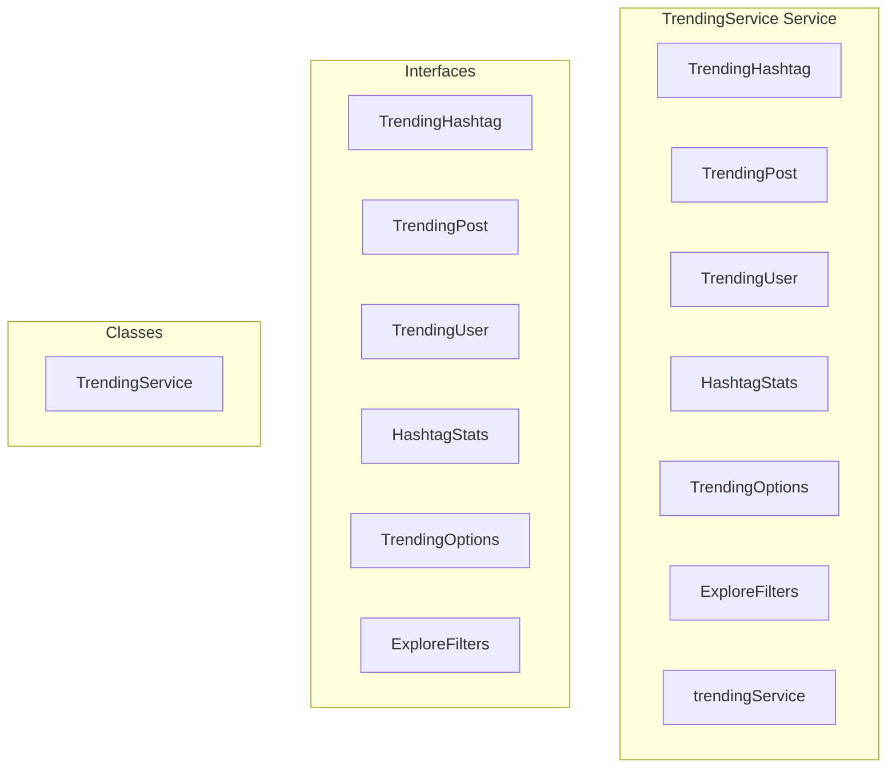

# TrendingService Service

**File:** `src/services/TrendingService.ts`

## Overview




## Exports

- **TrendingHashtag** - interface export
- **TrendingPost** - interface export
- **TrendingUser** - interface export
- **HashtagStats** - interface export
- **TrendingOptions** - interface export
- **ExploreFilters** - interface export
- **trendingService** - const export


## Classes

### TrendingService

No description available.

**Methods:**
- `getTrendingHashtags`
- `catch`
- `getHashtagStats`
- `searchHashtags`
- `getTrendingPosts`
- `getPostsByHashtag`
- `getTrendingUsers`
- `getFederatedInstances`
- `switch`
- `getInstanceStats`
- `getExploreContent`
- `getExplorePosts`
- `updateTrendingScores`
- `resetDailyCounters`
- `calculateTrend`
- `calculateEngagementVelocity`
- `getInstanceStatus`
- `getInstancePostCount`
- `getInstanceUserCount`
- `getTimeThreshold`
- `transformDatabasePostToTimelinePost`

**Properties:**
- `METHODS`
- `hashtags`
- `TrendingOptions`
- `limit`
- `p_days`
- `p_limit`
- `error`
- `format`
- `index`
- `tag`
- `daily_uses`
- `weekly_uses`
- `trending_score`
- `trending_rank`
- `change_percent`
- `trend`
- `statistics`
- `supabase`
- `null`
- `total_uses`
- `first_used_at`
- `last_used_at`
- `peak_daily_uses`
- `peak_daily_date`
- `stats`
- `normalizedQuery`
- `ascending`
- `posts`
- `timeframe`
- `includeLocal`
- `includeFederated`
- `minEngagement`
- `options`
- `query`
- `post`
- `author`
- `filtering`
- `engagement_score`
- `engagement_velocity`
- `hashtag`
- `cursor`
- `hasMore`
- `normalizedTag`
- `1`
- `hashtagData`
- `hashtagError`
- `normalized_tag`
- `data`
- `Fallback`
- `DB`
- `ID`
- `2`
- `postHashtagQuery`
- `phError`
- `postIds`
- `IDs`
- `3`
- `postsError`
- `post_hashtags`
- `postsMap`
- `orderedPosts`
- `nextCursor`
- `OPTIMIZED`
- `users`
- `context`
- `currentUserId`
- `engagement`
- `TODO`
- `posts_count`
- `now`
- `user`
- `id`
- `username`
- `domain`
- `handle`
- `display_name`
- `avatar_url`
- `bio`
- `is_local`
- `verified`
- `followers_count`
- `following_count`
- `created_at`
- `updated_at`
- `followers_growth`
- `engagement_rate`
- `new_followers`
- `exploration`
- `filter`
- `search`
- `filters`
- `break`
- `software`
- `version`
- `description`
- `admin_contact`
- `is_blocked`
- `is_trusted`
- `last_seen_at`
- `user_count`
- `status_count`
- `connection_count`
- `metadata`
- `status`
- `instances`
- `local_users_count`
- `last_activity`
- `ExploreFilters`
- `content`
- `feed`
- `contentType`
- `timeRange`
- `minScore`
- `threshold`
- `timeThreshold`
- `scores`
- `counters`
- `totalEngagement`
- `hours`
- `lastSeen`
- `hoursSince`
- `count`
- `0`
- `default`
- `store`
- `processedContent`
- `content_warning`
- `language`
- `author_id`
- `ap_id`
- `ap_type`
- `url`
- `reply_context`
- `conversation_id`
- `visibility`
- `is_federated`
- `replies_count`
- `reblogs_count`
- `favorites_count`
- `media_attachments`
- `is_sensitive`
- `is_deleted`
- `deleted_at`
- `reblog`
- `reblog_author`
- `false`
- `is_favorited`
- `is_reblogged`
- `is_bookmarked`


## Interfaces

### TrendingHashtag

No description available.

```typescript
interface TrendingHashtag {

  tag: string;
  daily_uses: number;
  weekly_uses: number;
  trending_score: number;
  trending_rank: number;
  change_percent: number;
  trend: 'up' | 'down' | 'stable';

}
```

### TrendingPost

No description available.

```typescript
interface TrendingPost {

  post: TimelinePost;
  trending_score: number;
  engagement_score: number;
  trending_rank: number;
  engagement_velocity: number;

}
```

### TrendingUser

No description available.

```typescript
interface TrendingUser {

  user: FederatedUser;
  trending_score: number;
  followers_growth: number;
  engagement_rate: number;
  trending_rank: number;
  new_followers: number;
  posts_count: number;

}
```

### HashtagStats

No description available.

```typescript
interface HashtagStats {

  tag: string;
  total_uses: number;
  daily_uses: number;
  weekly_uses: number;
  first_used_at: string;
  last_used_at: string;
  peak_daily_uses: number;
  peak_daily_date: string;

}
```

### TrendingOptions

No description available.

```typescript
interface TrendingOptions {

  limit?: number;
  days?: number;
  timeframe?: 'hourly' | 'daily' | 'weekly';
  includeLocal?: boolean;
  includeFederated?: boolean;
  minEngagement?: number;

}
```

### ExploreFilters

No description available.

```typescript
interface ExploreFilters {

  contentType?: 'all' | 'posts' | 'media' | 'users';
  timeRange?: '1h' | '6h' | '24h' | '7d' | '30d';
  instance?: string;
  language?: string;
  minScore?: number;

}
```


## Source Code Insights

**File Size:** 24520 characters
**Lines of Code:** 764
**Imports:** 3

## Usage Example

```typescript
import { TrendingHashtag, TrendingPost, TrendingUser, HashtagStats, TrendingOptions, ExploreFilters, trendingService } from '@/services/TrendingService'

// Example usage
// Use the exported functionality
```

---

*This documentation was automatically generated from the source code.*