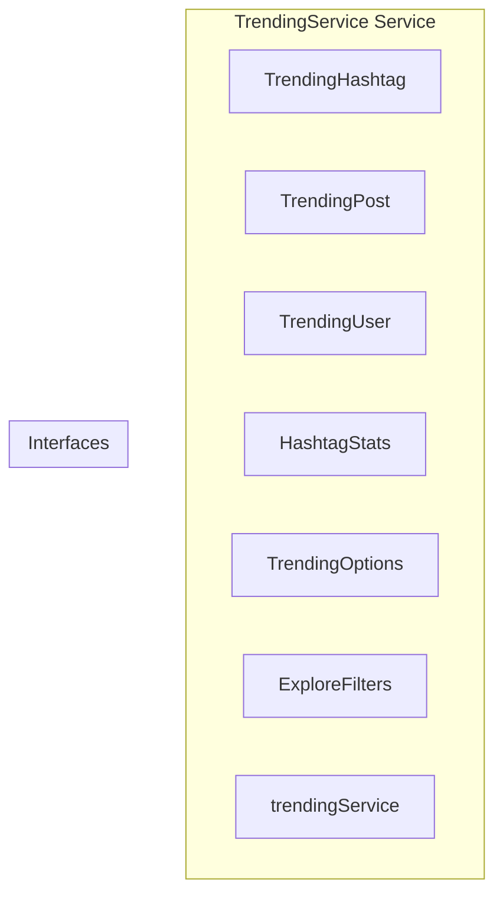

# TrendingService Service

**File:** `src/services/TrendingService.ts`

## Overview


```mermaid
graph TB
    subgraph "TrendingService Service"
        TRENDINGHASHTAG[TrendingHashtag]
        TRENDINGPOST[TrendingPost]
        TRENDINGUSER[TrendingUser]
        HASHTAGSTATS[HashtagStats]
        TRENDINGOPTIONS[TrendingOptions]
        EXPLOREFILTERS[ExploreFilters]
        TRENDINGSERVICE[trendingService]
    end
    
    
    
    subgraph "Interfaces"
        TRENDINGHASHTAG[TrendingHashtag]
        TRENDINGPOST[TrendingPost]
        TRENDINGUSER[TrendingUser]
        HASHTAGSTATS[HashtagStats]
        TRENDINGOPTIONS[TrendingOptions]
        EXPLOREFILTERS[ExploreFilters]
    end
```

## Exports

- **TrendingHashtag** - No description
- **TrendingPost** - No description
- **TrendingUser** - No description
- **HashtagStats** - No description
- **TrendingOptions** - No description
- **ExploreFilters** - No description
- **trendingService** - No description


## Classes

### TrendingService

No description available.

**Methods:**
None

**Properties:**
- `options`
- `TrendingOptions`


## Interfaces

### TrendingHashtag

No description available.

```typescript
export interface TrendingHashtag {
  tag: string;
  daily_uses: number;
  weekly_uses: number;
  trending_score: number;
  trending_rank: number;
  change_percent: number;
  trend: 'up' | 'down' | 'stable';
}
```

### TrendingPost

No description available.

```typescript
export interface TrendingPost {
  post: TimelinePost;
  trending_score: number;
  engagement_score: number;
  trending_rank: number;
  engagement_velocity: number;
}
```

### TrendingUser

No description available.

```typescript
export interface TrendingUser {
  user: FederatedUser;
  trending_score: number;
  followers_growth: number;
  engagement_rate: number;
  trending_rank: number;
  new_followers: number;
  posts_count: number;
}
```

### HashtagStats

No description available.

```typescript
export interface HashtagStats {
  tag: string;
  total_uses: number;
  daily_uses: number;
  weekly_uses: number;
  first_used_at: string;
  last_used_at: string;
  peak_daily_uses: number;
  peak_daily_date: string;
}
```

### TrendingOptions

No description available.

```typescript
export interface TrendingOptions {
  limit?: number;
  timeframe?: 'hourly' | 'daily' | 'weekly';
  includeLocal?: boolean;
  includeFederated?: boolean;
  minEngagement?: number;
}
```

### ExploreFilters

No description available.

```typescript
export interface ExploreFilters {
  contentType?: 'all' | 'posts' | 'media' | 'users';
  timeRange?: '1h' | '6h' | '24h' | '7d' | '30d';
  instance?: string;
  language?: string;
  minScore?: number;
}
```


## Source Code Insights

**File Size:** 21635 characters
**Lines of Code:** 688
**Imports:** 2

## Usage Example

```typescript
import { TrendingHashtag, TrendingPost, TrendingUser, HashtagStats, TrendingOptions, ExploreFilters, trendingService } from '@/services/TrendingService.ts'

// Example usage
// Use the exported functionality
```

---

*This documentation was automatically generated from the source code.*