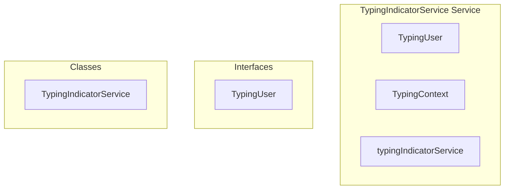

# TypingIndicatorService Service

**File:** `src/services/TypingIndicatorService.ts`

## Overview




## Exports

- **TypingUser** - interface export
- **TypingContext** - type export
- **typingIndicatorService** - const export


## Classes

### TypingIndicatorService

No description available.

**Methods:**
- `initialize`
- `startTyping`
- `stopTyping`
- `setupContext`
- `catch`
- `subscribeToChannel`
- `cleanupContext`
- `handlePresenceSync`
- `Date`
- `handlePresenceJoin`
- `handlePresenceLeave`
- `notifyCallbacks`
- `getChannelName`
- `switch`
- `getContextKey`
- `isSameContext`
- `cleanup`

**Properties:**
- `currentChannel`
- `currentContext`
- `currentUserId`
- `typingTimeout`
- `isCurrentlyTyping`
- `TYPING_TIMEOUT_MS`
- `context`
- `typingUsers`
- `change`
- `typingCallbacks`
- `ID`
- `available`
- `early`
- `authStore`
- `user`
- `TypingIndicatorService`
- `i`
- `30`
- `break`
- `callback`
- `contextKey`
- `initialized`
- `initialization`
- `users`
- `callbacks`
- `event`
- `it`
- `timeout`
- `presence`
- `userData`
- `displayName`
- `username`
- `user_id`
- `typing`
- `typing_at`
- `display_name`
- `true`
- `null`
- `false`
- `loads`
- `reuse`
- `channelName`
- `logic`
- `yet`
- `MAX_RETRIES`
- `RETRY_DELAY_MS`
- `SUBSCRIBE_TIMEOUT_MS`
- `attempt`
- `subscribed`
- `out`
- `resolved`
- `subscription`
- `channel`
- `status`
- `failed`
- `presenceState`
- `typingSet`
- `state`
- `typingAt`
- `now`
- `timeSinceTyping`
- `typingArray`
- `newPresences`
- `leftPresences`
- `comparison`
- `same`
- `b`
- `logout`


## Interfaces

### TypingUser

No description available.

```typescript
interface TypingUser {

  user_id: string
  display_name?: string
  username?: string
  typing_at: string

}
```


## Type Definitions

### TypingContext

No description available.

```typescript
export type TypingContext = 
  | { type: 'channel';
```


## Constants

### MAX_RETRIES

No description available.

```typescript
const MAX_RETRIES = 5
```

### RETRY_DELAY_MS

No description available.

```typescript
const RETRY_DELAY_MS = 500
```

### SUBSCRIBE_TIMEOUT_MS

No description available.

```typescript
const SUBSCRIBE_TIMEOUT_MS = 3000
```


## Source Code Insights

**File Size:** 15481 characters
**Lines of Code:** 479
**Imports:** 5

## Usage Example

```typescript
import { TypingUser, TypingContext, typingIndicatorService } from '@/services/TypingIndicatorService'

// Example usage
// Use the exported functionality
```

---

*This documentation was automatically generated from the source code.*