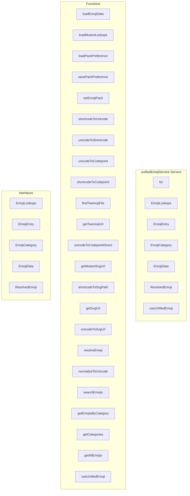

# unifiedEmojiService Service

**File:** `src/services/unifiedEmojiService.ts`

## Overview




## Exports

- **for** - type export
- **EmojiLookups** - interface export
- **EmojiEntry** - interface export
- **EmojiCategory** - interface export
- **EmojiData** - interface export
- **ResolvedEmoji** - interface export
- **useUnifiedEmoji** - function export

## Functions

### `loadEmojiData()`

No description available.

**Parameters:**
None

**Returns:** `Promise&lt;void&gt;`

```typescript
/**
 * Unified Emoji Service
 * 
 * A professional, DRY emoji system that:
 * - Stores reactions as standard unicode (portable across packs)
 * - Renders emojis based on user's selected pack (twemoji, mutant, or native)
 * - Provides lookup between shortcode ↔ unicode ↔ codepoint
 * - Works seamlessly when switching emoji packs
 * 
 * Data source: unicode-emoji-data.json (single source of truth)
 */

import { ref, computed } from 'vue'
import { debug } from '@/utils/debug'
import { 
  TWEMOJI_BASE_URL, 
  MUTANT_BASE_URL,
  DEFAULT_EMOJI_PACK,
  EMOJI_CATEGORIES,
  type EmojiPack 
} from '@/utils/emojiConstants'
import {
  getCachedStaticEmojiData,
  setCachedStaticEmojiData,
} from '@/services/emojiIndexedDBCache'

// Re-export type for convenience
export type { EmojiPack } from '@/utils/emojiConstants'

// Types
export interface EmojiLookups {
  shortcodeToUnicode: Record<string, string>
  unicodeToShortcode: Record<string, string>
  unicodeToCodepoint: Record<string, string>
  // Legacy support for mutant pack
  shortcodeToSvg?: Record<string, string>
  svgBasePath?: string
}

export interface EmojiEntry {
  unicode: string
  shortcode: string
  name: string
  category: string
  codepoint: string
  keywords: string[]
  skinToneSupport?: boolean
  // Legacy mutant fields
  svgPath?: string
  description?: string
  subcategory?: string
  codepoints?: number[]
}

export interface EmojiCategory {
  id: string
  name: string
  icon: string
  order: number
  count: number
}

export interface EmojiData {
  version: string
  source?: string
  pack?: string
  totalCount: number
  categories: EmojiCategory[]
  emojis: EmojiEntry[]
  lookups: EmojiLookups
}

// State
const PACK_STORAGE_KEY = 'harmony-emoji-pack'
const currentPack = ref<EmojiPack>(DEFAULT_EMOJI_PACK)
const emojiData = ref<EmojiData | null>(null)
const lookups = ref<EmojiLookups | null>(null)
const isLoaded = ref(false)
const isLoading = ref(false)

// Cache for mutant lookups (loaded separately when needed)
const mutantLookups = ref<EmojiLookups | null>(null)

// Twemoji file map for accurate SVG path resolution
const twemojiFileMap = ref<Record<string, boolean> | null>(null)

// Cache version - bump this when the static JSON files change to bust the IndexedDB cache
const EMOJI_DATA_CACHE_VERSION = '1'

/**
 * Load the unified emoji data.
 * Tries IndexedDB first for instant hydration, then falls back to network fetch.
 */
async function loadEmojiData(): Promise<void>
```

### `loadMutantLookups()`

No description available.

**Parameters:**
None

**Returns:** `Promise&lt;void&gt;`

```typescript
/**
 * Load mutant-specific lookups (for shortcode to SVG path mapping)
 */
async function loadMutantLookups(): Promise<void>
```

### `loadPackPreference()`

No description available.

**Parameters:**
None

**Returns:** `void`

```typescript
/**
 * Load user's emoji pack preference
 */
function loadPackPreference(): void
```

### `savePackPreference()`

No description available.

**Parameters:**
None

**Returns:** `void`

```typescript
/**
 * Save user's emoji pack preference
 */
function savePackPreference(): void
```

### `setEmojiPack(pack: EmojiPack)`

No description available.

**Parameters:**
- `pack: EmojiPack`

**Returns:** `void`

```typescript
/**
 * Set the current emoji pack
 */
function setEmojiPack(pack: EmojiPack): void
```

### `shortcodeToUnicode(shortcode: string)`

No description available.

**Parameters:**
- `shortcode: string`

**Returns:** `string | null`

```typescript
/**
 * Convert shortcode to unicode emoji
 * e.g., "grinning_face" → "😀"
 * Case insensitive lookup
 */
function shortcodeToUnicode(shortcode: string): string | null
```

### `unicodeToShortcode(unicode: string)`

No description available.

**Parameters:**
- `unicode: string`

**Returns:** `string | null`

```typescript
/**
 * Convert unicode emoji to shortcode
 * e.g., "😀" → "grinning_face"
 */
function unicodeToShortcode(unicode: string): string | null
```

### `unicodeToCodepoint(unicode: string)`

No description available.

**Parameters:**
- `unicode: string`

**Returns:** `string | null`

```typescript
/**
 * Convert unicode emoji to hex codepoint
 * e.g., "😀" → "1f600"
 */
function unicodeToCodepoint(unicode: string): string | null
```

### `shortcodeToCodepoint(shortcode: string)`

No description available.

**Parameters:**
- `shortcode: string`

**Returns:** `string | null`

```typescript
/**
 * Get emoji codepoint from shortcode
 */
function shortcodeToCodepoint(shortcode: string): string | null
```

### `findTwemojiFile(codepoint: string)`

No description available.

**Parameters:**
- `codepoint: string`

**Returns:** `string | null`

```typescript
/**
 * Find a Twemoji file by trying different fe0f variations
 * Returns the actual filename if found, or null
 */
function findTwemojiFile(codepoint: string): string | null
```

### `getTwemojiUrl(unicode: string)`

No description available.

**Parameters:**
- `unicode: string`

**Returns:** `string | null`

```typescript
/**
 * Get Twemoji SVG URL from unicode emoji
 * Uses file map for accurate resolution, with fallback to heuristic normalization
 */
function getTwemojiUrl(unicode: string): string | null
```

### `unicodeToCodepointDirect(unicode: string)`

No description available.

**Parameters:**
- `unicode: string`

**Returns:** `string | null`

```typescript
/**
 * Convert unicode directly to codepoint (without lookup)
 * Used as fallback when lookups aren't loaded
 */
function unicodeToCodepointDirect(unicode: string): string | null
```

### `getMutantSvgUrl(shortcode: string)`

No description available.

**Parameters:**
- `shortcode: string`

**Returns:** `string | null`

```typescript
/**
 * Get Mutant SVG URL from shortcode
 * Legacy support for mutant pack
 */
function getMutantSvgUrl(shortcode: string): string | null
```

### `shortcodeToSvgPath(shortcode: string)`

No description available.

**Parameters:**
- `shortcode: string`

**Returns:** `string | null`

```typescript
/**
 * Get SVG path for a shortcode (legacy compatibility)
 */
function shortcodeToSvgPath(shortcode: string): string | null
```

### `getSvgUrl(shortcode: string)`

No description available.

**Parameters:**
- `shortcode: string`

**Returns:** `string | null`

```typescript
/**
 * Get full SVG URL for a shortcode (legacy compatibility)
 */
function getSvgUrl(shortcode: string): string | null
```

### `unicodeToSvgUrl(unicode: string)`

No description available.

**Parameters:**
- `unicode: string`

**Returns:** `string | null`

```typescript
/**
 * Get SVG URL from unicode emoji
 */
function unicodeToSvgUrl(unicode: string): string | null
```

### `resolveEmoji(input: string)`

No description available.

**Parameters:**
- `input: string`

**Returns:** `ResolvedEmoji`

```typescript
/**
 * Resolve an emoji for display based on current pack
 * Input can be: unicode emoji, shortcode, or legacy "mutant:path" format
 */
/**
 * Resolve emoji from input (unicode, shortcode, or name)
 * LAZY: Triggers background load if not already loaded (non-blocking)
 */
function resolveEmoji(input: string): ResolvedEmoji
```

### `normalizeToUnicode(input: string)`

No description available.

**Parameters:**
- `input: string`

**Returns:** `string`

```typescript
/**
 * Normalize emoji input to unicode for storage
 * This ensures reactions are stored as standard unicode
 */
function normalizeToUnicode(input: string): string
```

### `searchEmojis(query: string, limit: number = 50)`

No description available.

**Parameters:**
- `query: string`
- `limit: number = 50`

**Returns:** `EmojiEntry[]`

```typescript
/**
 * Search emojis by query
 * LAZY: Triggers background load if not already loaded
 */
function searchEmojis(query: string, limit: number = 50): EmojiEntry[]
```

### `getEmojisByCategory(categoryId: string)`

No description available.

**Parameters:**
- `categoryId: string`

**Returns:** `EmojiEntry[]`

```typescript
/**
 * Get emojis by category
 */
function getEmojisByCategory(categoryId: string): EmojiEntry[]
```

### `getCategories()`

No description available.

**Parameters:**
None

**Returns:** `EmojiCategory[]`

```typescript
/**
 * Get all categories (sorted by order)
 */
function getCategories(): EmojiCategory[]
```

### `getAllEmojis()`

No description available.

**Parameters:**
None

**Returns:** `EmojiEntry[]`

```typescript
/**
 * Get all emojis
 */
function getAllEmojis(): EmojiEntry[]
```

### `useUnifiedEmoji()`

No description available.

**Parameters:**
None

**Returns:** `void`

```typescript
/**
 * Unified emoji composable
 * LAZY: Only loads emoji data when actually needed (emoji picker, search, etc.)
 */
export function useUnifiedEmoji()
```


## Interfaces

### EmojiLookups

No description available.

```typescript
interface EmojiLookups {

  shortcodeToUnicode: Record<string, string>
  unicodeToShortcode: Record<string, string>
  unicodeToCodepoint: Record<string, string>
  // Legacy support for mutant pack
  shortcodeToSvg?: Record<string, string>
  svgBasePath?: string

}
```

### EmojiEntry

No description available.

```typescript
interface EmojiEntry {

  unicode: string
  shortcode: string
  name: string
  category: string
  codepoint: string
  keywords: string[]
  skinToneSupport?: boolean
  // Legacy mutant fields
  svgPath?: string
  description?: string
  subcategory?: string
  codepoints?: number[]

}
```

### EmojiCategory

No description available.

```typescript
interface EmojiCategory {

  id: string
  name: string
  icon: string
  order: number
  count: number

}
```

### EmojiData

No description available.

```typescript
interface EmojiData {

  version: string
  source?: string
  pack?: string
  totalCount: number
  categories: EmojiCategory[]
  emojis: EmojiEntry[]
  lookups: EmojiLookups

}
```

### ResolvedEmoji

No description available.

```typescript
interface ResolvedEmoji {

  unicode: string          // The actual unicode character (always stored)
  shortcode: string | null // Shortcode if known
  display: {
    type: 'native' | 'svg'
    content: string        // Unicode char for native, URL for svg
  }

}
```


## Constants

### PACK_STORAGE_KEY

No description available.

```typescript
const PACK_STORAGE_KEY = 'harmony-emoji-pack'
```

### EMOJI_DATA_CACHE_VERSION

No description available.

```typescript
const EMOJI_DATA_CACHE_VERSION = '1'
```


## Source Code Insights

**File Size:** 22241 characters
**Lines of Code:** 795
**Imports:** 4

## Usage Example

```typescript
import { for, EmojiLookups, EmojiEntry, EmojiCategory, EmojiData, ResolvedEmoji, useUnifiedEmoji } from '@/services/unifiedEmojiService'

// Example usage
loadEmojiData()
```

---

*This documentation was automatically generated from the source code.*