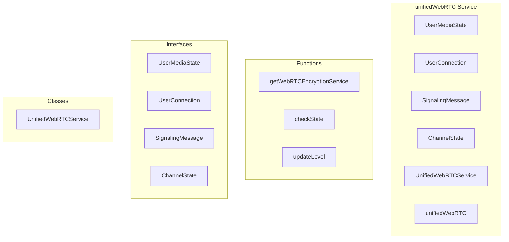

# unifiedWebRTC Service

**File:** `src/services/unifiedWebRTC.ts`

## Overview




## Exports

- **UserMediaState** - interface export
- **UserConnection** - interface export
- **SignalingMessage** - interface export
- **ChannelState** - interface export
- **UnifiedWebRTCService** - class export
- **unifiedWebRTC** - const export

## Functions

### `getWebRTCEncryptionService()`

No description available.

**Parameters:**
None

**Returns:** `void`

```typescript
async function getWebRTCEncryptionService()
```

### `checkState()`

No description available.

**Parameters:**
None

**Returns:** `Unknown`

```typescript
const checkState = () =>
```

### `updateLevel()`

No description available.

**Parameters:**
None

**Returns:** `Unknown`

```typescript
const updateLevel = () =>
```


## Classes

### UnifiedWebRTCService

No description available.

**Methods:**
- `constructor`
- `loadStreamQualitySettings`
- `catch`
- `saveStreamQualitySettings`
- `getVideoConstraints`
- `switch`
- `updateStreamQuality`
- `updateInputDevice`
- `updateOutputDevice`
- `updateVideoDevice`
- `joinChannel`
- `leaveChannel`
- `toggleVideo`
- `toggleScreenShare`
- `toggleMute`
- `setMuted`
- `toggleDeafen`
- `getLocalStream`
- `getLocalState`
- `getUserStream`
- `getUserState`
- `getAllUsers`
- `getConnectionState`
- `getUserAudioElement`
- `on`
- `off`
- `emit`
- `calculateSpeakingState`
- `initializeLocalAudio`
- `setupAudioLevelMonitoring`
- `setupSignaling`
- `requestChannelState`
- `handleSignalingMessage`
- `handleUserJoined`
- `handleUserLeft`
- `handleMediaStateUpdate`
- `handleAudioLevel`
- `handleStateSync`
- `createPeerConnection`
- `handleOffer`
- `handleAnswer`
- `handleIceCandidate`
- `broadcastMessage`
- `sendDirectMessage`
- `broadcastMediaState`
- `broadcastAudioLevel`
- `setupRemoteAudio`
- `setTraditionalAudioEnabled`
- `cleanupRemoteAudio`
- `setupCleanup`
- `getSelectedDevices`
- `loadAudioSettings`
- `saveAudioSettings`
- `setupSettingsListener`
- `updateAudioConstraints`
- `getAudioConstraints`

**Properties:**
- `channelId`
- `currentUserId`
- `signalChannel`
- `state`
- `localStream`
- `localMediaState`
- `userId`
- `isAudioEnabled`
- `isVideoEnabled`
- `isScreenSharing`
- `isMuted`
- `isDeafened`
- `isSpeaking`
- `audioLevel`
- `states`
- `connections`
- `allUserStates`
- `system`
- `eventListeners`
- `monitoring`
- `audioContext`
- `localAudioAnalyser`
- `settings`
- `audioConstraints`
- `echoCancellation`
- `noiseSuppression`
- `autoGainControl`
- `sampleRate`
- `streamQualitySettings`
- `resolution`
- `frameRate`
- `audioBitrate`
- `selection`
- `selectedInputDevice`
- `selectedOutputDevice`
- `selectedVideoDevice`
- `Encryption`
- `encryptionEnabled`
- `localStorage`
- `saved`
- `setting`
- `number`
- `360`
- `480`
- `720`
- `1080`
- `available`
- `width`
- `default`
- `tracks`
- `quality`
- `applyConstraints`
- `videoTracks`
- `constraints`
- `updated`
- `API`
- `stream`
- `to`
- `deviceId`
- `method`
- `device`
- `currentMuteState`
- `audioTracks`
- `newAudioStream`
- `audio`
- `video`
- `newAudioTrack`
- `track`
- `senders`
- `audioSender`
- `peer`
- `error`
- `elements`
- `user`
- `enabled`
- `baseVideoConstraints`
- `videoConstraints`
- `newVideoStream`
- `newVideoTrack`
- `videoSender`
- `experience`
- `channel`
- `cancellation`
- `connection`
- `cleanup`
- `presence`
- `signaling`
- `users`
- `sync`
- `type`
- `from`
- `data`
- `timestamp`
- `check`
- `true`
- `false`
- `leaving`
- `media`
- `null`
- `context`
- `oldChannelId`
- `active`
- `specified`
- `exact`
- `videoStream`
- `videoTrack`
- `obtained`
- `existingVideoTracks`
- `renegotiation`
- `sender`
- `existingSenders`
- `checkState`
- `offer`
- `update`
- `screenShareVideoTrackId`
- `screenShareAudioTrackId`
- `framerate`
- `screenVideoConstraints`
- `screenStream`
- `height`
- `screenVideoTrack`
- `screenAudioTrack`
- `audioLabel`
- `first`
- `screenshare`
- `Renegotiate`
- `hasScreenAudio`
- `failed`
- `gone`
- `sharing`
- `videoTrackId`
- `audioTrackId`
- `ID`
- `IDs`
- `share`
- `audioTrack`
- `change`
- `muted`
- `mute`
- `GETTERS`
- `SYSTEM`
- `callback`
- `listeners`
- `index`
- `listener`
- `METHODS`
- `status`
- `fallback`
- `ideal`
- `save`
- `fallbackConstraints`
- `choose`
- `UI`
- `source`
- `256`
- `dataArray`
- `lastBroadcast`
- `updateLevel`
- `average`
- `wasSpeaking`
- `speaking`
- `now`
- `Note`
- `config`
- `event`
- `message`
- `messages`
- `Received`
- `break`
- `store`
- `handle`
- `mediaState`
- `joined`
- `encryptionService`
- `participant`
- `left`
- `userState`
- `level`
- `changed`
- `action`
- `allStates`
- `isInitiator`
- `with`
- `pc`
- `iceServers`
- `urls`
- `iceCandidatePoolSize`
- `E2EE`
- `encodedInsertableStreams`
- `peerConnection`
- `remoteStream`
- `audioElement`
- `connectionState`
- `iceConnectionState`
- `playback`
- `candidates`
- `changes`
- `initiator`
- `answer`
- `candidate`
- `payload`
- `initialized`
- `spatialStore`
- `spatialStatus`
- `isSpatialAudioActive`
- `HTMLAudioElement`
- `errors`
- `playing`
- `toggled`
- `wasPlaying`
- `isNowPlaying`
- `MANAGEMENT`
- `devices`
- `inputDevice`
- `outputDevice`
- `videoDevice`
- `panel`
- `value`
- `needed`
- `possible`


## Interfaces

### UserMediaState

No description available.

```typescript
interface UserMediaState {

  userId: string;
  isAudioEnabled: boolean;
  isVideoEnabled: boolean;
  isScreenSharing: boolean;
  isMuted: boolean;
  isDeafened: boolean;
  isSpeaking: boolean;
  audioLevel: number;

}
```

### UserConnection

No description available.

```typescript
interface UserConnection {

  userId: string;
  peerConnection: RTCPeerConnection;
  mediaState: UserMediaState;
  remoteStream: MediaStream | null;
  audioElement: HTMLAudioElement | null;
  connectionState: RTCPeerConnectionState;
  iceConnectionState: RTCIceConnectionState;

}
```

### SignalingMessage

No description available.

```typescript
interface SignalingMessage {

  type: 'offer' | 'answer' | 'ice-candidate' | 'user-joined' | 'user-left' | 'media-state' | 'state-sync';
  from: string;
  to?: string;
  data: any;
  timestamp: number;

}
```

### ChannelState

No description available.

```typescript
interface ChannelState {

  participants: UserMediaState[];
  channelId: string;

}
```


## Source Code Insights

**File Size:** 66892 characters
**Lines of Code:** 1868
**Imports:** 5

## Usage Example

```typescript
import { UserMediaState, UserConnection, SignalingMessage, ChannelState, UnifiedWebRTCService, unifiedWebRTC } from '@/services/unifiedWebRTC'

// Example usage
getWebRTCEncryptionService()
```

---

*This documentation was automatically generated from the source code.*