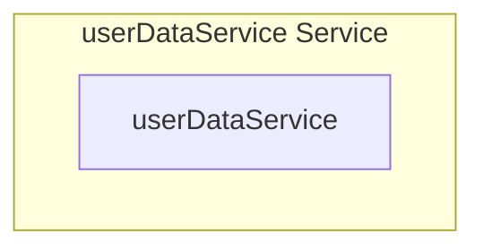

# userDataService Service

**File:** `src/services/userDataService.ts`

## Overview


```mermaid
graph TB
    subgraph "userDataService Service"
        USERDATASERVICE[userDataService]
    end
    
    
    
    
```

## Exports

- **userDataService** - No description


## Classes

### UserDataService

No description available.

**Methods:**
- `initialize`

**Properties:**
- `users`
- `contexts`
- `currentUserId`
- `null`
- `globalChannel`
- `null`
- `initialized`
- `pendingSubscriptions`
- `wasManuallySet`
- `manualStatus`
- `null`
- `lastAutoStatus`
- `UserStatus`
- `CACHE_TTL`
- `HEARTBEAT_INTERVAL`
- `heartbeatTimer`
- `null`
- `heartbeatFailures`
- `MAX_HEARTBEAT_FAILURES`
- `userId`
- `username`
- `currentUserId`
- `for`
- `currentUserId`
- `initialized`


## Source Code Insights

**File Size:** 40317 characters
**Lines of Code:** 1157
**Imports:** 4

## Usage Example

```typescript
import { userDataService } from '@/services/userDataService.ts'

// Example usage
// Use the exported functionality
```

---

*This documentation was automatically generated from the source code.*