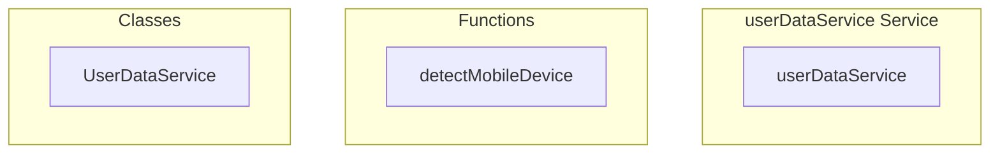

# userDataService Service

**File:** `src/services/userDataService.ts`

## Overview


```mermaid
graph TB
    subgraph "userDataService Service"
        USERDATASERVICE[userDataService]
    end
    
    subgraph "Functions"
        FN_DETECTMOBILEDEVICE[detectMobileDevice]
    end
    
    subgraph "Classes"
        CLS_USERDATASERVICE[UserDataService]
    end
```


## Exports

- **userDataService** - const export

## Functions

### `detectMobileDevice()`

No description available.

**Parameters:**
None

**Returns:** `boolean`

```typescript
/**
 * User Data Service
 * 
 * Discord/Slack-style user data management with:
 * - Smart fetching and caching
 * - Real-time presence sync
 * - Single source of truth for all user data
 * - Efficient context-based subscriptions
 */

import { supabase } from '@/supabase'
import { UserStatus, type UserData, type UserContext, type CustomUserStatus } from '@/types'
import { activityTracker } from '@/services/ActivityTracker'
import { debug } from '@/utils/debug'
import type { RealtimeChannel } from '@supabase/supabase-js'

/**
 * Detect if user is on a mobile device
 */
function detectMobileDevice(): boolean
```


## Classes

### UserDataService

No description available.

**Methods:**
- `initialize`
- `initializeBackgroundFeatures`
- `getStatusFromLocalStorage`
- `catch`
- `getCustomStatusFromLocalStorage`
- `saveCustomStatusToLocalStorage`
- `setupActivityTracking`
- `handleActivityResumed`
- `handleAutomaticStatusChange`
- `initializeCurrentUser`
- `setupGlobalPresence`
- `trackCurrentUserGlobally`
- `handleGlobalPresenceSync`
- `handleGlobalPresenceJoin`
- `handleGlobalPresenceLeave`
- `updateUserFromGlobalPresence`
- `updateUserFromPresence`
- `startHeartbeat`
- `handleConnectionLost`
- `subscribeToContext`
- `setupServerPresence`
- `trackCurrentUserInServer`
- `handleServerSync`
- `executeServerSync`
- `handleServerUserJoin`
- `handleServerUserLeave`
- `handleServerMemberJoin`
- `handleServerMemberLeave`
- `handleProfileUpdate`
- `handleProfileUpdateBroadcast`
- `loadUsersData`
- `getUserProfile`
- `fetchUserProfile`
- `fetchMultipleUserProfiles`
- `ensureUsersLoaded`
- `isUserDataStale`
- `updateCurrentUserStatus`
- `setCustomStatus`
- `clearCustomStatus`
- `getCustomStatus`
- `isCurrentUserMobile`
- `updatePresenceStatus`
- `updateCurrentUserProfile`
- `broadcastProfileToContexts`
- `getUser`
- `getCurrentUser`
- `getUsersInContext`
- `getAllUsers`
- `getOnlineUsers`
- `unsubscribeFromContext`
- `emitEvent`
- `refreshGlobalPresence`
- `cleanup`
- `refresh`
- `getStats`
- `findUserIdByUsername`
- `triggerPresenceSync`
- `getOnlineUsersInContext`
- `untrackFromAllPresenceChannels`

**Properties:**
- `users`
- `contexts`
- `currentUserId`
- `globalChannel`
- `initialized`
- `duplicates`
- `pendingSubscriptions`
- `management`
- `wasManuallySet`
- `manualStatus`
- `lastAutoStatus`
- `settings`
- `CACHE_TTL`
- `HEARTBEAT_INTERVAL`
- `debouncing`
- `presenceSyncTimeouts`
- `PRESENCE_SYNC_DEBOUNCE`
- `heartbeatTimer`
- `heartbeatFailures`
- `MAX_HEARTBEAT_FAILURES`
- `user`
- `username`
- `userId`
- `channel`
- `functionality`
- `true`
- `FIX`
- `render`
- `backup`
- `saved`
- `statusNumber`
- `localStorage`
- `UserStatus`
- `null`
- `customStatus`
- `expired`
- `tracking`
- `events`
- `resumption`
- `userData`
- `status`
- `choice`
- `inactivity`
- `Online`
- `flags`
- `Offline`
- `to`
- `manual`
- `profile`
- `loaded`
- `data`
- `handling`
- `IMPORTANT`
- `finalStatus`
- `Primary`
- `that`
- `database`
- `now`
- `online`
- `supabase`
- `only`
- `backupStatus`
- `consistency`
- `app`
- `id`
- `displayName`
- `avatarUrl`
- `bannerUrl`
- `bio`
- `color`
- `domain`
- `isLocal`
- `isOnline`
- `isMobile`
- `lastSeen`
- `lastHeartbeat`
- `lastCacheUpdate`
- `createdAt`
- `source`
- `initialStatus`
- `error`
- `SIMPLIFIED`
- `simple`
- `event`
- `spam`
- `need`
- `presence`
- `connection`
- `changes`
- `errors`
- `user_id`
- `display_name`
- `avatar_url`
- `custom_status`
- `is_mobile`
- `online_at`
- `failed`
- `churn`
- `state`
- `userCount`
- `globallyOnlineUserIds`
- `false`
- `join`
- `existing`
- `userStatus`
- `net`
- `offline`
- `NOTE`
- `repeatedly`
- `loss`
- `type`
- `context`
- `progress`
- `userIds`
- `lastSync`
- `needed`
- `subscriptions`
- `channelName`
- `server`
- `schema`
- `table`
- `filter`
- `connected`
- `serverId`
- `IMPLEMENTATION`
- `others`
- `approach`
- `STATUS`
- `banner_url`
- `server_id`
- `syncs`
- `existingTimeout`
- `sync`
- `onlineUserIds`
- `contextUsers`
- `complete`
- `newPresences`
- `leave`
- `leftPresences`
- `payload`
- `newUserId`
- `update`
- `contextId`
- `leftUserId`
- `updatedProfile`
- `it`
- `changed`
- `react`
- `loading`
- `clients`
- `payloads`
- `broadcast`
- `immediately`
- `missingUserIds`
- `updatedAt`
- `created_at`
- `updated_at`
- `roles`
- `is_local`
- `last_seen`
- `forceRefresh`
- `efficiently`
- `format`
- `results`
- `refresh`
- `age`
- `isManual`
- `Note`
- `feedback`
- `verification`
- `Expected`
- `channels`
- `clear`
- `persistence`
- `undefined`
- `mobile`
- `sufficient`
- `subscription`
- `Supabase`
- `propagation`
- `detail`
- `automatically`
- `reset`
- `heartbeat`
- `timeouts`
- `debugging`
- `totalUsers`
- `onlineUsers`
- `currentUser`
- `globalChannelConnected`
- `searchKey`
- `specified`
- `userKey`


## Source Code Insights

**File Size:** 60216 characters
**Lines of Code:** 1670
**Imports:** 5

## Usage Example

```typescript
import { userDataService } from '@/services/userDataService'

// Example usage
detectMobileDevice()
```

---

*This documentation was automatically generated from the source code.*