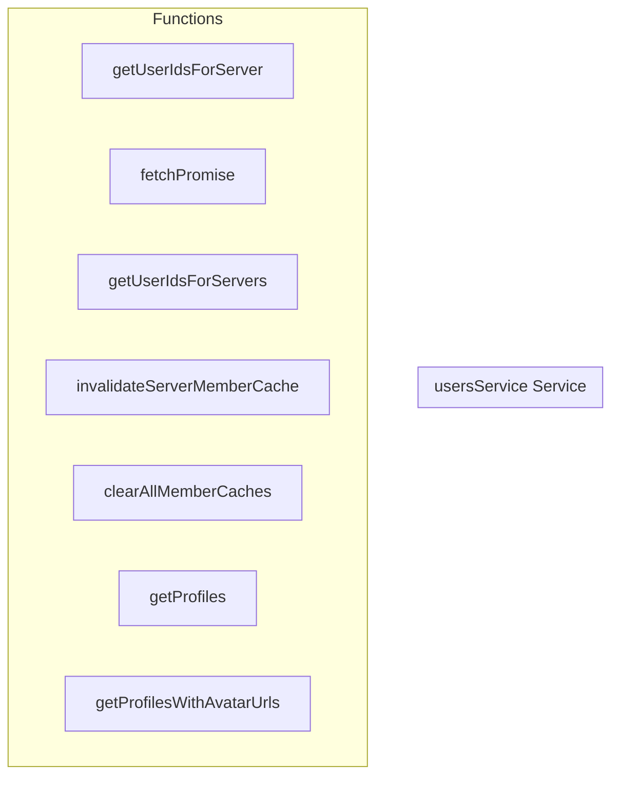

# usersService Service

**File:** `src/services/usersService.ts`

## Overview




## Functions

### `getUserIdsForServer(serverId: string)`

No description available.

**Parameters:**
- `serverId: string`

**Returns:** `Promise&lt;string[]&gt;`

```typescript
const getUserIdsForServer = async (serverId: string): Promise<string[]> =>
```

### `fetchPromise(async ()`

No description available.

**Parameters:**
- `async (`

**Returns:** `Unknown`

```typescript
const fetchPromise = (async () =>
```

### `getUserIdsForServers(serverIds: string[])`

No description available.

**Parameters:**
- `serverIds: string[]`

**Returns:** `Promise&lt;Map&lt;string, string[]&gt;&gt;`

```typescript
/**
 * Batch-fetch member IDs for multiple servers in a single query.
 * Uses the same cache as getUserIdsForServer - only queries uncached servers.
 */
const getUserIdsForServers = async (serverIds: string[]): Promise<Map<string, string[]>> =>
```

### `invalidateServerMemberCache(serverId: string)`

No description available.

**Parameters:**
- `serverId: string`

**Returns:** `void`

```typescript
/**
 * Invalidate the member cache for a server (call when members join/leave)
 */
const invalidateServerMemberCache = (serverId: string): void =>
```

### `clearAllMemberCaches()`

No description available.

**Parameters:**
None

**Returns:** `void`

```typescript
/**
 * Clear all member caches
 */
const clearAllMemberCaches = (): void =>
```

### `getProfiles(userIds: string[])`

No description available.

**Parameters:**
- `userIds: string[]`

**Returns:** `Promise&lt;Profile[]&gt;`

```typescript
const getProfiles = async (userIds: string[]): Promise<Profile[]> =>
```

### `getProfilesWithAvatarUrls(userIds: string[])`

No description available.

**Parameters:**
- `userIds: string[]`

**Returns:** `Promise&lt;Profile[]&gt;`

```typescript
const getProfilesWithAvatarUrls = async (userIds: string[]): Promise<Profile[]> =>
```


## Constants

### MEMBER_CACHE_TTL

No description available.

```typescript
const MEMBER_CACHE_TTL = 2 * 60 * 1000 // 2 minutes
```


## Source Code Insights

**File Size:** 4293 characters
**Lines of Code:** 144
**Imports:** 2

## Usage Example

```typescript
import { usersService } from '@/services/usersService'

// Example usage
getUserIdsForServer()
```

---

*This documentation was automatically generated from the source code.*