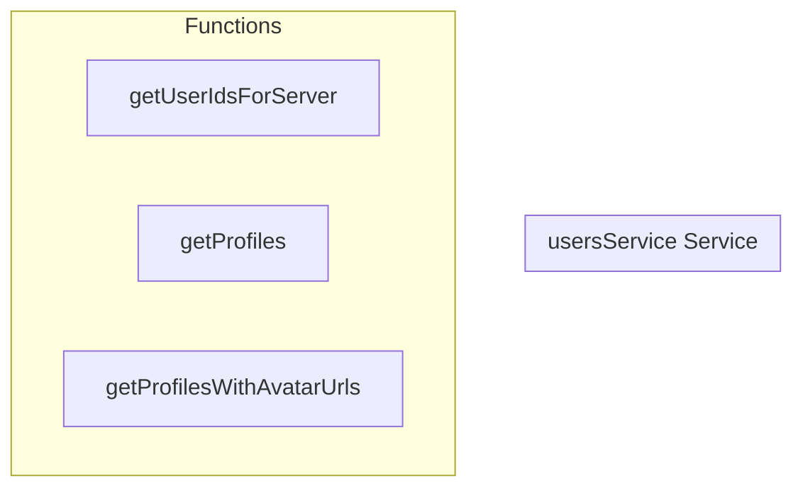

# usersService Service

**File:** `src/services/usersService.ts`

## Overview


```mermaid
graph TB
    subgraph "usersService Service"
    end
    
    subgraph "Functions"
        FN_GETUSERIDSFORSERVER[getUserIdsForServer]
        FN_GETPROFILES[getProfiles]
        FN_GETPROFILESWITHAVATARURLS[getProfilesWithAvatarUrls]
    end
```


## Functions

### `getUserIdsForServer(serverId: string)`

No description available.

**Parameters:**
- `serverId: string`

**Returns:** `Promise&lt;string[]&gt;`

```typescript
const getUserIdsForServer = async (serverId: string): Promise<string[]> =>
```

### `getProfiles(userIds: string[])`

No description available.

**Parameters:**
- `userIds: string[]`

**Returns:** `Promise&lt;Profile[]&gt;`

```typescript
const getProfiles = async (userIds: string[]): Promise<Profile[]> =>
```

### `getProfilesWithAvatarUrls(userIds: string[])`

No description available.

**Parameters:**
- `userIds: string[]`

**Returns:** `Promise&lt;Profile[]&gt;`

```typescript
const getProfilesWithAvatarUrls = async (userIds: string[]): Promise<Profile[]> =>
```


## Source Code Insights

**File Size:** 1616 characters
**Lines of Code:** 49
**Imports:** 2

## Usage Example

```typescript
import { usersService } from '@/services/usersService'

// Example usage
getUserIdsForServer()
```

---

*This documentation was automatically generated from the source code.*