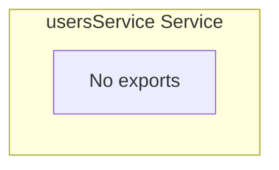

# usersService Service

**File:** `src/services/usersService.ts`

## Overview


```mermaid
graph TB
    subgraph "usersService Service"
        EMPTY[No exports]
    end
    
    
    
    
```


## Source Code Insights

**File Size:** 1616 characters
**Lines of Code:** 49
**Imports:** 2

## Usage Example

```typescript
import { usersService } from '@/services/usersService.ts'

// Example usage
// Use the exported functionality
```

---

*This documentation was automatically generated from the source code.*