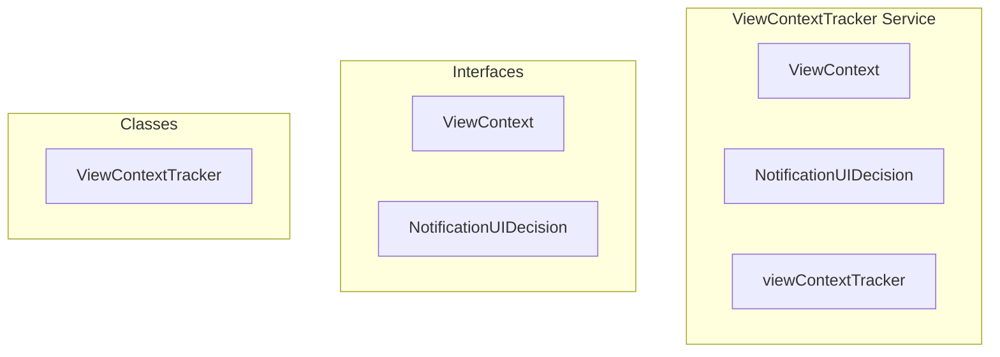

# ViewContextTracker Service

**File:** `src/services/ViewContextTracker.ts`

## Overview




## Exports

- **ViewContext** - interface export
- **NotificationUIDecision** - interface export
- **ViewContextTracker** - class export
- **viewContextTracker** - const export


## Classes

### ViewContextTracker

No description available.

**Methods:**
- `updateContext`
- `getCurrentContext`
- `isViewingChannel`
- `isViewingConversation`
- `shouldShowNotificationUI`
- `reset`

**Properties:**
- `currentContext`
- `view_type`
- `context`
- `navigates`
- `updated`
- `channel`
- `channelId`
- `conversation`
- `conversationId`
- `Note`
- `server_id`
- `channel_id`
- `conversation_id`
- `type`
- `suppress`
- `showToast`
- `showDesktop`
- `playSound`
- `reason`
- `notifications`


## Interfaces

### ViewContext

No description available.

```typescript
interface ViewContext {

  server_id?: string
  channel_id?: string
  conversation_id?: string
  view_type: 'server_channel' | 'dm' | 'settings' | 'home'

}
```

### NotificationUIDecision

No description available.

```typescript
interface NotificationUIDecision {

  showToast: boolean
  showDesktop: boolean
  playSound: boolean
  reason: string

}
```


## Source Code Insights

**File Size:** 3392 characters
**Lines of Code:** 121
**Imports:** 1

## Usage Example

```typescript
import { ViewContext, NotificationUIDecision, ViewContextTracker, viewContextTracker } from '@/services/ViewContextTracker'

// Example usage
// Use the exported functionality
```

---

*This documentation was automatically generated from the source code.*