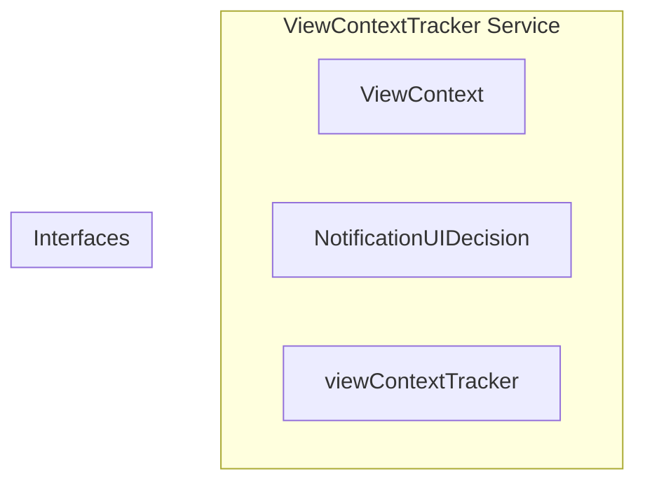

# ViewContextTracker Service

**File:** `src/services/ViewContextTracker.ts`

## Overview


```mermaid
graph TB
    subgraph "ViewContextTracker Service"
        VIEWCONTEXT[ViewContext]
        NOTIFICATIONUIDECISION[NotificationUIDecision]
        VIEWCONTEXTTRACKER[viewContextTracker]
    end
    
    
    
    subgraph "Interfaces"
        VIEWCONTEXT[ViewContext]
        NOTIFICATIONUIDECISION[NotificationUIDecision]
    end
```

## Exports

- **ViewContext** - No description
- **NotificationUIDecision** - No description
- **viewContextTracker** - No description


## Classes

### ViewContextTracker

No description available.

**Methods:**
None

**Properties:**
- `currentContext`
- `ViewContext`
- `view_type`


## Interfaces

### ViewContext

No description available.

```typescript
export interface ViewContext {
  server_id?: string
  channel_id?: string
  conversation_id?: string
  view_type: 'server_channel' | 'dm' | 'settings' | 'home'
}
```

### NotificationUIDecision

No description available.

```typescript
export interface NotificationUIDecision {
  showToast: boolean
  showDesktop: boolean
  playSound: boolean
  reason: string
}
```


## Source Code Insights

**File Size:** 2426 characters
**Lines of Code:** 89
**Imports:** 0

## Usage Example

```typescript
import { ViewContext, NotificationUIDecision, viewContextTracker } from '@/services/ViewContextTracker.ts'

// Example usage
// Use the exported functionality
```

---

*This documentation was automatically generated from the source code.*