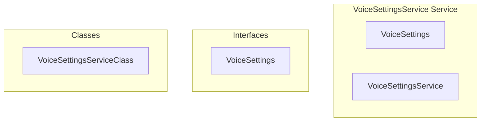

# VoiceSettingsService Service

**File:** `src/services/VoiceSettingsService.ts`

## Overview




## Exports

- **VoiceSettings** - interface export
- **VoiceSettingsService** - const export


## Classes

### VoiceSettingsServiceClass

No description available.

**Methods:**
- `constructor`
- `load`
- `catch`
- `save`
- `getAll`
- `getDevices`
- `getAudioConstraints`
- `updateMany`
- `setInputDevice`
- `setOutputDevice`
- `setVideoDevice`
- `setAudioConstraints`
- `validateDevices`
- `getValidatedDevices`
- `reset`

**Properties:**
- `settings`
- `listeners`
- `initialized`
- `localStorage`
- `stored`
- `parsed`
- `true`
- `only`
- `inputDevice`
- `outputDevice`
- `videoDevice`
- `constraints`
- `echoCancellation`
- `noiseSuppression`
- `autoGainControl`
- `setting`
- `value`
- `once`
- `device`
- `deviceId`
- `to`
- `changes`
- `devices`
- `input`
- `output`
- `video`
- `inputDevices`
- `outputDevices`
- `videoDevices`
- `inputValid`
- `outputValid`
- `videoValid`
- `selections`
- `null`
- `error`
- `exist`


## Interfaces

### VoiceSettings

No description available.

```typescript
interface VoiceSettings {

  // Device IDs
  selectedInputDevice: string | null;
  selectedOutputDevice: string | null;
  selectedVideoDevice: string | null;
  
  // Volume levels (0-100)
  inputVolume: number;
  outputVolume: number;
  
  // Audio processing
  echoCancellation: boolean;
  noiseSuppression: boolean;
  autoGainControl: boolean;
  
  // Video settings
  videoQuality: '480p' | '720p' | '1080p';
  frameRate: string;
  audioBitrate: string;

}
```


## Constants

### STORAGE_KEY

No description available.

```typescript
const STORAGE_KEY = 'voice-settings'
```

### DEFAULT_SETTINGS

No description available.

```typescript
const DEFAULT_SETTINGS: VoiceSettings = {
```


## Source Code Insights

**File Size:** 7451 characters
**Lines of Code:** 256
**Imports:** 2

## Usage Example

```typescript
import { VoiceSettings, VoiceSettingsService } from '@/services/VoiceSettingsService'

// Example usage
// Use the exported functionality
```

---

*This documentation was automatically generated from the source code.*