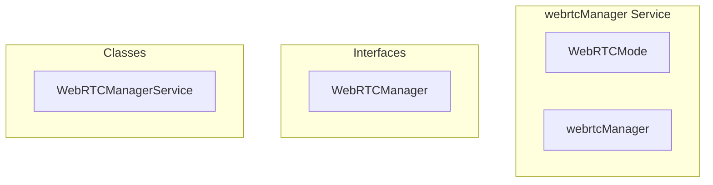

# webrtcManager Service

**File:** `src/services/webrtcManager.ts`

## Overview




## Exports

- **WebRTCMode** - type export
- **WebRTCManager** - interface export
- **webrtcManager** - const export


## Classes

### WebRTCManagerService

No description available.

**Methods:**
- `constructor`
- `setupEventForwarding`
- `setMode`
- `getMode`
- `getActiveService`
- `getCurrentMode`
- `shouldUseSFU`
- `catch`
- `joinChannel`
- `joinWithToken`
- `leaveChannel`
- `toggleVideo`
- `toggleScreenShare`
- `toggleMute`
- `setMuted`
- `toggleDeafen`
- `getLocalStream`
- `getUserStream`
- `attachVideoToElement`
- `detachVideoFromElement`
- `updateStreamQuality`
- `getLocalState`
- `getAllUsers`
- `isConnected`
- `updateInputDevice`
- `updateOutputDevice`
- `updateVideoDevice`
- `getSelectedDevices`
- `broadcastMessage`
- `setTraditionalAudioEnabled`
- `setUserMicVolume`
- `setUserScreenShareVolume`
- `getUserMicVolume`
- `getUserScreenShareVolume`
- `hasScreenShareAudio`
- `on`
- `off`
- `emit`

**Properties:**
- `currentMode`
- `activeService`
- `configCache`
- `eventListeners`
- `services`
- `eventsToForward`
- `mode`
- `to`
- `setting`
- `service`
- `null`
- `used`
- `false`
- `true`
- `isAvailable`
- `available`
- `availability`
- `METHODS`
- `channel`
- `transport`
- `channelId`
- `userId`
- `roomType`
- `abortSignal`
- `starting`
- `connection`
- `cleanup`
- `useSFU`
- `first`
- `success`
- `attempt`
- `cancellation`
- `failed`
- `fallback`
- `P2P`
- `server`
- `wsUrl`
- `token`
- `CONTROLS`
- `video`
- `share`
- `mute`
- `deafen`
- `ACCESS`
- `stream`
- `videoElement`
- `directly`
- `element`
- `tracks`
- `resolution`
- `frameRate`
- `audioBitrate`
- `state`
- `isAudioEnabled`
- `isVideoEnabled`
- `isScreenSharing`
- `isMuted`
- `isDeafened`
- `isSpeaking`
- `audioLevel`
- `users`
- `STATUS`
- `connected`
- `MANAGEMENT`
- `device`
- `devices`
- `inputDevice`
- `outputDevice`
- `videoDevice`
- `100`
- `volume`
- `scale`
- `yet`
- `SYSTEM`
- `event`
- `callback`
- `listeners`
- `index`
- `data`
- `listener`


## Interfaces

### WebRTCManager

No description available.

```typescript
interface WebRTCManager {

  // Connection
  joinChannel(channelId: string, userId: string, roomType?: 'voice_channel' | 'dm_call' | 'stage'): Promise<boolean>;
  joinWithToken(wsUrl: string, token: string, channelId: string, userId: string): Promise<boolean>;
  leaveChannel(): Promise<void>;
  
  // Media controls
  toggleVideo(): Promise<boolean>;
  toggleScreenShare(): Promise<boolean>;
  toggleMute(): boolean;
  toggleDeafen(): boolean;
  
  // Volume control
  setUserMicVolume(userId: string, volume: number): void;

  // ...
}
```


## Type Definitions

### WebRTCMode

No description available.

```typescript
export type WebRTCMode = 'sfu' | 'p2p' | 'hybrid';
```


## Source Code Insights

**File Size:** 21673 characters
**Lines of Code:** 733
**Imports:** 4

## Usage Example

```typescript
import { WebRTCMode, WebRTCManager, webrtcManager } from '@/services/webrtcManager'

// Example usage
// Use the exported functionality
```

---

*This documentation was automatically generated from the source code.*