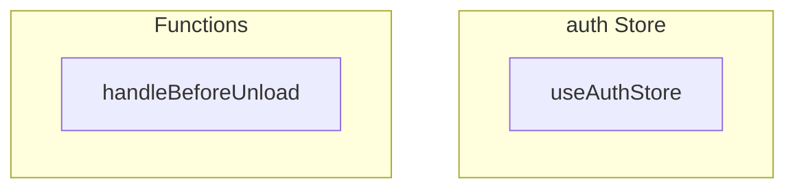

# auth Store

**File:** `src/stores/auth.ts`

## Overview




## Exports

- **useAuthStore** - const export

## Functions

### `handleBeforeUnload(_event: BeforeUnloadEvent)`

No description available.

**Parameters:**
- `_event: BeforeUnloadEvent`

**Returns:** `Unknown`

```typescript
const handleBeforeUnload = (_event: BeforeUnloadEvent) =>
```


## Source Code Insights

**File Size:** 26964 characters
**Lines of Code:** 675
**Imports:** 9

## Usage Example

```typescript
import { useAuthStore } from '@/stores/auth'

// Example usage
handleBeforeUnload()
```

---

*This documentation was automatically generated from the source code.*